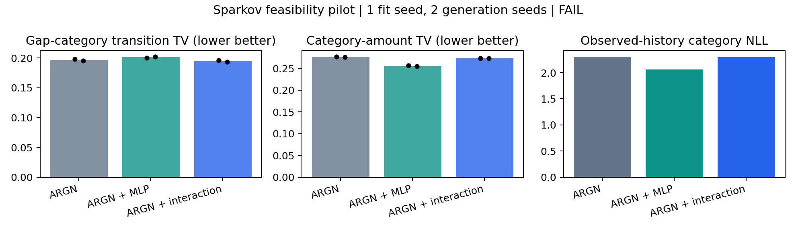

# TabularARGN 기반 추가 관계 경로 — 결과

**완료. 작은 개선은 관측했으나 등록된 추가 기여 screen은 FAIL이다. 이번 후보는
채택하지 않고 이 파일럿을 종료한다.** 계수/rank/epoch/seed의 후속 탐색은 실행하지 않았다.
공식 모델 기반으로 후속 연구를 하는 방식 자체가 불가능하다는 결론은 아니다.

## 무엇을 비교했는가

Sparkov의 기존 fit/check/validation을 사용해 공식 TabularARGN, 같은 입력의
일반 MLP 경로 추가, 곱 상호작용 경로 추가를 비교했다. 두 경로 모두 직전 업종과
현재 간격을 받아 현재 업종의 logit에 더한다. 모든 가중치를 함께 학습하며
금액 codec·기존 필드 순서·학습 목적·선택 기준은 유지했다.

기본 모델은3,599,240개, 두 확장은 각각3,601,383개 파라미터다. 기본 tensor와
두 추가 경로 초기 tensor가 정확히 같음을 확인했다. 이전 CS-SAF의 G/R과
이번 표의 G/R은 서로 다른 실험 식별자다.

- A: 공식 TabularARGN.
- G: A + 같은 용량의 일반 MLP 경로.
- R: A + 현재 간격×직전 업종의 곱 상호작용 경로.

## 핵심 결과

모든 값은 작을수록 좋다. 생성 지표는 생성2회 평균, 예측은 동일 실제 validation
177,997거래에서 계산했다. 학습 seed는1개이며 독립 확인 결과가 아니다.

| 모델 | 생성 간격–업종 전이 TV | 생성 업종–금액 TV | 실제 이력 업종 NLL |
|---|---:|---:|---:|
| A: 공식 TabularARGN | .196823 | .276437 | 2.307878 |
| G: 일반 경로 추가 | .201289 | .255544 | 2.062307 |
| R: 관계 경로 추가 | .194700 | .272965 | 2.300320 |

그림의 검은 점은 두 생성 seed의 값이며 신뢰구간이 아니다.

- R은 A보다 주 생성 오차를 **1.08%**, G보다 **3.27%** 줄였다. 두 생성 seed
  모두 같은 방향이었다. 다만 두 대조군 대비 각각5% 이상이라는 기준에 못 미쳤다.
- R의 예측·금액·주변분포·merchant–category·길이 손실 허용치는 모두 통과했다.
  따라서 이번 실패는 여러 지표가 악화해서가 아니라 **추가 개선 폭이 작아서**다.
- G는 R보다 업종 예측과 업종–금액 관계가 좋았지만 주 시간 관계는 더 나빴다.
  예측 개선과 전체 관계 생성의 개선을 같은 결과로 설명할 수 없다.
- invalid 금액/간격 및 unknown 행동/업종은 세 조건 모두0이었다.

기준을 결과에 맞춰 낮추거나, 작은 개선을 통계적으로 유의한 우위로 표현하지 않는다.
[전체 지표](generation_metrics.csv), [예측 지표](prediction_metrics.csv),
[판정의 모든 대비와 허용치](results.json).

## 확인된 것과 아직 설명하지 못한 것

추가 파라미터 네 블록은 선택 checkpoint에서 모두 초기값과 달랐고,
생성 중에도 관계 경로가 호출됐다. 경로가 실수로 비활성화된 결과는 아니다.
단, 이것으로 어떤 내부 특징이 작은 개선을 만들었는지까지 인과적으로 설명하지 않는다.

이 후보의 추가 경로는 category를 만들 때 작동한다. 현재 merchant와 amount는
이미 앞에서 생성됐으며 다음 거래에서만 변경된 category 이력을 받는다. 이 위치에서
merchant 생성까지 직접 통제하는 구조는 아니다. 이 구조적 범위는
[모델 설명](model_and_sources.md)에 명시했다. 이번 실패의 유일한 원인으로 확정하지 않는다.

또 모든 조건에서 **merchant–category joint TV가 높다**: A .887593, G .850249,
R .886658. 이는 고정된 개발 설정의 큰 공동분포 격차이며, 조건부 오류율과 같지 않다.
공식 모델의 기본 관계 생성이 충분히 확보됐다고 보기 어렵다. 이 결과를 곧바로
TabularARGN 방법 전체의 근본 한계 또는 CS-SAF 확장의 불가능성으로 확대할 수 없다.

| 모델 | 선택 epoch | 마지막 epoch | optimizer update | 선택 check loss |
|---|---:|---:|---:|---:|
| A | 10 | 15 | 120 | 1.1259 |
| G | 25 | 30 | 240 | 1.1036 |
| R | 10 | 15 | 120 | 1.1251 |

동일한 최대64epoch/20분 및 native early-stop을 적용했지만 실제 업데이트 수는
다르다. 조기 종료는 해당 validation 규칙의 결과이며 충분한 학습이나 전역 최적을
입증하지 않는다. 이번 결과를 보고 예산을 늘린 추가 실행은 하지 않았다.

## 실행·검산·보관

- 최초 등록 `afd418c`, 학습 전 기술 정정 및 실행 source `9ba6c6a`.
- 최초 메타데이터 누락으로 모델 초기화 전3건 종료: 학습/생성0회.
  [정정과 보존 위치](amendment_01.md). 최종 유효 학습3회·생성6회와 구분한다.
- CPU 검사7개 통과. 생성6개/813,967거래의 주요 지표78개를 독립 histogram/ECDF로
  검산했고 최대 절대 차이는4.43e−14였다. 예측 거래 수와 checkpoint/file hash도 검사했다.
- 이 검산은 지표 산술의 독립 검사이며 전체 신경망 학습의 독립 재현이라는 뜻은 아니다.
- `finx-System-Product-Name`의 빈 RTX3090 GPU0/1/2에서 실행했다. 시작 전 각각
  52/117/52MiB·0%를 확인했고 프로세스별 메모리 상한45%를 적용했다.
  이번 프로세스의 peak reserved는392/394/392MiB였다. 다른 작업을 중단하지 않았다.
  세 실행 종료와 GPU 반환을 확인했다.
- 기존 CS-SAF 코드·기존 공식 ARGN workspace·입력 파일의 hash가 그대로다.
  기존 branch/main을 수정하지 않았다.
- Git에는 등록·새 구현·집계·그림·검산을 저장한다. 원 생성 parquet/모델 가중치는
  새 worktree의 `artifacts/argn_relation_pilot_v1/`에 남기며 GitHub에는 올리지 않는다.

[실행 전 등록](preregistration.md) · [CPU 검증](cpu_gate.json) ·
[독립 지표 검산](verification.json) · [추가 경로 가중치 확인](checkpoint_verification.json)

재현은 등록 버전의 runtime으로 `scripts/run_argn_relation_pilot.py A|G|R`를
각 빈 GPU에서 실행하고 `scripts/report_argn_relation_pilot.py`로 집계한다.
이미 완료된 run 폴더에는 덮어쓰기 실행하지 않도록 막았다. 원 데이터와 공식
기존 workspace는 등록 문서의 워크스테이션 경로를 필요로 한다.

**다음 작업을 자동으로 실행하지 않는다.** 이번 결과는 공식 기반 모델을 분리해
추가 장치의 효과를 측정하는 비교가 구현됐다는 증거와, 이 특정 장치의 이득이
작았다는 결과를 남긴다. 새로운 방법론 기여나 최종 모델 확정으로 보고하지 않는다.
