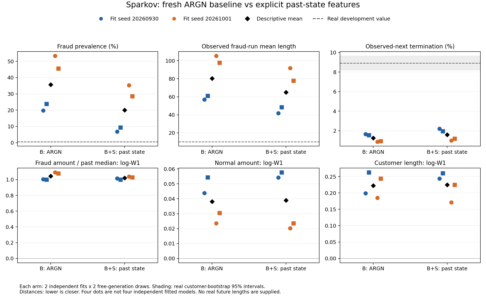

# 첫 B 대 B+S 평가와 후속 원인 검증

후속 상태 갱신(2026-09-27 16:15 KST): 가중치 대조 두 seed의 학습·생성·평가가
모두 완료됐다. 과생성은 감소했지만 사기가 한 건씩 끊기는 반대 오류가 나타났다.
[완료 결과](EVENT_WEIGHT_CONTROL_RESULTS.md). 아래 대기·등록 설명은 당시의 기록이다.

2026-09-27. **첫 비교의 학습 4회와 자유 생성 8개를 모두 평가했다. S는 일부
과잉 생성을 줄였지만, 현재 결과를 연구 기여의 입증으로 삼을 수 없다.**
기본 B부터 사기 비율과 사기 구간을 크게 잘못 생성한다. 이 상태에서 S를
확장하기보다, 확인된 학습 손실 가중치 문제를 분리하는 대조 실험을 우선한다.

## 완료와 범위

- 619명 optimization / 69명 내부 validation, 외부 development 147명 유지.
- B/B+S 각각 독립 학습 seed 2개, 각 체크포인트에서 생성 seed 2개.
- 학습은 17/18 epoch에서 조기 종료했고 선택 체크포인트는 12/13 epoch다.
  60 epoch 또는 180분 예산 때문에 잘린 실행은 없다. 조기 종료가 충분한
  학습이나 목표 관계의 수렴을 보장하는 것은 아니다.
- 등록된 8개 생성 파일과 체크포인트의 해시를 확인했다. 생성 결과 수정,
  사기 비율 보정, 실제 미래 길이 제공, test 거래 접근은 없다.
- 상태 모듈·엔진의 기존 검증 6개 외에 경계/재표집/거리 평가 테스트 3개와
  후속 손실 가중치 테스트 1개를 추가했다.

## 실제 생성 결과

범위는 모델별 **4개 생성 결과의 최솟값–최댓값**이다. 독립 학습은 2개다.

| 지표 | 원본 development | B | B+S |
|---|---:|---:|---:|
| 전체 사기 비율 | 0.644% | 19.72–53.36% | 6.80–35.24% |
| 첫 거래 사기 비율 | 8.16% | 76.87–86.39% | 74.83–85.71% |
| 관측 사기 구간 평균 건수 | 10.05 | 57.01–105.41 | 41.75–91.81 |
| 다음 거래가 관측됐을 때 사기 종료 확률 | 8.91% | 0.87–1.65% | 1.00–2.21% |
| 사기 금액 / 과거 금액 중앙값 관계 오차¹ | 0 | 0.999–1.091 | 1.000–1.040 |

¹ 직전 20건, 최소 5건의 금액 중앙값 대비 비율의 log1p Wasserstein 거리.
0에 가까울수록 원본에 가깝다. 원본 고객 재표집에 따른 같은 거리의 95% 구간은
0.024–0.124로, 두 모델의 오차는 이 변동 규모보다 훨씬 크다. 이것은 변동 참조이지
보편적 합격 기준은 아니다.

사기 비율과 시작률의 절대 오차는 네 생성 쌍 모두 S에서 줄었다. 관측 사기
구간 건수 분포 거리도 두 학습 seed의 생성 평균에서 약 0.087–0.089 감소했다.
그러나 고객 bootstrap에서는 이 구간 거리 개선의 95% 구간이 네 쌍 중 두 쌍에서
0을 포함한다. 이 구간은 학습 seed 불확실성이 아니라 해당 모델/생성 결과에서
고객을 다시 뽑을 때의 변동이다.

개선은 일관되게 확대되지 않는다.

- **시작과 종료가 모두 관측된 사기 구간만** 보면, 건수 분포는 첫 학습 seed에서
  악화되고 둘째에서 소폭 개선된다. 해당 구간의 경과 시간 분포 오차는 두 seed
  모두 증가한다. 전체 관측 구간 지표 하나만 보고 지속 문제가 해결됐다고 할 수 없다.
- 개인 이력 대비 사기 금액 관계는 첫 seed에서 악화되고 둘째에서 개선된다.
  사기 구간 나이 구성을 원본에 맞춰 재가중해도 결론은 같다. 원단위 사기 금액
  분포의 log-W1은 두 학습 seed 평균 모두 악화한다.
- 정상 금액 품질과 고객 길이 품질도 seed에 따라 개선/악화가 갈린다.
- 사기 구간 최대 길이는 B에서 1,588건, B+S에서 1,848건까지 관측된다.
  원본 관측 최대 19건은 강제 제한할 규칙이 아니지만, 이 큰 차이는 남은 오류다.
- 사기별 가맹점–업종 및 일부 이력 관계 TV는 두 학습 seed 평균에서 개선된다.
  따라서 S가 완전히 무효라고 결론내리지는 않되, 유효한 생성기로 개선됐다는
  넓은 주장도 하지 않는다.

구간 경계 처리와 표본 수는 [hazards.csv](evaluation/hazards.csv), 구간 나이별
금액은 [age_amounts.csv](evaluation/age_amounts.csv), 모든 지표와 학습 seed별
차이는 [metrics.csv](evaluation/metrics.csv), [paired_fit_means.csv](evaluation/paired_fit_means.csv)에 있다.

## 확인한 원인 후보: 전체 이력과 고객별 평균 손실의 결합

이번에는 B와 S에 같은 이력을 주려고 기존 100행 window 대신 **보존된 고객
거래열 전체**를 학습시켰다. 그러나 엔진의 기존 손실은 고객마다 거래 오차를
평균한 뒤 고객 간 평균을 낸다. 따라서 길이 10인 고객의 거래 한 건은 길이
1,000인 고객의 거래 한 건보다 100배 큰 가중치를 받는다.

Sparkov의 이 준비 데이터에는 짧고 모두 사기인 거래열들이 있다. 실제 optimization
데이터에서 계산하면 다음과 같다.

| 구분 | 실제 거래 건수 기준 사기 비중 | 현재 거래 손실에서 사기의 비중 |
|---|---:|---:|
| 전체 거래 | 0.581% | 8.572% |
| 각 고객의 첫 거래 | 7.916% | 90.398% |
| 각 고객의 첫 10건 | 7.760% | 89.460% |

이 값은 손실 기여량의 **가중치 비중**이다. 개별 cross-entropy 오차값까지 곱한
실제 gradient 비중을 측정한 것이 아니며, 곧바로 같은 생성 확률이 된다는 뜻도 아니다.
출처: [native_loss_weight_audit.csv](evaluation/native_loss_weight_audit.csv).

체크포인트를 고정하고 실제 development 고객의 첫 거래·실제 길이를 넣은 보조
진단에서도 평균 사기 확률은 B 66.54–76.27%, B+S 67.57–75.79%였다. 실제 첫 거래
사기 비율은 8.16%다. 즉, 오류가 생성된 과거의 누적 이후에만 생기는 것은 아니다.
첫 거래에서 S는 빈 상태(0)이므로 현재 상태 요약만으로 이 초기 문제를 설명할 수 없다.

생성 첫 거래의 금액만 원본으로 바꾸면 평균 사기 확률이 일부 감소하지만,
모든 현재 필드와 실제 길이를 원본으로 줘도 과대 예측이 남는다. 이는 손실/학습
목표 쪽을 먼저 검증할 근거다. 이 필드 교체는 조건부 민감도 진단이고, 실제 데이터
과정에 대한 인과 증명이나 자유 생성의 개선 점수는 아니다.

**따라서 지금 결과를 논문 원형 ARGN의 구조적 한계나 S 구조의 성공으로 해석하면
안 된다.** 이번 전체 이력 학습 설정과 원래 고객별 손실 평균을 함께 사용한
영향이 큰 원인 후보다. 손실 가중치 변경 후 재학습으로 검증해야 한다.

## 다음 실행을 준비하고 자원 대기열에 등록했다

[대조 프로토콜](EVENT_WEIGHT_CONTROL_PROTOCOL.md)에 따라 `B_event_weighted`를
두 seed로 새로 학습하도록 등록했다. 상태 S와 금액 head A는 바꾸지 않는다.
거래 출력 손실에만 `고객 거래 수 / 학습 고객 평균 거래 수`를 곱하여 거래 한 건당
손실 가중치를 같게 만들고, 길이 출력 손실은 기존대로 둔다. 원본 사기 비율을
직접 맞추는 규칙이나 라벨별 가중치는 없다.

이번 대조 실행 직전에 GPU 4개가 모두 다른 VLLM 작업으로 사용 중임을 확인해
점유 GPU에서 학습을 시작하지 않았다. **등록 시점의 상태는 GPU 대기이며 실제
대조 학습은 아직 시작되지 않았다.** 전용 dispatcher는 최대 2시간 동안 확인하고,
사용률/메모리가 연속 두 번 낮은 GPU가 생기면 시작한다. 계속 사용 중이면
`gpu_wait_timeout`으로 남기며 기존 작업을 중단하거나 공유하지 않는다.
시작된 실행은 학습 → 자유 생성 2회 → 같은 핵심 지표 평가로 자동 진행된다.

현재 상태 파일은 로컬 `artifacts/argn_event_weight_control_v1/DISPATCH_STATUS.json`,
seed별 `queue_20260930.json`, `queue_20261001.json`이다. 등록 이후의 실제 진행
상태는 이 파일을 확인해야 한다.

후속 사용자 지시 ‘GPU 비면 바로 실행 시작’에 따라 대기 만료를 해제했다.
등록 당시의 2시간 정책은 이 지시로 대체되었으며, 현재 dispatcher는 30초마다
확인해 GPU가 연속 두 번 비어 있으면 남은 실험을 시작한다. 이전 대기 기록은
`dispatcher_history/`, 변경 기록은 `USER_WAIT_POLICY.json`에 보존했다.
학습 모델·데이터·실험 조건에는 변경이 없다.
