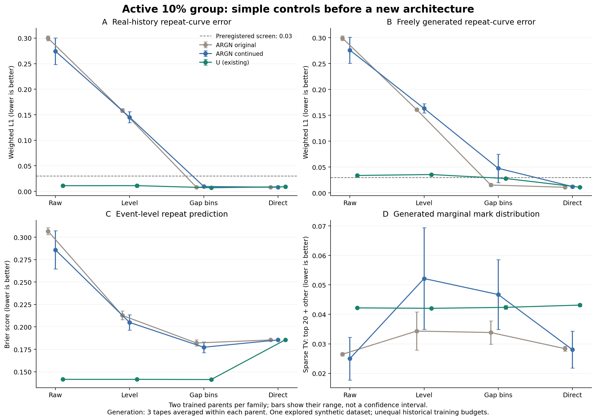

# 학습 시간을 늘리고 단순 보정을 적용한 결과 — 2026-09-20

**완료:** TabularARGN 추가 학습 4회, 부모 모델 12개에 대한 보정·예측 비교, 생성 144조건 평가(신규 132개 데이터셋, 기존 12개 재사용), 원본 보존·계산 검증. **새 제안 신경망은 학습하지 않았다.**

**이번에 확인한 핵심은 “반복관계 개선의 상당 부분은 단순 보정으로도 가능하다”는 것이다.** U+간격별 보정과 추가 학습 ARGN+직접 반복률 대조군은 이번 실용 기준을 모두 통과했다. 그러므로 이 개선을 복잡한 새 결합 모듈의 기여로 주장하면 안 된다. 남은 연구 대상은 **생성 관계를 개선하면서 거래별 예측 정확도와 다른 분포를 함께 유지하는 것**이다.

## 무엇을 비교했는가

기존 인공 데이터의 소수 집단 비율 10%, 관계 없음/있음 두 조건을 유지했다. 각 조건에서 기존 ARGN 두 시드의 저장 모델을 100 epoch 더 학습했다. 공식 모델·손실·배치·optimizer는 유지하고 조기 종료 patience만 늘렸다. 여기에 원래 ARGN 4개와 기존 U 4개를 포함했다. 새로운 데이터 시드나 실제 금융 데이터의 검증은 아니다.

각 부모에서 ① 원래 모델(raw), ② 집단별 평균 반복률 보정(level), ③ 집단×간격 5구간별 보정(gap), ④ 같은 구간의 학습 반복률을 직접 사용하는 대조군(direct)을 비교했다. **direct는 간단한 통계적 예측값이며 새 신경망이 아니다.** 보정에는 학습 데이터만 사용했고 정답 생성 법칙·validation·test를 학습하지 않았다. 자세한 수식·정보 범위·CPU 검증은 [방법 설명](methods.md), 고정 조건은 [사전등록](preregistration.md)에 있다.

## 결과 1: 학습 시간을 늘리는 것만으로는 충분하지 않았다

추가 학습 후에도 raw ARGN은 기본 예측 기준을 **0/4개 모델**에서 통과했다. 추가 예산의 사전등록 기여 기준(Brier .01 및 행동 NLL .05 이상 개선)은 각 조건에서 두 시드 중 하나만 통과했다. **학습 효과가 두 시드 모두에 재현된 조건은 0/2개**다. 선택 checkpoint뿐 아니라 마지막 가중치의 예측도 반복률을 크게 낮게 예측했다.

이는 정해 둔 100 epoch 추가만으로 해결되지 않았다는 뜻이다. 최적 수렴을 확인했거나, TabularARGN 계열이 원리상 이 관계를 배우지 못한다는 뜻은 아니다. 최적화·손실 배분·표현 중 주원인은 여전히 분리되지 않았다. 이 raw 점수로 제안 방법의 우월성을 주장하지 않는다. [시드별 예산 효과](budget_contrasts.csv), [선택 epoch·시간](continuation_runs.csv), [마지막 가중치의 보조 진단](final_checkpoint_conditional.csv).

## 결과 2: 단순 보정은 효과가 크지만, 무엇을 잃는지도 봐야 한다

아래는 **관계가 있는 10% 집단**의 결과다. L1은 5개 간격 구간에서 실제 반복률과의 절대 차이, Brier는 거래별 반복 예측 오차다. 모두 작을수록 좋다. 두 학습 모델의 평균이며, 생성은 각 모델에서 생성 난수 3개의 평균을 먼저 계산했다.

| 모델 | 보정 | 실제 이력 곡선 L1 | 자유 생성 곡선 L1 | 거래별 반복 Brier |
|---|---|---:|---:|---:|
| 원래 ARGN | 없음 | .29980 | .29923 | .30670 |
| 원래 ARGN | 간격별 | .00833 | .01525 | .18208 |
| 원래 ARGN | 직접 반복률 | .00810 | .01093 | .18545 |
| 추가 학습 ARGN | 없음 | .27433 | .27609 | .28579 |
| 추가 학습 ARGN | 간격별 | .00952 | .04760 | .17734 |
| 추가 학습 ARGN | 직접 반복률 | .00810 | .01225 | .18545 |
| U | 없음 | .01108 | .03375 | .14152 |
| U | 간격별 | **.00709** | .02788 | **.14133** |
| U | 직접 반복률 | .00895 | **.01107** | .18563 |



- **간격을 구분할 필요는 있었다.** 원래 ARGN의 평균 수준만 보정하면 생성 오차가 .16111에 남았지만, 간격별 보정은 .01525로 낮췄다. 이것은 작은 보정의 효과이며 새로운 복잡한 구조의 효과가 아니다.
- **생성 곡선만 맞추는 것은 더 쉽다.** U에서 직접 반복률을 사용하면 간격별 보정 대비 생성 L1이 .02788→.01107로 줄지만, 거래별 Brier는 .14133→.18563으로 악화한다. 행동 NLL도 3.26847→3.36783으로 증가한다. 직접 반복률은 이력별 반복확률 차이를 제거하는 대조군이다. 곡선 평균을 맞췄다는 이유로 개별 거래의 조건부 예측까지 좋아졌다고 할 수 없다.
- **예측 보정과 생성 보정은 같지 않았다.** 원래 ARGN의 관계 없음 데이터·집단 0에서 간격별 보정의 실제 이력 예측률은 31.45%로 실제 31.22%에 가깝지만, 생성 반복률은 39.77%였다. 추가 학습 후에도 이런 차이가 남거나 더 커진 시드가 있었다. 이 결과는 실제 이력 평가만으로 생성 품질을 보장할 수 없다는 근거이며, 생성 이력 피드백을 유일한 원인으로 확정한 인과 분해는 아니다.

각 변수의 분포도 함께 공개한다. 예를 들어 활성 집단에서 U+gap의 gap KS/행동 sparse TV/수치값 KS는 .03301/.04237/.05418, 추가 학습 ARGN+direct는 .01868/.02803/.02062다. 두 계열의 과거 학습 예산·길이 처리 등이 다르므로 이 수치로 최종 동등 예산 우월성을 주장하지 않는다. 어느 한 지표의 개선이 다른 모든 측면의 개선을 의미하지도 않는다. [전체 평균 13개 지표](generation_means.csv), [모든 시드·생성 난수](generation_metrics.csv).

## 결과 3: 허용 범위는 미리 두었고, 작은 미달과 큰 문제를 구분했다

이번 기준은 곡선 L1≤.03, 비활성 곡선 모양 오차≤.02, 자기 raw 대비 gap/행동/수치값 분포 오차 증가≤.01, 길이 오차 증가≤.02 등이다. 모든 지표가 0이어야 한다는 기준이 아니다. 다음 수는 관계 없음/있음×두 학습 시드의 **4개 모델 중 두 집단을 모두 통과한 모델 수**다.

| 대조군 | 조건부 예측 기준 | 생성 관계·비활성 모양·분포 비용 기준 | 두 기준 모두 |
|---|---:|---:|---:|
| U 원본 | 4/4 | 2/4 | 2/4 |
| U+간격별 보정 | **4/4** | **4/4** | **4/4** |
| U+직접 반복률 | 4/4 | 4/4 | 4/4 |
| 원래 ARGN+간격별 보정 | 4/4 | 1/4 | 1/4 |
| 원래 ARGN+직접 반복률 | 4/4 | 2/4 | 2/4 |
| 추가 학습 ARGN+간격별 보정 | 3/4 | 0/4 | 0/4 |
| 추가 학습 ARGN+직접 반복률 | **4/4** | **4/4** | **4/4** |

원래 ARGN+direct가 실패한 두 경우는 행동 분포 오차 증가 .01020/.01193으로 .01 상한을 조금 넘었다. 이를 큰 확정적 악화라고 부르지 않는다. 반면 추가 학습 ARGN+gap에는 행동 분포 오차 증가가 최대 .10349인 경우도 있었다. **같은 “미통과”라도 크기를 구분해야 한다.** 간격·수치값·길이의 비용 기준과 비활성 곡선 모양 기준은 전체 비교에서 통과했고, 남은 생성 실패는 반복률/곡선 오차 또는 행동 분포 비용이었다. [부모별 통과·미달과 비용](generation_by_parent.csv).

모든 비활성 조건에서 평균을 제거한 곡선 모양 오차는 .02 이하였다(모델별 세 생성 난수 평균의 최댓값 .01498). 따라서 이번 큰 비활성 오류를 “간격에 가짜 반응이 많이 생겼다”로 설명하면 틀린다. 반복률 수준의 오류와 구분해야 한다. [비활성 조건 그림](null_shape_comparison.png).

통과는 탐색용 실용 기준 통과이지 최적 모델·통계적 유의성의 증명이 아니다. 예측 기준은 학습 평균 상수 대조보다 크게 나쁘지 않을 것을 요구했으므로, 직접 반복률도 통과할 수 있다. **이 기준이 U의 좋은 거래별 예측 성능을 유지한다는 뜻은 아니다.** 그 비용은 위 Brier/NLL에서 별도로 드러난다. 기준을 결과에 맞춰 바꾸거나 다른 계수를 추가하지 않았다. [빠짐없는 전체 표](result_tables.md), [조건부 기준](conditional_screens.csv).

## 다음 연구의 주장과 종료 판단

이번 등록 범위에서 실행을 종료한다. 현재 자료에서 **“간격별 반복곡선을 맞추기 위해 제약 결합/생성 궤적 학습이 필수다”라는 주장은 지지되지 않는다.** 단순 U+gap과 추가 학습 ARGN+direct가 이미 이번 기준을 통과했기 때문이다. 과거 E/ER의 실패를 이 결과로 지우지도 않는다.

다음으로 검증할 질문은 **“단순 대조군보다 생성 관계를 더 잘 맞추면서, U+gap의 거래별 예측 정확도도 유지할 수 있는가?”**다. 진행한다면 순서는 다음처럼 제한한다.

1. U+gap과 외부 ARGN+direct를 기준으로 유지한다. 관측 반복을 직접 출력하는 **일반 신경망 head와 제안 제약 결합 head**에 같은 이력 인코더·파라미터 용량·likelihood·보정 기회를 준다. 이번 direct 통계 대조군을 일반 신경망 head를 이미 학습한 것으로 대체해서는 안 된다.
2. 실행 전에 생성 관계 개선 폭과 U+gap 대비 Brier/NLL 허용 손실을 함께 고정한다. 곡선만 맞추고 이력에 따른 예측 정확도를 포기한 개선은 새 구조의 성공으로 세지 않는다. gap/행동/수치값 분포와 비활성 조건도 같이 유지한다. 제약 결합이 고정 이력의 gap/평균 반복률을 보존해도 전체 생성 분포 보존이 보장되지는 않는다.
3. 이 공정한 비교에서 추가 이득이 없으면 제약 결합을 핵심 기여에서 제외한다. 조건부 예측은 충분한데 생성 오류가 남는 경우에만 생성 궤적 학습을 별도로 등록한다. 현재 raw ARGN의 학습 충분성 문제를 궤적 손실로 덮지 않는다.
4. 후보를 고정한 뒤에 새 데이터 생성·학습 시드, 다른 전이 법칙, 실제 데이터와 탐지 효용으로 확대한다. 현재는 기존 인공 데이터와 이미 살펴본 validation의 탐색 결과이며, 새로운 방법의 우수성이나 금융 효용을 입증하지 않았다.

위 후속 신경망 비교는 **아직 구현·학습하지 않았으며 이번 실행에 포함하지 않았다.** [기존 구조 후보·수식·한계](../external_audit_v1/research_decision.md)는 가설로 유지한다. 이번 연구 진전은 잘못된 비교로 기여를 주장할 위험을 줄이고, 단순 대조군을 이겨야 할 정확한 목표를 세운 것이다.

## 저장과 검증

원본 모델·optimizer·scheduler·입력 데이터는 유지됐다. 보정 계수는 별도의 스칼라 최적해 계산과 최대 9.92×10⁻⁸ 이내에서 일치했고, direct 반복률 오차는 0이었다. 기존 ARGN replay 확률과의 차이는 0, 재사용 생성물의 기본 지표 차이는 10⁻¹² 미만이다. 모든 저장물 hash와 고정 실행 코드도 확인했다. [검증 기록](verification.json), [실행 목록과 hash](execution_summary.json), [기술 기록](execution_notes.md).

GPU 학습은 원격 NVIDIA에서 여유 확인 후 하나씩 실행했고 모두 끝났다. Intel Arc는 사용하지 않았다. 코드·사전등록·표·그림·이 보고서는 `research/cs-saf-external-audit-v1`에 저장하며 `main`과 기존 `research/cs-saf`에는 병합하지 않는다. 약 0.8 GB의 checkpoint·특징·생성 원본은 워크스테이션 `artifacts/cs_saf/baseline_adequacy_v1/`에 보존한다. GitHub는 대용량 원본의 전체 백업이 아니다.

원래 연구 Python 환경에서 저장물을 다시 집계·검증·그릴 때는 다음 순서를 사용한다. 신경망을 다시 학습하는 명령이 아니다.

```bash
OMP_NUM_THREADS=1 OPENBLAS_NUM_THREADS=1 MKL_NUM_THREADS=1 python scripts/summarize_cs_saf_baseline_adequacy.py
OMP_NUM_THREADS=1 OPENBLAS_NUM_THREADS=1 MKL_NUM_THREADS=1 python scripts/verify_cs_saf_baseline_adequacy.py
OMP_NUM_THREADS=1 OPENBLAS_NUM_THREADS=1 MKL_NUM_THREADS=1 python scripts/report_cs_saf_baseline_adequacy.py
```
