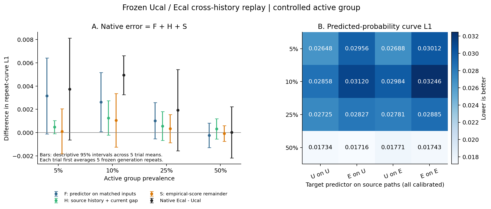
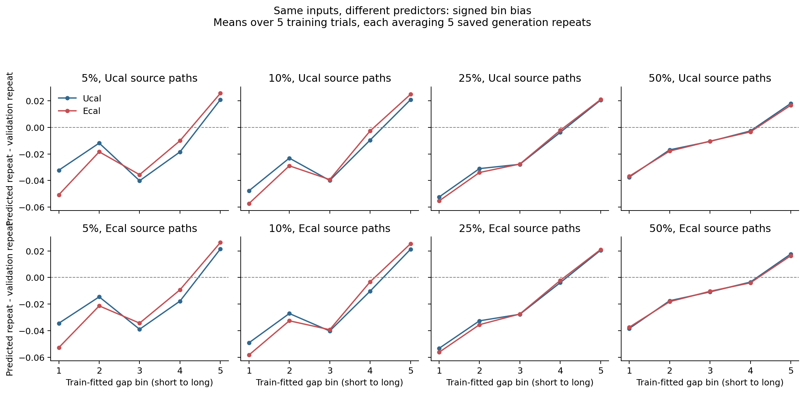

# CS-SAF: 보정된 U/E의 동일 이력 교차 평가

2026-09-20 · `research/cs-saf` · 400개 저장 경로 / 800회 예측 평가 완료

**같은 생성 이력과 현재 간격을 넣어도, E+보정의 반복확률 곡선 오차가 U+보정보다 5%·10%·25%에서 반복해서 컸다. 생성 이력이 달라진 효과만으로는 앞선 생성 품질 차이를 설명할 수 없다.** 다만 5%·25%의 학습 시드 간 참고 구간은 0을 포함하며, 50%에서는 같은 방향이 아니었다. 유일한 원인이나 모든 조건의 확정적 열세를 입증한 결과는 아니다.

[사전등록](calibrated_replay_v1_preregistration.md) · [전체 통계](calibrated_replay_v1_result.json) · [전체 스칼라 CSV](calibrated_replay_v1_scalars.csv) · [전체 bin CSV](calibrated_replay_v1_bins.csv) · [교수님 보고용](professor_brief_calibrated_replay_2026_09_20.md)

## 1. 연구 목표와 이번 질문

희소 집단에서도 필요한 간격–행동 관계를 보존하면서 비활성 집단의 가짜 반응을 줄이는 것이 연구 목표다. U도 과거 이력을 쓰며, E는 반복확률 계산부에 추가 이력 보정을 넣은 구조다. E의 조건부 예측 이점은 남아 있지만, 같은 확률 보정을 적용한 U보다 실제 생성 관계를 잘 재현한다는 기여는 입증되지 않았다.

직전 실험에서 생성 난수를 다섯 번 바꿔도 세 비율의 생성 오차 차이가 반복됐다. 이번에는 **입력 이력을 같게 했을 때도 두 모델의 차이가 남는가**를 확인했다. 2026-09-17의 U/E/L003 교차 진단을 보정된 U/E와 최신 전체 생성 경로로 확장한 것이다. 과거 진단을 처음 수행한 것처럼 설명하지 않는다.

- 관측 집단 비율 5/10/25/50%, κ=0/1, 학습 시드 5개, 생성 난수 5개를 전부 사용했다.
- 저장된 Ucal/Ecal 모델 상태 80개와 각 2,048개 거래열을 담은 생성 경로 400개를 그대로 사용했다. 두 모델이 모든 경로를 평가해 **800회·1,638,400회 거래열 재평가**다.
- 모델·보정값·집단/길이/순서·생성 배열을 고정했다. 새 학습, 새 보정 적합, 새 생성은 모두 0회다.
- 같은 source 경로에 대해 실제 과거 간격·행동·수치값과 현재 간격을 두 모델에 똑같이 넣었다. 각 모델의 encoder로 이력을 다시 계산했으며, 서로의 hidden state를 넘긴 것이 아니다.
- 생성된 첫 거래도 다음 이력에 포함했다. 첫 거래 자체는 반복률 평가에서 제외했다. fresh 경로에서 우연히 행동이 반복되는 확률까지 포함했다.

## 2. 같은 입력에서도 차이가 남는가

다음 표는 모델의 **예측 반복확률을 간격 구간별로 평균한 곡선**이 실제 validation 반복곡선과 얼마나 다른지 보여준다. 낮을수록 좋다. 행마다 같은 source를 쓰는 두 열이 직접적인 동일 입력 비교다. 이 값은 실제 생성 행동으로 계산한 이전 L1과 다른 평가량이다.

| 집단 비율 | U 이력 → U 예측 | U 이력 → E 예측 | E 이력 → U 예측 | E 이력 → E 예측 |
|---|---:|---:|---:|---:|
| 5% | 0.026484 | 0.029564 | 0.026884 | 0.030117 |
| 10% | 0.028583 | 0.031199 | 0.029836 | 0.032459 |
| 25% | 0.027253 | 0.028266 | 0.027810 | 0.028847 |
| 50% | 0.017339 | 0.017157 | 0.017715 | 0.017428 |

표의 U/E는 모두 보정된 모델이다. 5%·10%·25%에서는 **U가 생성한 이력을 공통으로 써도, E가 생성한 이력을 공통으로 써도 E의 평균 오차가 더 크다.** 두 방향 모두 각각 4/5 학습 시드에서 같은 부호다. 50%에서는 평균적으로 E가 조금 더 낮지만 시드 방향이 섞여 있다.

## 3. 실제 생성 오차와 어떻게 연결되는가

C[예측기, 이력 source]를 위 표의 곡선 오차, L[source]를 직전 실험의 실제 생성 반복곡선 오차라 하면:

```text
F = ((C[E,E] - C[U,E]) + (C[E,U] - C[U,U])) / 2
H = ((C[E,E] - C[E,U]) + (C[U,E] - C[U,U])) / 2
S = (L[E] - C[E,E]) - (L[U] - C[U,U])
L[E] - L[U] = F + H + S
```

- **F — 같은 입력에서 예측기를 바꾼 차이:** 두 종류의 source에서 측정한 예측기 차이의 대칭 평균.
- **H — 입력 경로의 구성 차이:** 예측기를 고정하고 U/E source를 바꾼 차이. 과거 행동뿐 아니라 과거 간격·수치값과 현재 간격 구성도 포함한다.
- **S — 실제 생성 행동과 예측확률 집계 사이의 잔여 차이:** 행동 표본과 비선형 절댓값 평가의 영향이 포함된다. 독립적인 평균 0의 잡음이나 분산 비율이 아니다.

| 집단 비율 | 예측기 차이 F | 경로 구성 차이 H | 잔여 차이 S | 실제 생성 오차 E−U |
|---|---:|---:|---:|---:|
| 5% | +0.003157 | +0.000476 | +0.000108 | +0.003740 |
| 10% | +0.002620 | +0.001257 | +0.001065 | +0.004941 |
| 25% | +0.001024 | +0.000569 | +0.000339 | +0.001932 |
| 50% | -0.000234 | +0.000323 | -0.000071 | +0.000019 |

각 학습 시드에서 생성 난수 5개의 값을 먼저 평균하고, 그다음 학습 시드 5개를 평균했다. 각 경로·시드에서 항등식이 성립하며, 표에는 반올림 오차가 있다. **직전 실험의 25개 개별 차이와 이번 복원값은 각 비율에서 모두 정확히 일치했다.**

F는 5%·10%·25%에서 평균 +.001 이상, 같은 부호 4/5 시드라는 등록 기준을 충족했다. 따라서 세 비율 이상이라는 전체 일관성 기준도 충족했다. H와 S는 10%에서만 이 기준에 해당했으며 전체 기준은 충족하지 못했다. **H가 0이거나 이력 피드백이 무관하다는 뜻은 아니다.** 10%에서는 H와 S도 각각 약 +.0013과 +.0011이다.

| 비율 | F가 양수인 학습 시드 | 학습 시드 간 참고 95% 구간 | 고정 모델에서 생성 난수만의 95% 구간 |
|---|---:|---|---|
| 5% | 4/5 | [-0.000108, +0.006421] | [+0.002516, +0.003797] |
| 10% | 4/5 | [+0.000080, +0.005159] | [+0.002242, +0.002997] |
| 25% | 4/5 | [-0.000541, +0.002590] | [+0.000854, +0.001195] |
| 50% | 2/5 | [-0.001287, +0.000819] | [-0.000324, -0.000144] |

5%·25%의 학습 시드 간 구간은 0을 포함한다. 25%의 F=.001024는 등록한 .001 기준을 조금 넘는 수준이다. 이를 강한 확증적 발견이라고 포장하지 않는다. 50%의 F 평균은 음수이며, 이 방향도 학습 시드 일반화가 확정된 것은 아니다. 생성 난수만의 구간은 현재 모델·계획을 고정한 조건부 불확실성이므로 학습 시드 간 구간을 대체하지 않는다.



이 분해는 산술적 진단이다. **F는 두 학습 모델의 모든 가중치·보정값 차이를 포함하므로 추가 계수 32개만의 인과 효과가 아니다.** H도 source의 공동 분포를 바꾼 결과이지 mark 피드백만의 인과 효과가 아니다. C는 예측확률 평균곡선의 오차이며, '다시 행동을 생성했을 때의 L1의 기대값'과 같지 않다. F/H/S를 원인별 비율로 환산하지 않는다.

## 4. 어떤 구간에서 차이가 생겼는가



동일 U 생성 이력을 쓰는 5% 조건에서, 가장 짧은 gap 구간의 기준 대비 편향은 Ucal −.032220, Ecal −.050716이다. 가장 긴 구간은 Ucal +.020934, Ecal +.025687이다. **이미 짧은 간격에서 반복을 적게 예측하고 긴 간격에서 많이 예측하는 편향이 있는데, E는 양 끝 구간에서 그 편향을 더 키웠다.** E source를 써도, 10%·25% 조건에서도 양 끝 구간의 평균 방향이 같다.

그러나 중간 구간에서는 E가 오차를 줄인 곳도 있다. 50%에서는 가장 짧은/긴 구간의 평균 편향을 E가 줄인다. 'E가 모든 gap에서 나쁘다'거나 '이력을 더 쓰면 항상 해롭다'는 결론이 아니다. 그림의 bin 평균 차이는 동일한 개별 이력에서 gap만 개입한 반응과도 구별해야 한다.

전체 행동 분포의 같은 입력상 TV도 보존했다. 다음 값은 두 모델 사이의 차이이며 정답에 대한 정확도는 아니다.

| 비율 | U 이력의 행동분포 TV | U 이력의 반복확률 절대차 | E 이력의 행동분포 TV | E 이력의 반복확률 절대차 |
|---|---:|---:|---:|---:|
| 5% | 0.026810 | 0.024734 | 0.026795 | 0.024717 |
| 10% | 0.027050 | 0.022229 | 0.027135 | 0.022308 |
| 25% | 0.017672 | 0.014767 | 0.017741 | 0.014847 |
| 50% | 0.014207 | 0.010644 | 0.014184 | 0.010574 |

이 차이가 0이 아니어도 어느 쪽이 개별 사건의 정답 분포에 더 가까운지는 이 표만으로 판단할 수 없다. 기존 실제 이력에서의 조건부 TV 개선과 이번 생성 이력에서의 집계 곡선 오차 악화가 함께 나타날 수 있다. 이력 분포와 평가량이 모두 다르기 때문이다. 초기/중기/후기 단계별 결과도 전체 CSV에 포함했다. TV가 후기로 갈수록 일률적으로 커지는 결과로 해석하지 않는다.

비활성 조건도 빠짐없이 확인했다. F/H는 혼합된 부호이고, 평균 절댓값은 아래 범위에서 작았다. 이는 두 모델 사이의 차이에 대한 결과이지 두 모델이 각각 완벽한 비활성 생성기를 뜻하지 않는다.

| 비율 | κ/context | F | H | 실제 생성 오차 E−U |
|---|---|---:|---:|---:|
| 5% | 0/0 | +0.000019 | +0.000164 | -0.000093 |
| 5% | 0/1 | -0.000315 | -0.000170 | +0.000855 |
| 5% | 1/0 | +0.000069 | -0.000026 | +0.000116 |
| 10% | 0/0 | +0.000035 | +0.000078 | -0.000065 |
| 10% | 0/1 | +0.000147 | -0.000324 | -0.000362 |
| 10% | 1/0 | -0.000046 | +0.000208 | -0.000142 |
| 25% | 0/0 | +0.000086 | +0.000271 | +0.000073 |
| 25% | 0/1 | +0.000101 | -0.000096 | +0.000493 |
| 25% | 1/0 | -0.000082 | -0.000069 | +0.000235 |
| 50% | 0/0 | -0.000087 | -0.000120 | -0.000381 |
| 50% | 0/1 | +0.000105 | -0.000065 | -0.000579 |
| 50% | 1/0 | +0.000351 | +0.000213 | +0.000788 |

## 5. 무엇을 수정 대상으로 삼을 것인가

**생성 이력의 분포가 달라졌다는 설명만으로 넘어갈 수 없고, 생성된 동일 입력에서의 반복확률 곡선 보정이 우선 수정 대상이다.** 그렇다고 이 진단만으로 encoder가 정상이고 반복 head만 고장났다고 판정하지 않는다. 공통된 이력 오류가 두 source에 함께 존재할 수도 있다.

다음 후보로는, 모델 전체를 재학습하기 전에 **현재 gap 구간에 따른 제한된 추가 확률 보정**을 U/E에 똑같이 적용하는 비교가 적절하다. 지금의 집단별 두 계수 보정 뒤에도 짧은/긴 구간의 반대 방향 편향이 남으므로 이를 검증할 구체적인 근거가 생겼다. 학습 데이터의 관측 행동 반복만 사용하고, 두 모델의 보정 용량·적합 예산·규제 선택 절차를 같게 해야 한다. 이번 그림이나 validation의 편향 값을 그대로 보정 정답으로 넣어서는 안 된다. 구간별 보정은 비활성 반응을 새로 키울 수 있으므로 해당 비용도 함께 평가해야 한다.

이것은 **제안이며 아직 사전등록·실행하지 않았다.** 고정된 한 가지 후보와 기존 Ucal/Ecal 대조군을 두고, 실제 생성 오차·조건부 정확도·비활성 반응을 함께 확인해야 한다. 새로운 데이터 생성 시드와 학습 시드의 확인 단계도 미리 분리해야 한다. 간격별 보정만의 개선은 범용 보정의 기여이며, E의 추가 구조 기여는 **같은 보정을 받은 U와의 차이**로 따로 입증해야 한다.

그 제한된 수정에서도 E가 같은 보정의 U보다 낫지 않다면, 현 E 구조의 생성 우수성 주장을 고수하지 않고 더 단순한 U 기반 방법 또는 학습 목표 변경으로 방향을 정해야 한다. 모델 구조·계수·평가 지표를 계속 바꾸어 성공한 조건만 고르는 방식으로 진행하지 않는다. 기존 ER 실패와 이전 보정 결과는 그대로 남긴다.

## 6. 기여 주장의 범위와 선행연구

**문제 정의:** 관측 가능한 집단과 과거 거래 이력을 조건으로 새 거래열을 생성할 때, 필요한 거래 간격–행동 관계는 유지하고 관계가 없는 집단의 가짜 반응은 억제할 수 있는가? 특히 집단 비율이 작아져도 이 선택성과 실제 생성 품질이 함께 유지되는가?

**구조의 의미:** U도 이미 과거 이력을 이용하는 순차 생성기다. E는 같은 계열의 모델에서 반복확률 계산부에 이력 보정 계수 32개를 추가했다. 두 모델에 동일한 형식의 확률 보정을 적용한 뒤 남는 차이를 비교하므로, 이번 결과를 단순 보정의 효과나 '과거 이력을 처음 사용한 효과'라고 설명하지 않는다. U와 E는 별도로 학습된 가중치를 가지므로, 교차 평가의 예측기 차이를 그 32개 계수만의 인과 효과로도 볼 수 없다.

**기여 후보:** 필요한 관계의 조건부 정확도·비활성 반응·실제 생성 관계를 함께 평가하고, 관계 보존과 반응 억제의 비용을 분리해 보완하는 방법이다. 현재 확보한 것은 이 목표를 검증하는 대조 실험과 실패 양상의 재현이다. 이 진단만으로 새로운 우수한 생성 방법이나 독창성이 입증됐다고 주장하지 않는다.

학습 때의 실제 이력과 생성 때의 자기 이력 차이는 [Professor Forcing (NeurIPS 2016)](https://arxiv.org/abs/1610.09038)에서도 다뤘고, 시간에 따른 관계를 보존하는 생성 목표는 [TimeGAN (NeurIPS 2019)](https://proceedings.neurips.cc/paper/2019/hash/c9efe5f26cd17ba6216bbe2a7d26d490-Abstract.html)에서도 다뤘다. 따라서 이 일반적인 문제 자체를 새 기여로 삼지 않는다. 현재 연구의 차별화 후보는 집단별 gap–행동 관계의 선택성과 생성까지의 보존이며, 이를 해결하는 구체적 방법과 공정한 비교 증거가 더 필요하다. 위 두 문헌 확인은 모든 관련 연구를 망라한 독창성 검증이 아니다.

원래 거래 행동–사기 관계와 탐지 효용의 검증은 이 통제된 gap–행동 연구의 다음 적용 단계다. 지금 얻은 생성 오차나 비활성 반응을 실제 사기 탐지 성능으로 바꾸어 표현하지 않는다.

## 7. 검증·재현·한계

- 사전등록 커밋 `5f3c745`, 모든 교차 평가 실행 소스 `035473d967d66e9aeff886aaac7dba7aa25a54c6`. CPU 테스트 6개, 같은 소스 CPU/GPU gate 모두 통과했다.
- 현재 행동/수치값 및 미래 정보 누출 방지, 같은 모델의 TV=0, 배치 크기 변경의 일치, copy+fresh 관측 반복확률, 단계별/prefix 계산과의 일치를 확인했다.
- CPU/GPU 최대 차이 2.543e-7; 전체 실행의 단계별 검증 최대 차이 3.688e-7; 반복확률 공식과 범주 확률 최대 차이 2.980e-7. 등록 허용값 3e-6 이내다.
- 저장 경로 400개와 모델·보정값의 불변을 확인했다. 원시 예측 배열로 **native L1 1,200개, 예측확률 곡선 L1 2,400개, 분해 600개**를 별도 코드로 재계산했다. 최대 차이 3.469e-18, 이전 반복 실험의 개별 주 대비 복원 차이는 0이다.
- 모든 source/group의 스칼라 행 1,200개, bin 행 6,000개와 단계별 결과를 Git에 저장한다. 원시 경로·예측 배열·checkpoint는 워크스테이션 `artifacts/cs_saf/calibrated_replay_v1/` 및 부모 실험 경로에 보존한다.
- GPU 0에서 작업 하나를 낮은 우선순위·20% allocator 한도로 실행했다. 전체 GPU 평가는 약 175초에 끝났고 기술적 실패·재시도는 0회다. 종료 후 기존 idle MPS 외 이번 작업이 남지 않았음을 확인했다.
- 기존 인공 데이터 seed42, validation, 모델과 생성 경로를 재사용했다. 새 데이터·학습 시드, test, 실데이터, 추가 외부 baseline 실행은 없다. 다섯 생성 반복을 다섯 새 학습 모델처럼 세지 않았다.
- 고정된 2,048개 표본 크기의 비선형 지표 편향과 validation 표본 불확실성을 제거하지 않았다. source 이력은 상대 모델에서 드문 입력일 수 있다. 네 비율은 독립 데이터 복제가 아니다. 현재 진단이 연구 전체의 독창성·외부 baseline 우수성·사기 탐지 효용을 증명하지 않는다.

최신 코드는 `research/cs-saf` 브랜치에 누적하며 `main`으로 자동 병합하지 않는다.
