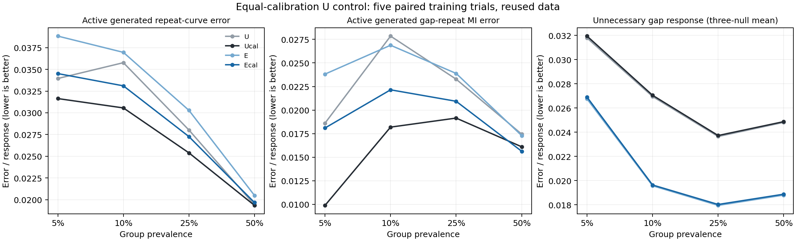
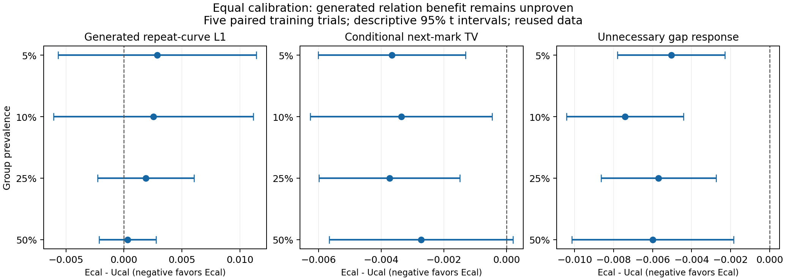

# CS-SAF: 기준 U에도 같은 보정을 적용한 비교

2026-09-20 · `research/cs-saf` · **40개 보정 및 검증 완료, GPU 실행 종료**

**추가 이력 구조 E의 조건부 예측·불필요한 반응 억제 이점은 남았다. 그러나 같은 보정을 받은 U보다 생성 반복관계를 더 정확히 재현한다는 근거는 나오지 않았다. 보정의 개선을 E 구조만의 기여로 설명해서는 안 된다.**

[사전등록](calibration_u_control_v1_preregistration.md) · [모든 시드·대조·보정 계수·검증 수치](calibration_u_control_v1_result.json) · [짧은 보고](professor_brief_calibration_u_2026_09_20.md)

## 1. 이번에 분리한 질문

U도 과거 거래 이력을 사용하는 순차 생성 모델이다. E는 U의 행동 반복확률 계산부에 추가 이력 보정을 넣은 구조다. 이전 실험은 E에 확률 보정을 추가했으므로, 그 개선이 U에도 가능한 일반 보정 효과인지 구분하지 못했다. 이번에는 **U / U+보정 / E / E+보정**을 동일 조건에서 비교했다.

`과거 이력·현재 gap → 원래 모델의 copy logit z → 집단별 a+bz → 행동 생성 → 다음 이력`

`q′=sigmoid(a_s+b_s z)`, `b_s>0`이며 실제 반복확률은 `R′=q′+(1−q′)f(직전 행동)`이다. 새 행동 분포에서 우연히 같은 행동이 나오는 경우까지 포함했다. 관측 집단당 a,b 두 개, 총 네 값만 같은 관측 반복 NLL로 적합했다. U에 E의 이력 파라미터를 추가하지 않았고 모든 기존 신경망 가중치는 고정했다. 첫 행동도 변경하지 않았다.

- 집단 비율 **5/10/25/50% × 관계 활성/비활성 두 조건 × 기존 학습 시드 5개**.
- U 보정 **40개 추가**, 신경망 재학습 **0회**. U/E/E+보정 **120개 기존 결과**는 무결성을 검증해 재사용했다.
- E 보정과 **같은 학습 전이 전체, 목적함수, 최적화 방법·초기값·범위, 수치 설정**을 사용했다. 정답 법칙·평가 데이터·활성 여부를 보정 목표에 넣지 않았다.
- 각 조건에서 같은 길이·집단 구성의 **2,048개 거래열**과 같은 생성 난수를 사용했다. 간격·행동·수치값 모두 순차 생성했다. 원래 가중치를 고정해도 새 행동이 다음 이력을 바꾸므로 미래 간격·수치값은 달라질 수 있다.
- 기존 데이터 생성 시드 42와 validation을 재사용했다. **독립 데이터 재검증이나 실제 사기 탐지 실험은 아니다.** 한 학습 시드당 생성 난수 묶음도 하나다.

## 2. 일반 보정은 U에서도 작동했지만, E의 생성 우위는 확인되지 않았다

아래는 활성 집단에서 생성된 **간격별 행동 반복률의 L1 오차**다. 작을수록 실제 반복관계와 가깝다. 각 값은 다섯 학습 시드의 평균이다.

| 집단 비율 | U | U+보정 | E | E+보정 |
|---|---:|---:|---:|---:|
| 5% | 0.033951 | 0.031640 | 0.038831 | 0.034517 |
| 10% | 0.035771 | 0.030563 | 0.036959 | 0.033105 |
| 25% | 0.028020 | 0.025389 | 0.030285 | 0.027262 |
| 50% | 0.019398 | 0.019344 | 0.020487 | 0.019670 |

**U+보정 − U:** 평균 생성 오차는 네 비율 모두 줄었다. 감소율은 6.8%, 14.6%, 9.4%, 0.3%이며, 개선 시드는 3/5, 4/5, 4/5, 3/5다. MI 오차는 네 비율 각각 5/5 시드에서 줄었다. 따라서 보정으로 줄일 수 있는 오차는 E에만 존재한 것이 아니다. 다만 U 보정도 주 지표 일관성 기준을 통과하지 못했다.

**E+보정 − U+보정:** 같은 보정을 받은 모델끼리의 핵심 비교다. 양수는 E 쪽의 생성 오차가 더 크다는 뜻이다.

| 집단 비율 | L1 차이 | E+보정이 나은 시드 | 참고 95% 구간 |
|---|---:|---:|---|
| 5% | +0.002877 | 1/5 | [-0.005659, +0.011413] |
| 10% | +0.002542 | 3/5 | [-0.006058, +0.011141] |
| 25% | +0.001873 | 1/5 | [-0.002281, +0.006027] |
| 50% | +0.000326 | 3/5 | [-0.002129, +0.002781] |

E+보정의 평균 L1은 U+보정보다 각각 9.1%, 8.3%, 7.4%, 1.7% 컸다. **추가 이력 구조가 생성 관계를 개선한다는 주장은 지지되지 않았다.** 다만 네 구간 모두 0을 포함하므로, 반대로 U+보정의 일관된 우월성이나 두 모델의 동등성이 입증됐다고 할 수도 없다.

사전등록 기준은 네 비율 중 최소 세 비율에서 **평균 개선과 4/5 이상 시드 개선**이었다. E+보정 대 U+보정은 해당 비율이 **0개**, U 보정 자체는 **10%·25% 두 개**다. 둘 다 기준 미충족이다. 이 기준은 탐색 단계의 일관성 판단이며 실제 응용에서 정당화한 허용 오차가 아니다. 기존 ER 실패 판정도 유지한다.

참고 구간은 같은 데이터의 다섯 학습 시드 차이에 대한 기술적 t 구간이며 다중 비교를 보정하지 않았다. 네 비율은 같은 기반 데이터를 공유하므로 독립적인 20회 재현으로 세지 않는다.

## 3. E에 남는 이점과 비용을 함께 봐야 한다

조건부 예측은 **실제 과거 이력이 주어졌을 때 다음 행동 분포를 얼마나 정확히 맞히는가**를 묻는다. 위 생성 L1은 **스스로 만든 이력을 계속 이어갔을 때 전체 반복관계를 재현하는가**를 묻는다. 평가 대상이 다르다.

| 집단 비율 | U+보정 조건부 TV | E+보정 조건부 TV | U+보정 비활성 반응 | E+보정 비활성 반응 |
|---|---:|---:|---:|---:|
| 5% | 0.076456 | 0.072796 | 0.031943 | 0.026899 |
| 10% | 0.070367 | 0.067009 | 0.027051 | 0.019641 |
| 25% | 0.066942 | 0.063208 | 0.023728 | 0.018031 |
| 50% | 0.065232 | 0.062511 | 0.024874 | 0.018881 |

모두 작을수록 좋다. E+보정은 U+보정보다 **조건부 TV와 비활성 copy/repeat 반응이 네 비율 각각 5/5 시드에서 작았다.** 조건부 TV의 참고 구간은 50%에서 0을 포함한다. 비활성 반응은 관계가 없는 세 조건을 동일 가중한 확률 반응 폭이며 **사기 탐지 오탐률이 아니다.**

따라서 E는 무의미한 모델로 판정된 것이 아니라, **조건부 정확도·불필요한 반응 억제의 이점이 생성 반복관계의 개선으로 이어지지 않은 모델**이다. 이 차이를 서로 다른 지표의 임의 총점으로 상쇄하지 않았다.

다른 생성 지표도 모두 같은 방향은 아니다. E+보정의 MI 오차는 U+보정 대비 5/10/25%에서 평균적으로 크고, 50%에서는 작다. 행동 전이 TV도 5/10/25%에서 크고 50%에서는 작다. 간격·수치값 분포 및 자기상관을 포함한 모든 기존 지표와 각 시드 차이는 수치 파일에 보존했다. U 보정 자체도 비활성 반응과 행동 전이 TV의 평균을 네 비율 모두 조금 늘렸다.

| 집단 비율 | E+보정−U+보정 MI 오차 | 개선 시드 | E+보정−U+보정 행동 전이 TV | 개선 시드 |
|---|---:|---:|---:|---:|
| 5% | +0.008211 | 0/5 | +0.001783 | 1/5 |
| 10% | +0.003958 | 1/5 | +0.001737 | 1/5 |
| 25% | +0.001782 | 2/5 | +0.002024 | 0/5 |
| 50% | -0.000473 | 3/5 | -0.000334 | 2/5 |

그림은 평균이며 시드 불확실성은 위 표와 수치 파일을 함께 봐야 한다.

각 점은 E+보정−U+보정의 평균, 선은 다섯 시드의 참고 95% 구간이다. 왼쪽은 E의 평균 생성 오차 비용, 가운데·오른쪽은 조건부 정확도·비활성 반응의 이점이다.

## 4. 보정과 구조의 결합 효과

`(E+보정−E)−(U+보정−U)`도 계산했다. 음수이면 해당 지표에서 보정에 따른 감소폭이 E에서 더 크다는 뜻이며, E+보정이 U+보정보다 좋다는 뜻은 아니다.

| 집단 비율 | 생성 L1 결합 효과 | 음수 시드 | 참고 95% 구간 |
|---|---:|---:|---|
| 5% | -0.002003 | 2/5 | [-0.014592, +0.010587] |
| 10% | +0.001353 | 2/5 | [-0.005228, +0.007934] |
| 25% | -0.000392 | 3/5 | [-0.002548, +0.001765] |
| 50% | -0.000763 | 4/5 | [-0.002508, +0.000983] |

L1 결합 효과의 방향은 비율·시드에 따라 섞였고 네 구간 모두 0을 포함했다. 추가 이력 구조가 보정의 생성 효과를 일관되게 강화한다는 근거도 부족하다.

## 5. 현재 결론과 다음 실험

1. **이번에 확인한 기여와 확인하지 못한 기여를 분리한다.** 동일 보정 후에도 E의 조건부 예측·비활성 반응 이점은 남았다. 생성 반복관계 우위는 확인되지 않았다. 보정 효과를 E만의 새로운 기여로 제시하지 않는다.

2. **다음 우선순위는 구조를 더 바꾸기 전에 생성 난수의 영향을 분리하는 것이다.** U/U+보정/E/E+보정과 학습된 계수·지표를 그대로 고정하고, 사전에 정한 복수의 새 생성 난수에서 같은 구성의 거래열을 반복 생성하는 실험을 별도 등록한다. 학습 시드 내부의 생성 변동과 학습 시드 사이의 차이를 나눠 보고, 생성 반복을 독립 학습 시드처럼 세지 않는다. 이번에는 한 생성 난수만 사용했으므로 현재 L1 차이가 얼마나 안정적인지 아직 분리하지 못했다. **이 다음 실험은 제안이며 아직 등록·실행하지 않았다.**

3. **그 결과에 따라 후속 범위를 제한한다.** 생성 차이가 반복되면 E의 조건부 이점이 이어지지 않는 부분을 gap–mark의 공동 생성과 이력 분포 측면에서 진단하고, 변경 하나와 대조군을 고정한다. 현재 결과만으로 mark 이력 피드백을 유일한 원인으로 단정하지 않는다. 반복된 생성 평가에서 목적에 맞는 후보가 보이면 새로운 데이터 생성 시드·학습 시드로 독립 검증한다. 이후 동등한 예산의 외부 순차 baseline 및 실제 행동–사기 관계·탐지 효용으로 연결한다. 지금은 최종 모델이나 학회 수준 우수성을 확정할 단계가 아니다.

## 6. 실행·검증·저장

- 사전등록 커밋 `de011db`; 모델·실행 소스 `c39313fd67424dfc7da2e8072b90cf9e4c0e2f96`. 등록 후 40개 모두 동일 소스로 실행했으며 기술적 실패·재시도는 없었다. 결과 정리와 추가 검증 코드는 실행 후 별도로 저장했다.
- CPU 테스트 10개 통과, CUDA 대상 2개는 CPU 실행에서 제외. U 전용 GPU 환경 테스트 3개 통과. 동일 소스 CPU/GPU gate에서 원래 U와 보정 전 예측·생성의 정확한 동일성, 결정적 적합, 가중치 동결, 저장·재적재를 검증했다.
- 40개 원래 모델 가중치 불변, 80개 집단별 관측 반복 NLL, 80개 조건부 평가 배열 집계, 40개 생성 계획을 검증했다. 최적화 경계 도달 0개, 모든 적합 수렴.
- U/E 보정의 관측 타깃·전이 순서·학습 개체·생성 계획·수치 설정이 40쌍 모두 일치했다. 기존 결과의 해시도 보존됐다.
- **480개 평가 집단의 L1·MI, 총 960개 값**을 저장된 간격·행동 배열에서 독립 재계산했으며 최대 차이는 **0**이었다. 전체 정밀도 응답 검증도 40개 모두 통과했다.
- 비어 있던 GPU 0·1만 사용했고 종료 후 기존 대기 프로세스 상태로 돌아왔다. 다른 작업을 종료하지 않았다.
- 원시 모델·생성 배열·검증 기록은 워크스테이션의 `artifacts/cs_saf/calibration_u_control_v1/`에 보관한다. Git은 구현·등록·수치 요약·보정 계수·그림·보고서를 저장하며 전체 checkpoint 백업은 아니다. `main`으로 병합하지 않는다.
