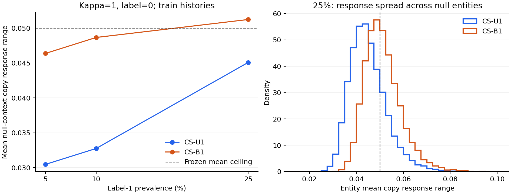

# CS-SAF v1 checkpoint 원인 분석 — 2026-09-16

**확인한 실패 형태는 history마다 달라지는 불필요한 gap 반응이다.**
Train에서도 재현되며, 소수 entity나 극단 gap만으로 설명되지 않는다.
현재 구조의 공유 bilinear 경로가 집단 간 영향을 전달하는 국소 경로는
확인했지만, 과거 학습 실패의 원인을 이것 하나로 확정하지는 못했다.

이 근거로 **집단별 bilinear 경로를 분리하되 총 파라미터 수를 유지하는
CS-SAF v2 후보 하나를 사전 등록**했다. [별도 등록 문서](revision_v2_preregistration.md)를
참조한다. V2는 아직 구현·학습하지 않았고 v1의 FAIL 판정은 유지한다.

## 실행과 정보 경계

- 원격 워크스테이션에서 기존 최적 checkpoint **12개 모두** 분석했다:
  pi=.05/.10/.25 × kappa=0/1 × U1/B1.
- 각 조건의 train entity 31,951개, nonfirst transition 734,984개를
  사용했다. 기존 checkpoint의 tensorizer를 재사용했으며 재학습하지 않았다.
- 새 validation/test 행은 읽지 않았다. Train/validation 혼합 tensor cache를
  불러오는 대신 Parquet에서 train entity 행만 필터링했다. 기존 validation
  결과 숫자는 이미 공개된 v1 보고서에서 비교 목적으로만 사용했다.
- 실현된 oracle latent는 읽지 않았다. 새 fit **0회**, optimizer step **0회**.
- 분석 전후 12개 checkpoint의 파일 해시와 모델 tensor digest가 동일했다.
  추가로 결과 기록 시 checkpoint·분석 배열 **24개 해시**를 재검증했다.
- 분석 코드와 범위는 실행 전에 `d96e1b4966f9fec018aee472a26be579ab9a4d1c`로
  고정했다. 이는 실패를 본 뒤 설계한 탐색적 분석이지 독립 확증 실험은 아니다.
- 진단과 관련 모델 테스트 **16개 통과**. 진단 테스트 3개는 gradient 수식,
  수치 미분, 서로 다른 sequence 길이와 batch의 집계 일관성을 검사한다.

전체 수치: [원 분석 JSON](checkpoint_forensics_v1_result.json),
[동일 entity 비교 JSON](checkpoint_forensics_v1_comparison.json).
실행 범위: [사전 고정한 진단 계약](checkpoint_forensics_v1_contract.md).

## 1. Validation만의 현상인가?

아니다. 문제가 된 kappa=1/label=0의 평균 copy 반응은 다음과 같다.
아래 train 값은 이번에 계산했고 validation 값은 기존 pilot 기록이다.

| 비율 | U1 train | B1 train | B1 기존 validation | B1 > U1인 train entity 비율 |
|---|---:|---:|---:|---:|
| 5% | 0.030472 | 0.046377 | 0.046383 | 99.98% |
| 10% | 0.032754 | 0.048665 | 0.048660 | 99.92% |
| 25% | 0.045083 | 0.051240 | 0.051167 | 92.88% |

같은 entity를 두 모델에서 대응시켜 비교했다. 모든 history를 동일하게
가중한 값이 아니라, entity 내부 평균 후 entity 간 평균을 사용했다.
Train과 validation 반응이 비슷하다는 사실은 이 반응의 존재가 단순한
validation 표본 이상 현상이라는 설명을 약화시킨다. 예측 정확도가 같거나
과적합이 없다는 뜻은 아니다.



왼쪽 점선은 원래 평균 반응 기준 0.05다. 오른쪽은 개별 entity의 평균 반응
분포이며, entity별 0.05 초과 비율 자체가 원래 pilot 판정 기준은 아니다.

## 2. 소수 entity, 초반 history 또는 극단 gap 때문인가?

25%/kappa=1/B1의 null 집단에서:

- 평균 0.051240, 중앙값 **0.050248**, 10/90 분위수 0.042392/0.061267.
- Entity의 **51.36%**가 개별 평균 0.05 초과. U1에서는 23.13%다.
- 관측 gap의 중앙 10–90% mass에 해당하는 bin 3–27만 사용하면 0.045342.
  원래 반응의 **88.49%**가 남는다. Tail 제거 시 기준 아래로 내려가지만,
  이것으로 full-support FAIL을 면제하거나 기준을 바꾸지 않는다.
- Event index 1–4 / 5–8 / 9–16 / 17–31의 transition 평균 copy 반응은
  **0.053264 / 0.051214 / 0.050623 / 0.050675**다. 첫 구간에만 국한되지 않는다.
- Null 집단의 31개 gap bin 모두 train 관측을 갖는다. Bin별 관측 수는
  15,346–18,937이다. 다만 집단 전체의 빈도만으로 각 history에서의 조건부
  coverage가 충분하다고 단정할 수는 없다.

History별 반응의 평균은 0.051240이지만, history를 먼저 평균한 곡선의
반응 범위는 **0.013695**에 불과하다. History별 곡선 방향이 상쇄되므로
집단 평균 곡선만 그리면 실패 규모를 과소평가한다. 이는 반응 집계 순서를
유지해야 하는 직접적인 이유이며, 새로운 모델 우위나 일반적 dilution
이론을 입증한 결과는 아니다.

## 3. Copy 경로인가, fresh-mark 항인가?

현재 구조에서 fresh-mark 분포는 history/static만 받고 현재 gap을 받지 않는다.
따라서 같은 history에서는 정확히

```text
range(p_repeat) = (1 - p_new(previous)) * range(q_copy)
```

이다. 전체 분석에서 이 식의 최대 수치 오차는 **1.20e-7 이하**였다.
25% null 집단의 평균 `p_new(previous)`는 U1 0.016262, B1 0.016812였다.
Fresh-mark 항은 반응을 조금 줄이며, 현재-gap 반응을 새로 만들어내지 않는다.

같은 집단의 bilinear interaction logit 범위는 U1 **0.293939**, B1
**0.335742**였다. Base logit은 현재 gap에 대해 상수이므로 logit의 gap
변동 자체는 bilinear 경로에 있다. 다만 최종 확률 범위는 base logit과
sigmoid 위치에도 영향을 받으므로 이 숫자만으로 U1/B1의 전체 차이를
단일 항에 인과적으로 배분하지 않는다.

## 4. Balanced 보조 손실은 무엇을 바꾸는가?

직접 bilinear 파라미터에 대해서는 mark NLL과 observable-repeat BCE의
gradient가 같다. Nonrepeat일 때 fresh category를 고르는 추가 손실은
그 파라미터와 무관하기 때문이다. 테스트에서 이 identity를 검증했다.

전체 train event 수를 E, 집단 y의 nonfirst transition 수를 T_y라 하면,
global base mark NLL의 집단별 conditional repeat-gradient 계수는 T_y/E다.
B1에서는 balanced 보조 손실로 **1/2가 더해진다**.

25% 조건의 계수는 다음과 같다.

| 집단 | U1 global 계수 | B1 global 계수 |
|---|---:|---:|
| label=0 | 0.720010 | 1.220010 |
| label=1 | 0.238329 | 0.738329 |

따라서 집단 비중뿐 아니라 전체 direct-route 손실 계수도
0.958339에서 1.958339로 증가한다. 이는 v1 목적함수의 구조적 사실이다.
실제 stochastic minibatch의 event-count 비율은 이 global 식과 완전히
같지 않으며, AdamW는 단순 gradient 크기 배율과 동일하게 작동하지 않는다.
이 증가 자체를 실패의 입증된 원인이라고 해석해서는 안 된다.

## 5. 공유 파라미터를 통한 영향은 측정되는가?

History/static/gap embedding을 고정하고 직접 route 파라미터 5,440개에
대해서만 미분했다. `g_y`는 집단 y의 transition 평균 repeat BCE gradient,
`d_0`는 null 집단의 entity 평균 반응 gradient다.
`-dot(d_0,g_y)`가 양수이면 해당 집단 손실을 줄이는 미소 gradient 방향이
null 반응을 국소적으로 키운다. 실제 모델에 이 update를 적용하지 않았다.

25%/kappa=1/B1에서:

- 활성 집단 방향의 미가중 도함수: **+6.3681e-5**.
  Global B1 계수를 적용하면 **+4.7017e-5**.
- Null 집단 자체 방향도 미가중 **+1.5931e-5**,
  global 계수 적용 시 **+1.9436e-5**로 양수였다.
- 두 집단의 loss-gradient cosine은 **-0.029884**다. 거의 직교하므로
  이를 강한 gradient 충돌이라고 부를 근거는 없다.
- 활성→null 도함수는 B1의 5%·10% 조건에서도 양수였다.

즉, **공유 direct route를 통해 활성 집단이 null 반응에 영향을 주는
국소 경로는 존재한다. 동시에 null 집단 자신의 학습 방향도 이 반응을
키울 수 있다.** 한 집단의 간섭만 제거하면 해결된다고 결론 내릴 수 없다.
이 미분은 encoder 업데이트, AdamW 상태, weight decay, clipping, 과거
minibatch 경로를 재현하지 않는다. 최적 checkpoint 하나씩만 보존되어 있어
epoch 전체의 원인을 추적한 것도 아니다.

## 판단과 등록한 수정 후보

확인한 사실은 다음과 같다: null 반응이 train에서도 넓게 존재하고,
history별 방향이 달라 평균 곡선에서 상쇄되며, 직접 gap interaction에서
생기고, 공유 route를 통해 집단 간 국소 영향이 전달된다.
반면 실패의 유일한 원인, 최적화 경로, 가중치 증가의 인과효과는 미확정이다.

이에 **공유 rank-32 route를 관측 집단별 rank-16 route 두 개로 교체**하는
후보를 하나 등록했다. 총 route 파라미터 5,440개, 총 모델 파라미터
133,549개를 유지한다. 두 집단 모두 같은 규칙으로 학습하며 알려진
활성 label을 hard-code하지 않는다. Objective와 모든 pilot 기준은 유지한다.

이 설계는 고정된 공통 feature에서 다른 집단의 direct-route 파라미터가
현재 집단 출력에 주는 미분을 정확히 0으로 만든다. Shared encoder와 gap
embedding을 통한 영향 및 집단 내부의 불필요한 반응은 남을 수 있다.
또한 집단당 rank가 32에서 16으로 줄어드는 tradeoff가 있다.
따라서 **수정 가설의 사전 등록**이며 성공이나 완전한 원인 규명의 선언이 아니다.

다음 실행 단계는 v2 구현 → 구조/CPU gate → 별도 v2 pilot이다.
이번 작업에서는 등록까지 완료했으며 새 후보 학습은 수행하지 않았다.

## 재현과 보존

원격 artifact root는 CS-SAF worktree 아래
`artifacts/cs_saf/forensics_v1/`이다. 각 job에 `audit.json`과
`train_entity_and_gradient_arrays.npz`를 보존했다. 배열에는 entity별 진단
수치와 집단별 정확한 gradient vector가 있다. 대형 배열은 Git에 넣지 않고
작은 전체 JSON, 비교 JSON, 그림과 문서를 커밋한다.

원 분석 JSON SHA-256:
`e3b30f169b8dc2555e8ebee6524f08a4648170a569acfd7e19ed5c3df349deb1`.
PyTorch 2.1.2+cu121, RTX 3090의 cuda:0에서 실행했다.

기록된 분석 source의 clean checkout에서 새 output 경로로 재현한다:

```bash
python -m scripts.audit_cs_saf_checkpoints \
  --data-root data/cs_saf/prevalence_v1 \
  --pilot-root artifacts/cs_saf/pilot_v1 \
  --output artifacts/cs_saf/forensics_reproduction --device cuda:0
```

분석 시 train으로 필터링된 tensor의 새 해시를 기록했다. Validation 행을
decode하지 않기 위해 원 Parquet 전체 파일 해시는 다시 계산하지 않았으며,
직전 pilot 결과 기록 때 검증한 manifest/file provenance를 보존했다.
