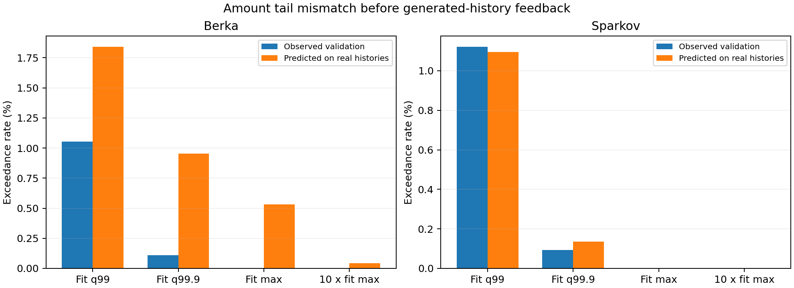
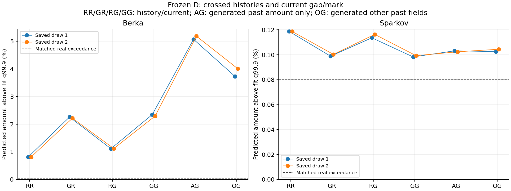

# D 금액 오류 진단: 출력 분포의 오류와 생성 이력의 증폭이 함께 있다

후속 [D_bin 금액 출력 비교](../external_binned_amount_v1/README.md)는 완료했다.
생성 개선과 Berka 비용을 함께 확인하고 공통 채택 없이 종료했다. 아래 진단 결과는 유지한다.

**Berka에서는 실제 과거를 넣어도 큰 금액을 과도하게 예측했고, 생성 이력을 넣으면
그 확률이 더 커졌다. Sparkov에서는 같은 증폭이 나타나지 않았다.** 따라서 전체
순차 구조를 폐기하거나 두 자료에 같은 원인을 단정할 근거는 없다. 다음 비교는
금액 출력부로 좁히되, 이것만 바꾸면 생성 피드백까지 해결된다고 주장하지 않는다.

저장된 D 두 개와 기존 생성물 네 개를 읽어 진단했다. **새 학습 0, 새 생성 0**.
기존 결과·가중치·보정은 유지했다. [진단 전 등록](preregistration.md),
[설정](../../../configs/cs_saf_external_amount_diagnostic_v1.json),
[이전 모델 비교](../external_controls_v1/README.md).

## 1. 생성하기 전, 실제 이력을 넣어도 문제가 있는가

학습 자료의 상위 0.1%에 해당하는 기준 금액을 먼저 고정했다. 각 validation 거래의
실제 과거와 실제 현재 간격·행동을 넣고, D가 그 기준을 넘는 금액에 부여하는 확률을
평균했다. 이것은 **새 금액을 뽑은 결과가 아니라 저장된 예측 분포의 계산값**이다.

| 자료 | 기준 금액: fit 99.9분위 | 실제 validation 초과율 | 실제 이력을 넣은 D의 예측 초과율 |
|---|---:|---:|---:|
| Berka | 62,500 | 0.1091% | **0.9540%** |
| Sparkov | 1,497.58 | 0.0921% | 0.1363% |

Berka는 약 **8.7배**로 과대 예측한다. 이 오류는 생성 이력이 없어도 존재한다.
Sparkov도 완전한 일치는 아니지만 차이의 크기가 훨씬 작다. 금액 단위·분포가 다른
두 자료의 원화 환산이나 직접 난이도 비교는 하지 않는다.

Berka validation에서 87,400을 넘은 관측값은 없지만 D는 평균 0.5319%의 확률을
부여했다. 관측 최댓값이 실제 가능한 금액의 절대 상한이라는 뜻은 아니다.
거래 종류별로는 `VKLAD` 23,604건에서 62,500 초과 관측이 0건인데 예측 초과율이
3.9139%였다. 큰 금액 과대 예측이 어디에 집중되는지 보여주는 개발 자료의 기술적
결과다. 개별 거래의 참 조건부 분포나 미래 상한을 아는 것은 아니다.

이 오류는 긴 거래열 끝에서만 나타나지도 않는다. Berka 실제 이력의 거래 순번
1–7에서도 예측 1.8017% 대 관측 0.1905%였다. 성분별 꼬리 질량을 계산했으며,
양수 lognormal을 사용한다는 이유만으로 상위 금액 보정이 적절해지지는 않았다.

## 2. 생성 이력이 이 오류를 더 키우는가

기존 생성 plan과 **같은 고객 특성·거래 길이·거래 순번**의 원본 이력을 짝지었다.
짝지어진 원본은 fit 자료이므로 위 validation 결과와 구별해야 한다. Berka 128개
plan은 실제로 126개 고객, Sparkov는 114개 고객에서 나왔다. 동일한 경제 상태나
시간을 맞춘 인과 실험은 아니다.

아래는 62,500 초과에 대한 Berka 예측 확률이다. 범위는 기존 생성 난수 두 개의
최솟값–최댓값이며 신뢰구간이 아니다.

| 과거 이력 | 현재 간격·행동 | 코드 | 예측 초과율 |
|---|---|---|---:|
| 실제 | 실제 | RR | 0.8134% |
| 생성 | 실제로 고정 | GR | **2.2152–2.2589%** |
| 실제로 고정 | 생성 | RG | 1.1132–1.1189% |
| 생성 | 생성 | GG | 2.2924–2.3434% |

**현재 간격·행동이 같아도 생성 과거를 넣으면 확률이 커진다.** 두 난수에서 같은
방향이었다. 현재 간격·행동 구성 변화도 영향을 줬으나, 위 교차 입력에서 이력을
바꾼 차이가 더 컸다. 이를 현실의 원인 비율이나 새 모델의 개선 효과로 해석하지 않는다.

기존 생성물의 실제 초과율은 2.2219–2.4540%였다. 32,314건 중 예측 초과 건수는
각각 약 757/741건, 실제 생성은 793/718건이었다. 큰 금액 몇 개가 우연히 나온
문제만으로 설명하기 어렵고, 저장된 생성 조건에서의 분포 자체에 큰 초과 질량이 있다.

Sparkov에서는 실제/실제 0.1187%가 생성/실제 0.0988–0.1003%, 생성/생성
0.0982–0.0992%였다. **이 자료에서는 생성 이력이 상위 금액 오류를 증폭했다는
결과가 아니다.** 이것이 Sparkov의 다른 관계 오류까지 해결했다는 뜻도 아니다.

## 3. 생성 금액 하나만 이력에서 고치면 되는가

**그렇게 결론 내릴 수 없다.** 현재 간격·행동을 생성값으로 고정하고 과거 필드를
교차한 Berka 결과는 다음과 같다.

| 금액 이력 | 나머지 이력: 간격·행동·보조 필드 | 코드 | 예측 초과율 |
|---|---|---|---:|
| 실제 | 실제 | RG | 1.1132–1.1189% |
| 생성 | 생성 | GG | 2.2924–2.3434% |
| 생성 | 실제 | AG | 5.0695–5.1856% |
| 실제 | 생성 | OG | 3.7318–4.0059% |

어느 한쪽만 실제값으로 교체한 혼합 이력이 오히려 더 나빴다. 금액과 다른 과거
필드의 조합에 민감하며, 혼합하면 원래 함께 나타나지 않는 거래가 만들어질 수 있다.
따라서 산술 분해 값만으로 금액 이력을 단독 원인으로 지목하거나, 실제값 치환의
개선 효과를 주장하지 않는다. 새 출력으로 **일관된 전체 거래열을 다시 생성하는
별도 비교**가 필요하다.

## 무엇을 유지하고, 다음에는 무엇만 비교할 것인가

**유지할 기본 구조:** 고객 특성·최근 31거래 → GRU 이력 상태 → 간격 → 행동 →
금액 → 보조 필드 → 다음 이력. D는 이 뼈대의 일반 행동 예측 대조군이다.
기존 U/G의 반복 전용 구조가 일반 D보다 필요하다는 기여는 여전히 입증하지 못했다.

**다음 한정된 후보:** D의 이력·행동 구조를 유지하고, 학습 자료에서 정한 금액
구간의 확률을 예측한 뒤 선택 구간의 학습 금액을 표본추출하는 일반 출력 대조군을
비교하는 방향이다. 기존 lognormal 출력과 비교하고, 생성한 금액은 다음 이력에
정상 반영한다. 금액·행동 관계, 시간·행동 관계, 실제 이력의 예측 비용을 함께 봐야 한다.
현재 category/type을 금액 예측에 넣는 미래 정보 누출도 피해야 한다.

이는 **다음 제안이며 아직 사전등록·구현·학습하지 않았다.** 구간/경험 분포 방식은
관측 범위 밖 금액을 생성하지 못하는 제한이 있다. 따라서 상위 금액이 작아지는 것만으로
성공을 선언하지 않고, 관측된 큰 금액과 조건부 관계도 잘 재현하는지 비교해야 한다.
일반 출력부 보완 자체를 새 논문 기여로 부르지 않는다. 이미 실패한 U/G 채택 기준은
유지하며, 이번 진단은 전체 구조 확정이나 시드 확대의 통과 판정이 아니다.

## 근거와 검증

- validation 335,658거래, 기존 생성 394,676거래(4개), 각 생성물의 6개 교차 조건.
  모두 이전 개발 데이터·checkpoint를 사용한 진단이다. 독립 데이터/학습 시드 검증이 아니다.
- 사전 CPU 검사 3개 통과. 26개 확률 배열 검산, 원래 parquet의 초과율 40개 별도 집계,
  교차 분해 합 검산. [검증 기록](verification.json).
- SciPy 생존함수식과의 최대 확률 차이 4.67×10⁻¹⁵. 단일 prefix와 batch 이력 상태
  320개 경계 입력 검산 최대 차이 2.51×10⁻⁶. validation log-MAE 기존 점수와의 최대
  차이 1.61×10⁻⁸. 저장 checkpoint·입력·생성물·기존 과학 소스 해시 유지.
- 진단 소스/등록 `76f8230`. 빈 GPU 0에서 Berka 약 7.4초, Sparkov 약 24.1초.
  학습·새 생성·다른 작업 중단 없음. [자원 기록](execution_resources.json).
- [전체 초과율](tail_summary.csv), [거래 위치·행동별 결과](stratified_tail.csv),
  [교차 효과와 상호작용](paired_effects.csv), [혼합 성분](mixture_components.csv),
  [예측 초과 건수와 저장 표본](sampling_check.csv),
  [Berka audit](berka_audit.json), [Sparkov audit](sparkov_audit.json).

교차 조건의 관측 금액은 해당 실제/생성 query에서 가져온 참고값이다. 혼합 이력의
참 정답이 아니므로 그 차이를 조건부 정확도라고 부르지 않는다. 거래 단위 배열은
`artifacts/cs_saf/external_amount_diagnostic_v1/`, 문서·코드·집계·그림은 연구 branch에
보관한다. GitHub가 원데이터와 checkpoint의 전체 백업은 아니다.
