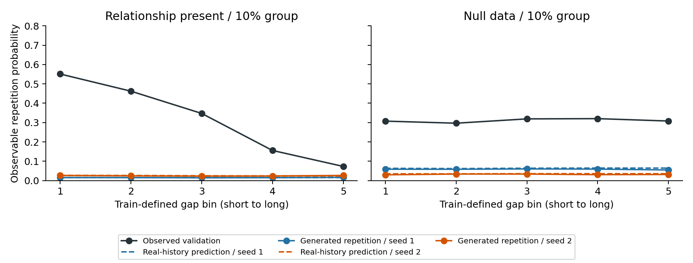

# 공식 외부 순차 모델 확인과 다음 연구 판단 — 2026-09-20

**완료:** 공식 TabularARGN 4회 학습, 20개 생성 데이터셋(40,960개 거래열), 저장 모델의 실제/생성 이력 예측 진단. **미완료:** 새 제안 모델 전체의 구현·학습, 독립 데이터 재현, 실제 사기 탐지 효용, 방법의 우수성 입증.

핵심은 **이 실행 조건에서는 실제 이력을 넣어도 반복확률을 크게 낮게 예측했다**는 것이다. 데이터 변환 손실이나 생성 이력 누적만으로 설명할 수 없다. 다만 아직 학습 설정과 구조 중 주원인을 분리하지 못했으므로, 이 외부 모델의 점수를 제안 방법의 우수성 근거로 사용하지 않는다.

## 1. 무엇을 실제로 비교했는가

- 대표 모델: [TabularARGN 논문](https://arxiv.org/html/2501.12012)의 [공식 엔진](https://github.com/mostly-ai/mostlyai-engine), `mostlyai-engine==2.4.0` 순차 모드. 별도 Python 환경, 약 115만 파라미터, Medium 설정. Python 3.10 호환 공식판을 결과 확인 전에 선택했다. 최신 2.7.0 실행 또는 논문 원래 데이터의 재현이라고 하지 않는다.
- 데이터: 기존 통제된 인공 데이터, 생성 시드 42, 소수 집단 비율 10%. 거래 간격에 따라 반복확률이 변하는 조건(κ=1)과 변하지 않는 조건(κ=0). 데이터의 **정답 생성 법칙과 활성 여부는 학습에 입력하지 않았다.** 관측 집단 정보는 두 조건 모두 같은 형식으로 입력했다.
- 외부 학습 개체 31,951개 안에서 공식 내부 학습/검증 25,561/6,390개로 분할했다. 외부 validation 6,846개는 평가 전용이다. test는 사용하지 않았다.
- 각 조건에서 학습 시드 20260920/20260921, 각 저장 모델에서 생성 시드 20261001–20261005. 같은 학습 기반 계획 2,048개(집단 0: 1,834개, 집단 1: 214개)를 사용했다. 길이는 공식 모델이 생성하며, 계획 길이로 잘라 맞추거나 사후 수리하지 않았다.
- 최대 100 epoch/30분, 공식 내부 검증 checkpoint 선택 및 조기 종료를 사용했다. 결과에 따른 추가 신경망 학습은 하지 않았다. [실행 전 등록](preregistration.md), [고정 설정](../../../configs/benchmark_v2/cs_saf_external_audit_v1.json).

| 조건 | 학습 시드 | 실행 마지막 epoch | 선택 epoch | 학습 시간 |
|---|---:|---:|---:|---:|
| 관계 없음 | 20260920 | 100(상한) | 97 | 469.8초 |
| 관계 없음 | 20260921 | 49 | 44 | 324.0초 |
| 관계 있음 | 20260920 | 48 | 43 | 295.5초 |
| 관계 있음 | 20260921 | 40 | 35 | 271.8초 |

TabDiT도 [공식 소스](https://github.com/fabriziogaruti/TabDiT/tree/cbb2b9a4866b0071ed9150a552704db188c33d4b)를 확보했으나, 확인한 HEAD에는 평가 코드와 생성 데이터만 있고 생성 모델의 학습/샘플링 구현은 없었다. 따라서 직접 실행하지 않았다. 이전의 실행 가능 baseline 추천을 정정하며, 이를 TabDiT의 성능 한계로 취급하지 않는다. [소스 버전·파일 목록](source_inventory.json).

## 2. 가장 중요한 결과

반복이란 “직전 행동과 이번 행동이 같음”이다. 아래 예측률은 **실제 validation 이력을 넣은 모델 확률**을 평균낸 값이다.

| 평가 대상 | 실제 반복률 | 모델 예측률: 시드 1 | 모델 예측률: 시드 2 |
|---|---:|---:|---:|
| 관계 없음 데이터 전체 | 31.20% | 6.53% | 3.56% |
| 관계 있음 데이터의 90% 집단(관계 없음) | 31.75% | 1.56% | 2.51% |
| 관계 있음 데이터의 10% 집단(관계 있음) | **32.02%** | **1.56%** | **2.53%** |



실제 이력에서도 이미 크게 틀린다. 관계 있음 집단에서는 평균 반복률뿐 아니라 간격 구간별 곡선의 모양도 재현하지 못했다. 관계 없음 집단의 큰 오차는 주로 반복률 수준의 오류이며, 이를 곧 큰 가짜 gap 반응으로 설명하면 안 된다.

반복곡선 오차는 학습 데이터로 정한 5개 간격 구간에서 validation 반복률과의 절대 차이를 평균한 값이다. 작을수록 좋다. 다음 표는 두 학습 시드와 각 5개 생성 시드의 평균이다. 실제 이력 예측은 모델별 동일 값이므로 생성 시드를 독립적인 추가 학습 표본으로 세지 않았다.

| 평가 대상 | 인코딩→복원 오차 | 실제 이력에서의 예측 오차 | 자유 생성 오차 |
|---|---:|---:|---:|
| 관계 없음 데이터 전체 | 0.000479 | 0.261536 | 0.266562 |
| 관계 있음 데이터의 90% 집단 | 0.000227 | 0.297095 | 0.297659 |
| 관계 있음 데이터의 10% 집단 | **0.000631** | **0.299805** | **0.300035** |

간격 자체의 분포(KS)는 전체 집단에서 0.0074–0.0078, 행동 분포의 sparse TV는 0.0088–0.0093이지만, 반복곡선 오차는 0.27–0.30이었다. **각 변수의 빈도가 대체로 맞는 것과 행동의 반복 관계가 맞는 것은 별개였다.** sparse TV는 학습 상위 20개 행동과 나머지를 묶은 지표이며 64개 전체 TV로 해석하지 않는다.

13개 지표를 선택 없이 [전체 평균 표](metrics_mean.csv), [시드별 전체 수치](metrics.csv)에 기록했다. 여기서 새로 측정한 값은 탐색 결과이며, 기존 U/E 결과와는 예산·길이 처리·생성 계획이 다르므로 새 우월성 검정 표로 합치지 않았다.

## 3. 확인한 원인 범위와 아직 모르는 부분

| 점검 | 확인 결과 | 해석 |
|---|---|---|
| 원본→학습 입력 순서·값 | 동일; 첫 gap 호환 표시만 0 사용 | 순서를 섞은 오류로 설명되지 않음 |
| 공식 인코딩 후 반복률 | 원래 학습 반복률과 동일(두 조건 약 31.65–31.67%) | 큰 반복 손실이 인코딩에서 이미 발생했다는 근거 없음 |
| 실제 이력의 조건부 예측 | 모든 4개 모델에서 반복 과소예측 | 생성 이력 누적만의 문제 아님 |
| 단순 학습 평균 반복률 예측과 비교 | 모든 4개 모델에서 단순 평균보다 Brier 오차 큼 | 강하게 학습된 baseline이라고 볼 수 없음 |
| 현재 정답·미래 값 변경 / prefix 재생 | 검사 배치에서 이전 예측 차이 0 | 진단 코드의 해당 누출·정렬 검사 통과 |
| checkpoint·입력 hash | 모두 일치, 진단 중 가중치 변경 없음 | 기존 저장 모델의 읽기 전용 진단 |

관계 있음 첫 모델의 행동 NLL은 약 4.159로 64개 균등 예측 수준이다. 관계 없음 첫 모델은 epoch 상한에서 종료됐다. **조기 종료, 최적화, 반복 구조를 배우기 어려운 표현의 영향을 더 분리해야 한다.** 지금으로서는 오류가 발생하는 위치를 찾았으며, 유일한 구조적 원인을 확정한 것이 아니다. 저자들이 논문에서 이 실패를 보고했다고 인용하지도 않는다.

생성 이력의 재입력은 재인코딩과 실현 길이 제어를 포함하므로 순수한 노출 편향의 인과 분해가 아니다. 평균 수준/곡선 모양 분해와 단순 평균 예측 대조는 첫 결과를 본 뒤 추가한 **사후 탐색 진단**이다. 사전등록 지표나 종료 기준을 바꾸지 않았다. [진단 표](prediction_diagnostics.csv), [단순 예측 대조](repeat_prediction_sanity.json), [원본·생성물 검증](artifact_inventory.json), [실행 수정 기록](execution_notes.md).

## 4. 그래서 다음 연구는 무엇을 입증해야 하는가

**연구 질문:** 집단별 거래열에서 기본 행동 반복률과 간격에 따른 변화를 구분하여 학습하면, 단순 보정보다 필요한 관계의 자유 생성 오차를 더 줄이면서 다른 분포와 관계 없는 집단의 성능을 유지할 수 있는가?

다음 구조는 [연구 결정 문서](research_decision.md)에 수식·차원·대조군을 고정했다. 기존 U와 같은 규모의 과거 이력 인코더를 사용하고, **기본 반복확률 → 간격별 관계 수정 → 반복/비반복 행동 선택 → 수치값 생성**으로 나눈다. E의 추가 이력 계수와 기존 ER 규제는 필수 부품에서 제외한다.

다만 진행 순서는 아래와 같다. 지금 확인한 학습 부족을 건너뛰어 복잡한 생성 경로 학습부터 추가하지 않는다.

1. **외부 baseline의 학습 충분성과 단순 반복 head/동일 보정을 먼저 확인한다.** 구조의 기여와 반복확률 보정의 효과를 분리한다. 내부 검증 손실만 낮고 행동 예측이 균등 수준인 상태를 최종 비교점으로 사용하지 않는다.
2. **조건부 예측을 충분히 맞춘 뒤에도 남는 관계 오류에만 제약 결합 후보를 비교한다.** 같은 용량·학습 목표·보정을 준 일반 head보다 추가 이득이 있어야 한다. 단순 head/보정으로 해결되면 복잡한 모듈의 기여 주장은 중단한다.
3. **그 뒤에도 자유 생성 오류가 남는 경우에만 생성 궤적의 관계 오차를 학습에 사용한다.** 같은 생성 손실을 준 일반 모델보다 이득이 있어야 한다. 틀린 기본 확률을 동결하거나 다른 분포를 더 망가뜨리면 채택하지 않는다.
4. **최종 채택은 독립 검증 후에 한다.** 새로운 데이터 생성 시드·학습 시드, 다른 행동 전이 법칙, 현실 데이터와 탐지 효용을 확인해야 한다. 현 copy 성격의 인공 데이터 하나에만 맞는 구조를 일반적인 금융 생성 모델로 주장하지 않는다.

관측 반복의 제약 결합 계산만 구현했고 [CPU 수치·기울기 검사](observable_coupling_cpu_check.json)를 통과했다. **전체 새 모델은 미학습이다.** 제약 logistic/coupling 자체, 이력 사용, 관계 평가, rollout은 각각 기존 아이디어다. 차별화 후보는 이들 이름이 아니라 **같은 기회를 준 단순/외부 대조군보다 관계 개선과 부작용의 균형을 실제로 개선하는 학습 방법**이며, 아직 입증하지 않았다.

## 5. 보관·재실행

새 브랜치 `research/cs-saf-external-audit-v1`에 코드·등록·환경 버전·결과 표·그림·판단 근거를 보관한다. 원래 `research/cs-saf`와 `main`에는 이 작업을 병합하지 않았다. 대용량 checkpoint/생성 데이터는 워크스테이션의 `research-cs-saf-external-audit/artifacts/cs_saf/external_audit_v1/`에 보존하고 Git에는 올리지 않는다. 파일별 hash와 위치는 [artifact inventory](artifact_inventory.json)에 있다.

원래 연구 환경에서 준비·평가, 별도 공식 환경에서 fit/replay를 실행했다. 전체 의존성은 [requirements](runtime_requirements.txt)에 기록했다. 완료 폴더를 덮어쓰지 않도록 fit은 기존 폴더가 있으면 중단한다. 현재 저장물을 다시 요약할 때의 순서는 아래와 같다.

```bash
python scripts/run_cs_saf_external_audit_v1.py evaluate
python scripts/summarize_cs_saf_external_audit_v1.py
python scripts/check_cs_saf_external_input_and_repeat.py
python scripts/verify_cs_saf_external_artifacts.py
```

기존 U/E의 실패 판정은 삭제하거나 외부 모델의 약한 점수로 대체하지 않는다. 이 연구에서 이번에 얻은 것은 **외부 실행 근거와 오류 위치, 그리고 다음 구조를 선택/기각할 근거**다.
