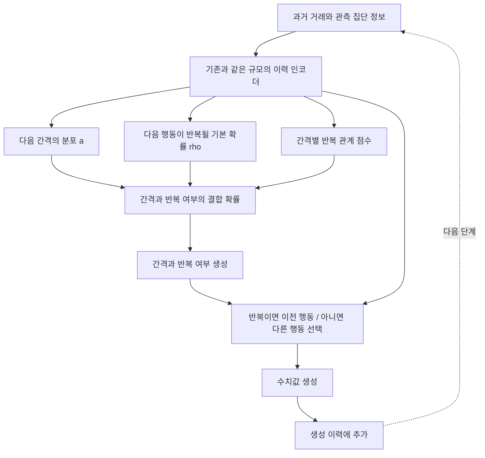

# 무엇을 고치려는 연구인가 — 외부 모델 확인 후 설계 판단

**Stage 1 후속 결과:** [추가 학습·동일 보정 비교](../baseline_adequacy_v1/README.md)가 완료됐다. U+gap과 추가 학습 ARGN+direct 통계 대조군은 이번 실용 기준을 충족했다. 아래의 제약 결합 구조를 필수 해법이나 확정된 contribution으로 해석하지 않는다. 후속 질문은 단순 대조보다 생성 관계를 개선하면서 U+gap의 거래별 예측 정확도를 유지할 수 있는가이며, 같은 용량의 일반 신경망 head와의 비교는 아직 실행하지 않았다. 아래 수식과 설계는 그 비교를 위한 미검증 후보로 보존한다.

최신 실행 수와 숫자는 [실행 요약](execution_summary.json), [전체 지표](metrics_mean.csv), [예측 진단](prediction_diagnostics.csv)을 기준으로 한다. 이 문서는 **연구 질문과 검증 후보의 선택**이며, 새 모델의 학습 성공이나 최종 architecture 채택 선언이 아니다.

## 1. 대표 선행모델과 실제 확인한 문제

대표 실행 모델은 [TabularARGN](https://arxiv.org/html/2501.12012)의 공식 `mostlyai-engine==2.4.0` 순차 모드다. 정적 집단 정보, 거래 간격, 행동, 수치값, 과거 거래 이력을 모두 사용한다. 약 115만 parameter의 LSTM 기반 모델이며, 원래 입력 표현과 자체 길이 생성을 유지했다. 현재 최신 소스 2.7.0과 구분한다.

[TabDiT](https://arxiv.org/html/2504.07566)는 관련 문헌이지만, 확인한 [공식 HEAD](https://github.com/fabriziogaruti/TabDiT/tree/cbb2b9a4866b0071ed9150a552704db188c33d4b)에는 생성 모델 학습·샘플링 코드가 없다. 직접 실행 가능한 대표 모델로 추천했던 이전 설명을 정정한다. 코드 미공개는 모델의 성능 실패가 아니다.

두 학습 시드, 관계 없음/있음 두 조건의 총 4회 학습과 20개 생성 표본에서 나타난 문제는 다음처럼 구분된다. [완료 보고서](README.md)에 결과 표와 그림을 정리했다.

| 확인 대상 | 결과의 의미 |
|---|---|
| 간격과 행동 각각의 전체 분포 | 비교적 작은 오차가 나와도 행동의 반복 관계가 맞는 것은 아님 |
| 학습 입력의 순서 | 원본, adapter 입력, 공식 인코딩 이후에도 약 31%의 반복이 유지됨. 순서를 섞어서 생긴 오류라는 설명은 맞지 않음 |
| 인코딩→디코딩 왕복 | 반복곡선 오차가 자유 생성보다 훨씬 작음. 관측한 큰 손실을 입력 변환만으로 설명하기 어려움 |
| 실제 과거를 입력한 예측 | 반복확률을 이미 크게 과소예측. 생성 이력 누적만의 문제로 볼 수 없음 |
| 관계가 있는 10% 집단 | 반복률 평균뿐 아니라 간격 구간별 곡선 모양도 학습 부족이 나타남 |
| 관계가 없는 조건 | 반복률 평균 오류는 크지만 곡선 모양 오류는 작음. 이것을 큰 가짜 gap 관계가 생겼다고 설명하면 틀림 |

관계 없음 조건에서 관측 반복률은 전체 평균 31.20%, 실제 이력을 넣은 예측은 두 시드에서 각각 6.53%, 3.56%였다. 관계 있음 데이터의 10% 집단에서는 관측 32.02%, 예측 1.56%, 2.53%였다. **이는 이 고정 구현·학습 조건에서 다음 행동 관계를 충분히 배우지 못한 결과**다. 모델 계열 전체의 표현 불가능성을 입증하지 않는다. 공식 조기 종료/epoch 상한, 최적화, 모델의 반복 구조 학습 난도는 아직 분리할 원인 후보다.

이 한계는 TabularARGN 저자가 논문에서 명시한 실패를 인용한 것이 아니라, **이번 데이터·구현·예산에서 새로 관찰한 결과**다. 특히 첫 시드의 관계 있음 모델은 행동 NLL이 64개 균등 예측 수준이므로, 충분한 학습을 확인한 강한 baseline의 최종 성능이라고 간주하면 안 된다. 공식 조기 종료/학습 충분성 점검과 단순 대조군을 통과하기 전에는 이 점수를 이용해 새로운 방법의 우수성을 주장하지 않는다.

또한 기존 U도 이미 이력을 쓰고 이전 행동을 재사용하는 경로를 갖는다. 외부 모델보다 U/E의 점수가 좋더라도 E의 추가 계수 32개나 규제의 기여가 입증되는 것은 아니다. 같은 보정의 U보다 E가 자유 생성에서 우수하지 않았다는 기존 결과는 유지한다.

## 2. 연구 문제와 주장

**연구 문제:** 집단별 거래열을 생성할 때, 행동의 반복 수준과 거래 간격에 따른 반복의 변화를 구분하여 학습하고, 생성 후에도 필요한 관계를 보존하면서 관계가 없는 집단에 불필요한 변화를 만들지 않을 수 있는가?

주장을 아래처럼 구분한다.

- **현재 말할 수 있는 관찰:** 개별 변수 분포의 재현과 행동 관계의 재현은 이 실험에서 다른 결과다. 기존 E의 조건부 이득도 실제 생성 우위와 같지 않았다. 외부 모델에서도 관계 오류가 관찰되지만, 그 위치는 이미 실제 이력의 예측 단계부터다.
- **새 방법으로 입증할 가설:** 반복률의 수준과 gap에 따른 변화를 분리하고, 생성 궤적에서 측정한 관계 오차로 제한된 수정을 학습하면, 같은 보정과 같은 생성 손실을 준 대조군보다 관계 재현의 효과/비용이 개선되는가?
- **아직 하면 안 되는 주장:** 기존 모델은 관계를 원리상 못 배운다; 노출 편향이 유일한 원인이다; E가 핵심 기여다; 금융 사기 탐지 효용을 확인했다; 제안 구조의 신규성·학회 수준을 입증했다.

정확한 joint likelihood를 충분히 학습한 모델은 관계도 재현할 수 있다. 따라서 “기존 likelihood에는 관계 항이 없어서 불가능하다”는 이론적 설명은 사용하지 않는다. 이 연구가 다뤄야 하는 것은 유한 데이터·불균형·제한된 학습에서의 오차와 개선이다.

## 3. 다음에 검증할 구조를 하나로 좁히기

**E의 추가 이력 계수는 필수 구성요소에서 제외한다.** 기존 U의 이력 처리 용량을 출발점으로 삼고, 우선 아래의 관측 가능한 반복 구조를 가진 후보를 검토한다.

- 최초 기전 비교에서는 기존처럼 GRU hidden 128과 관측 집단 정보를 사용한다. 인코더를 크게 만든 효과로 설명하지 않도록 용량 대조군을 둔다.
- 반복 여부 `R_t = 1[M_t=M_(t-1)]`를 직접 다룬다. 기존의 latent copy 확률 q는 실제 반복확률과 다르므로 해석/학습 목표와 구분한다.
- 반복하지 않는 분포에서는 이전 행동을 제외한다. 첫 거래는 이전 행동이 없으므로 별도 일반 행동 분포에서 생성한다.
- 초기 계산 검증은 기존 gap support와 같은 표현을 사용한다. 이것을 연속 gap 모델의 최종 구현이라고 하지 않는다.
- 금액/수치값은 기존과 같이 이력·gap·행동에 조건부로 생성한다. 이 후보가 전체 mark 분포, 금액, 길이까지 보존한다고 주장하지 않는다.

최초 기전 비교의 구조 선택을 더 구체적으로 고정한다. 아래의 **전체 신경망은 아직 구현·학습하지 않았으며**, 구현 완료를 주장하는 것은 결합 확률 계산 함수에 한정한다.

| 구성 | 고정할 후보 | 비교에서 통제할 것 |
|---|---|---|
| 과거 요약 | 기존 strict-past GRU 128, gap/mark embedding 32, 관측 집단 embedding 8 | U와 같은 입력과 이력 용량 |
| gap | 기존 31개 대표값의 categorical decoder | 같은 support와 복원 규칙 |
| 기본 반복 수준 | 136차원 이력·집단 특징에서 관측 반복확률 rho 출력 | latent copy q와 혼동하지 않음 |
| gap 관계 | 기존 U 계열의 관측 집단별 rank-16 bilinear 점수, E의 32개 추가 계수 제외 | 단순 직접 반복 head도 같은 점수 용량 사용 |
| 확률 결합 | 아래의 31×2 관측 gap–반복 결합 | 일반 조건부 sigmoid head와 비교 |
| 행동 선택 | 반복이면 직전 행동, 아니면 64개 중 직전 행동을 마스킹한 분포 | 비반복 head는 기존처럼 이력·집단에 조건부; 새 gap 경로를 더하지 않음 |
| 수치값·첫 거래 | 기존 수치값 조건부 decoder, 첫 거래의 일반 행동 분포 | 첫 거래에는 반복 손실을 적용하지 않음 |
| 관계 수정 단계 | 기본 학습/보정 후 encoder·gap·rho·비반복/수치값 head를 동결하고 별도 관계 점수 파라미터만 갱신 | 같은 동결 조건의 일반 head 대조군; 전체 갱신 비교와 분리 |

동결은 사전에 틀린 반복 수준을 고정하지 않는다는 전제가 필요하다. 그 전제가 실패하면 이 관계 수정 단계로 넘어가지 않는다. 생성 궤적 목적함수는 실제 이력의 예측을 충분히 맞춘 뒤에도 생성 오류가 남는 경우에만 추가 검토한다. 지금의 외부 결과만으로 궤적 학습을 필수 부품으로 확정하지 않는다.

고정 이력 h에서 gap 확률을 a_k, 기본 반복확률을 rho, 간격별 점수를 s_k라 두면,

\[
r_k=\sigma(s_k+\alpha),\qquad \sum_k a_k r_k=\rho,
\]
\[
J_{k,1}=a_k r_k,\qquad J_{k,0}=a_k(1-r_k).
\]

alpha는 위 등식을 만족하도록 계산한다. 반복 수준 rho와 gap별 변화를 분리하며, 같은 h에서 gap 확률과 평균 반복확률을 유지하는 결합이다. **이 정규화 자체는 알려진 제약 logistic/coupling 구성이고 새로운 기여가 아니다.** 단순 재매개변수화만 하면 예측 성능이 자동으로 좋아지지 않는다.

[구성요소 CPU 검증](observable_coupling_cpu_check.json)에서 정규화, gap/반복 주변확률 보존, 0점수에서의 조건부 독립, 공통 점수 이동 불변성, 유한차분 대비 1차 기울기를 확인했다. 이것은 완성된 신경 생성기의 구현·학습 성공이 아니다.

## 4. 학습에서 실제로 달라져야 하는 부분

1. **먼저 기본 예측을 학습한다.** gap, 관측 반복/비반복, 비반복 행동, 수치값의 likelihood로 학습한다. 반복 BCE를 추가 보조항으로 중복 가산해 전체 loss 비중을 몰래 키우지 않는다.
2. **반복 수준과 곡선 보정을 먼저 확인한다.** 학습 데이터만 쓴 단순 반복확률 보정과 gap별 보정을 U와 외부 모델에 같은 기회로 제공한다. 이것으로 문제가 해결되면 복잡한 구조를 핵심 기여로 삼지 않는다.
3. **남는 오류에만 생성 궤적 학습을 검토한다.** 생성 경로에서 측정한 집단별 gap–반복 joint 통계를 학습 표본의 통계와 비교한다. 관계를 일괄적으로 0으로 줄이는 규제가 아니다. oracle의 활성 표식이나 정답 생성 법칙은 학습 목표로 쓰지 않는다.
4. **결합 제약의 추가 이득을 분리한다.** 잘 학습된 a/rho를 고정해 관계 부분만 수정하는 군과, 동일한 생성 손실을 전체 조건부 head에 주는 군을 비교한다. 여러 단계 비용이 한 단계 보정보다 도움이 되는지도 분리한다.

정확히 구분할 대조군은 일반 U/직접 반복 head, 같은 train-only 보정, 제약 결합+likelihood만, 일반 head+같은 생성 손실, 제약 결합+생성 손실이다. 새 신경망 파일럿의 구체적 시드·예산·허용 손실은 실행 전에 별도 등록해야 하며 현재 실행한 것으로 세지 않는다.

외부 비교에는 **TabularARGN+직접 반복 head**와 **TabularARGN+같은 train-only 보정 기회**도 포함해야 한다. 원래 TabularARGN과만 비교해 기본 반복 구조의 이득을 새 결합/궤적 학습의 기여로 설명하지 않는다. 입력에 이전 행동을 더 명시적으로 전달하는 것과 어려운 반복 재사용을 모델이 처음부터 배우게 하는 것의 차이를 통제하는 목적이다.

**핵심 제약:** 잘못된 rho를 동결하면 어떤 간격별 점수를 주어도 평균 반복률을 복구할 수 없다. 또한 고정 h에서의 주변 보존이 생성 이후 전체 분포의 보존을 뜻하지 않는다. [작은 정확 계산과 반례](coupling_feasibility_limits.json)를 확인했으며, 이 두 점을 만족하지 못하는 설계는 채택하지 않는다.

## 5. 무엇이 차별화 후보이고 언제 중단하는가

[TabularARGN](https://arxiv.org/html/2501.12012)은 이미 이력·집단·변수 관계를 모델링한다. [TACTiS-2](https://arxiv.org/html/2310.01327)는 주변분포와 의존성을 분리하며, [Professor Forcing](https://arxiv.org/abs/1610.09038) 등은 학습/생성 경로 차이를 다룬다. [TabStruct](https://arxiv.org/html/2509.11950)는 구조적 관계 평가를 이미 주요 대상으로 삼는다. 따라서 이력, 분리, rollout, 관계 평가를 하나씩 새로 제안했다고 주장할 수 없다.

차별화의 검증 대상은 **관측 반복 수준을 보존하는 조건부 관계 수정이, 집단별 자유 생성 관계를 개선하면서 생기는 비용을 단순 보정/일반 생성 손실보다 더 잘 제어하는가**다. 기존 구성의 결합에 그치지 않고 학습 추정·계산량·효과를 보여야 방법 기여가 된다.

- 단순 보정 또는 직접 반복 head가 개선의 대부분이면, 그 효과를 복잡한 결합/rollout 모듈의 기여로 옮기지 않는다.
- 제약이 잘못된 기본 확률을 고정하거나 개선을 막으면 해당 제약을 중단한다.
- 현 copy 성격의 인공 법칙에서만 좋으면 일반 순차 생성 우위를 주장하지 않는다. 다른 전이 법칙과 실제 거래에서 확인해야 한다.
- 최소한 독립 데이터/학습 시드, 같은 기회의 외부 비교, 관계·개별 분포·불필요한 반응의 효과/비용을 확인해야 최종 구조를 채택한다. 실제 사기 탐지 주장은 별도 탐지 검증 이후에만 가능하다.

**현재의 결정은 대표 모델·문제·대조군·검증 후보를 정한 것이다. 외부 모델의 원인이 모두 밝혀졌다거나, 새로운 architecture의 성공이 확정됐다는 결론은 아니다.**
