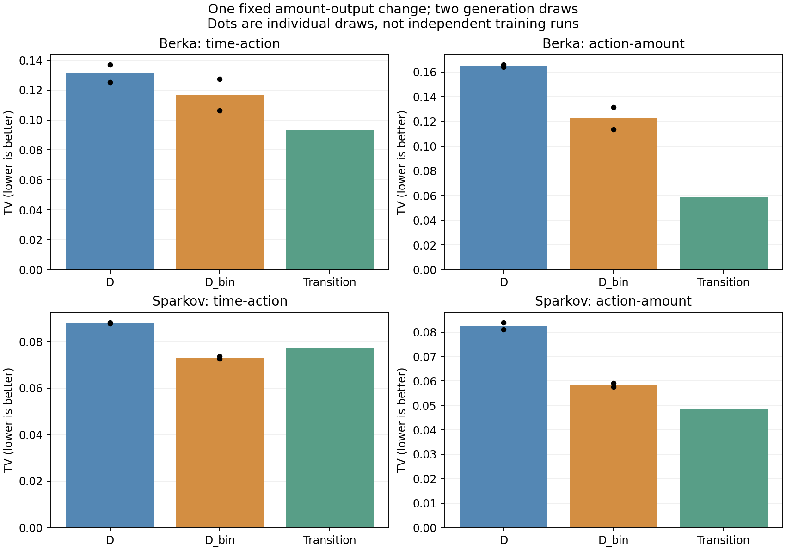
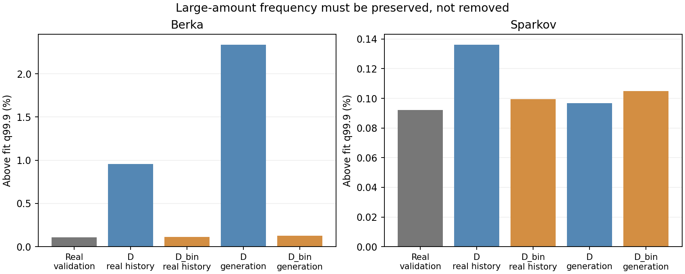

# 마지막 금액 출력 비교: 생성은 개선, Berka 비용 초과로 공통 채택하지 않고 종료

**금액 구간을 예측하고 학습 금액을 추출하는 D_bin은 두 자료의 생성 관계를 개선했다.
그러나 Berka에서 행동 비율과 금액 점예측의 손실이 사전 허용치를 넘었다.** Sparkov는
등록한 기준을 모두 통과했지만, 두 자료의 공통 작업 모델로 채택하는 기준은 미통과다.
약속한 대로 **이 금액 출력 수정 방향을 종료한다. 추가 구간·구조·계수·seed를 실행하지 않는다.**

신규 학습 **2회**, 생성 **4개/394,676거래**, 보정 **0회**를 완료했다. 기존 D의
checkpoint와 결과는 보존했다. [구조 한 장 설명](model_explanation.md),
[수식·범위](methods.md), [학습 전 기준](preregistration.md), [최종 판정](decision.json).

## 무엇을 바꿨나

고객 정보·최근31거래 GRU·일반 행동 MLP·생성 순서를 유지하고 **금액 출력만** 교체했다.
기존 D는 lognormal 3개 혼합, D_bin은 fit-only 구간 확률과 구간 내 학습 거래 금액
표본추출이다. 현재 간격·행동에 조건화하며, 생성 금액은 다음 이력에 실제로 넣는다.
현재 category/type의 정답을 금액 예측에 미리 넣지 않는다.

기존 D와 공통 초기 tensor를 맞춰 처음부터 공동 학습했다. 이력/행동 가중치를 동결한
실험은 아니며 금액 손실이 그 학습에도 영향을 준다. Berka32/Sparkov34 범주는 동일
분위 규칙의 중복 경계 처리 결과다. 결과를 보고 구간 수를 골라 추가한 실행은 없다.

## 1. 생성 관계는 실제로 개선됐다

아래는 생성 난수 2개의 평균이다. TV는 낮을수록 좋다. Berka 시간–행동은 날짜
간격–operation, Sparkov는 gap–category 전이다. 각 자료 안에서 비교한다.

| 자료 | 지표 | 기존 D | D_bin | 변화 |
|---|---|---:|---:|---|
| Berka | 시간–행동 TV | 0.1311 | **0.1167** | 개선 |
| Berka | 행동–금액 TV | 0.1650 | **0.1225** | 약25.8% 감소 |
| Sparkov | 시간–행동 TV | 0.0880 | **0.0732** | 개선 |
| Sparkov | 행동–금액 TV | 0.0825 | **0.0583** | 약29.3% 감소 |

단순 전이 대조군은 Berka .0931/.0587, Sparkov .0774/.0488이다. Sparkov의
시간–행동에서는 D_bin이 이번 전이 모델보다 낮지만 금액 관계는 아직 더 나쁘다.
외부 모델 전반을 능가했다는 결론은 아니다. [기존 ARGN·CPAR까지 포함한 표](reference_comparison.csv).
기존 ARGN의 인코딩/길이 차이와 CPAR 학습 충분성 한계는 그대로 남는다.

## 2. Berka의 과도한 큰 금액도 줄었고, 큰 거래를 없애지는 않았다

학습 금액 q99.9인 **62,500 초과**를 보면 다음과 같다.

| 비교 | 실제 validation | 기존 D | D_bin |
|---|---:|---:|---:|
| 실제 이력에서의 예측 초과율 | 0.1091% | 0.9540% | **0.1123%** |
| 자유 생성물의 초과율 | 0.1091% | 2.3380% | **0.1269%** |

상위 금액의 발생률과 행동별 초과 질량 기준도 통과했다. fit 최댓값보다 큰 금액이
없어진 것만으로 성공이라고 판정한 것이 아니다. 그 값이 0이 되는 것은 경험적 pool의
설계상 성질이다. [모든 tail 수치](tail_metrics.csv), [실제 이력의 확률](teacher_tail.csv).

## 3. 그럼 왜 공통 채택하지 않았나

**Berka에서 아래 두 종류의 비용이 허용 범위를 넘었다.** 모든 지표에서 최고여야
한다는 기준은 아니며, 실행 전에 아래의 작은 손실을 허용해 두었다.

| 비용 지표 | 기존 D | D_bin | 허용한 증가 | 실제 증가 |
|---|---:|---:|---:|---:|
| 전체 행동 비율 TV | 0.0573 | 0.0829 | ≤0.0100 | **0.0256** |
| 실제 이력의 금액 log-MAE | 0.4660 | 0.5097 | ≤0.0233(5%) | **0.0437(약9.4%)** |

`mark_tv`와 `root_tv` 실패는 Berka에서 같은 operation 비율을 측정하므로 독립된
문제 두 개로 세지 않는다. 예를 들어 `PREVOD NA UCET` 비중은 실제18.18%, 기존
D15.56%, D_bin12.86%였고, `VYBER`는 실제41.99%, 기존44.65%, D_bin46.63%였다.
이 비율 확인은 결과 후 기술적 분석이며 새 판정 기준을 추가한 것이 아니다.
[행동별 비중](berka_operation_rates_descriptive.csv), [모든 통과·미통과 항목](screens.csv).

Sparkov 금액 log-MAE는 .7466→.7642로 약2.4% 증가했지만 등록한 5% 허용 범위
안이었다. 나머지 등록 조건도 모두 통과했다. **이 자료의 긍정적 결과는 보존하되,
주목적 자료인 Berka의 실패를 덮어 공통 모델로 채택하지 않는다.**

## 확인한 사실과 원인 해석의 경계

이번 출력 변경으로 상위 금액의 보정과 생성 관계는 개선됐지만, Berka의 거래별 금액
예측 및 전체 행동 구성은 함께 개선되지 않았다. 이것이 확인한 성능 교환이다.
구간 안 금액을 이력/행동에 더 조건화하지 않는 한계, 바뀐 손실이 공통 인코더에
미치는 영향, 생성 이력 피드백 중 어느 것이 비용의 주원인인지는 이번 비교가
개별 분리하지 않았다. 특정 코드 오류나 단일 원인이 확인됐다고 설명하지 않는다.

출력 범위 안에 있다는 것과 실제 금액값을 모두 지원한다는 것도 다르다. validation의
정확한 금액값 중 fit에 없는 사건 비율은 Berka 약14.3%, Sparkov 약2.5%다. D_bin은
이런 새 원금액을 그대로 만들 수 없다. 구간 CE는 원금액 likelihood가 아니며 기존
D의 native NLL과 직접 비교하지 않는다. [지원 범위 점검](support_coverage_descriptive.csv).

## 여기서 멈추는 내용

- D_bin을 두 자료의 공통 최종 구조로 채택하지 않는다. 기존 D를 참고 기준으로
  유지하고, D_bin의 구조·결과도 변경 없이 보관한다.
- **기본 금액 출력 수정 실험은 종료했다.** 새 head, 구간 수, 추가 학습, 계수 탐색,
  새로운 seed 확대를 자동 실행하지 않는다. 이번 결과의 설명·정리 단계로 넘긴다.
- U/G 반복 전용 구조의 기여, D_bin의 독창적인 방법론 기여, 사기 탐지 효용은
  입증하지 않았다. 실패한 과거 후보의 판정도 그대로 남긴다.

한 학습 seed·두 생성 난수·반복 사용한 개발 자료의 탐색 결과다. Berka는 30epoch
상한에서 종료하고 epoch26을 선택했다. 수렴을 완전히 입증한 것이 아니며, 그렇다고
이번 실행의 예산을 연장하지 않았다. Sparkov는 epoch8 선택/13 종료(patience5)다.

## 검증과 저장

- CPU5 테스트 통과. fit/check/validation **1,990,071거래** 구간 부호화와 fit pool
  빈도 일치, 경계 입력 검사. GPU forward/backward는 가중치 갱신0회로 검사했다.
- 생성4개의 **76개 지표와48개 tail 수치 독립 검산**, 최대 지표 차이3.61×10⁻¹⁶.
  독립적인 집계 방식으로 예측 점수도 검산해 최대 차이3.02×10⁻⁸, tail 확률 차이1.09×10⁻¹⁰.
  공통 초기 tensor·최소 check epoch·실제 업데이트 수·pool 원자료 일치·생성값의
  정확한 pool 소속·기존 파일 해시 확인. [검증](verification.json), [전체 검사 요약](validation_summary.json).
- 등록/과학 소스 `1579ee4`. Berka GPU0, Sparkov GPU2에 빈 상태 확인 후 배정했다.
  학습 약409초/207초. 다른 작업 중단 없음. 두 과학 실행 실패·재시도0회.
  [학습량](training_budgets.csv), [자원 기록](execution_resources.json), [실행 기록](execution_notes.md).
- 코드·등록·집계·표·그림은 `research/cs-saf-external-audit-v1`에 저장한다.
  pool/checkpoint/거래열은 워크스테이션의 `artifacts/cs_saf/external_binned_amount_v1/`에
  보관한다. main은 최신 연구 branch가 아니며 GitHub가 대용량 artifact 전체 백업은 아니다.
