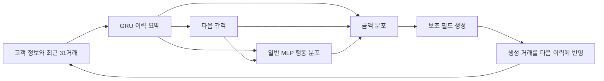

# 이번에 비교한 모델을 설명하는 한 장

**연구 목표:** 거래마다 그럴듯한 값을 만드는 것과 함께, 거래 간격·행동·금액의
관계를 보존하는 거래열을 생성한다. 이번에는 금액 출력의 기본 오류를 해결하는
일반 대조군 하나만 비교한다. 반복 전용 U/G를 새로 수정하는 실험은 아니다.

## 유지한 구조

행동은 Berka에서 operation, Sparkov에서 merchant다. 금액 뒤의 보조 필드는
각각 transaction_type/category다. 과거 보조 필드는 이력에 들어가지만 현재
보조 필드를 금액 예측에 미리 넣지는 않는다. D는 반복 여부를 따로 강제하지 않고
이력·현재 간격·직전 행동으로 전체 행동의 확률을 직접 계산한다.

## 교체한 부분 하나: 금액 분포

| 기존 D | 수정 D_bin |
|---|---|
| 금액 크기별 lognormal 분포 3개를 섞어 확률 분포를 만듦 | 학습 금액으로 구간을 만들고 각 구간의 확률을 예측 |
| 선택한 분포에서 새로운 양수 값을 추출 | 선택한 구간에 속한 학습 거래 금액 하나를 추출 |
| 학습 범위 밖의 큰 금액도 생성 가능 | 학습 금액 범위 안에서만 생성 가능 |
| fit에 0이 있으면 0 확률 별도 학습 | fit에 0이 있으면 0 범주 별도 학습 |

예를 들어 현재 이력과 행동에서 낮은 금액 구간의 확률을 .7, 높은 금액 구간을
.3으로 예측했다면 먼저 그 확률로 구간을 고르고, 고른 구간 안의 학습 금액 중
하나를 뽑는다. **실제 구현은 Berka 32개, Sparkov 34개 범주**이며 같은 분위
규칙에서 중복 경계를 합친 결과다. 현재 고객/행동별 별도 pool을 만들지 않는다.

추출한 금액을 완성된 표에만 끼워 넣지 않는다. 다른 필드와 함께 다음 이력으로
넣기 때문에 이후 간격과 행동에도 영향을 줄 수 있다.

## 무엇을 같게 했고, 무엇이 달라질 수 있나

기존 D와 공통 구조의 초기 가중치·데이터·학습 seed·학습 예산·선택 규칙·생성
고객/길이·생성 seed를 맞췄다. 같은 초기값에서 전체를 다시 학습하므로 학습 후
이력/행동 가중치가 같다는 뜻은 아니다. 새 금액 손실이 공통 인코더에 영향을 준다.

구간 확률의 cross-entropy와 기존 연속 분포의 NLL은 직접 비교할 수 없다.
또한 출력 수가 늘어 전체 파라미터는 Berka 127,378→131,624, Sparkov
288,877→293,509로 증가한다. 출력 분포·표현·손실·약간의 용량 변화가 함께 있는
**일반 출력 대조군**이며 순수한 한 수학적 성질만 분리한 실험은 아니다.

## 이번 비교로 결정하는 것

큰 금액을 지우는 것만으로는 통과하지 못한다. 관측되는 상위 금액 발생률과
행동별 금액 관계를 보존하면서 예측·시간–행동 관계의 비용이 제한 이내여야 한다.
Berka의 명확한 오류를 개선하고 Sparkov의 성능도 유지하면 연구용 작업 구조로
고정한다. 그렇지 않으면 이 출력 수정 방향을 종료한다.

이것이 새로운 방법론의 기여, 여러 시드 재현성, 외부 baseline 우수성, 개인정보
보호나 사기 탐지 효용까지 확정한다는 뜻은 아니다. 결과는 [최종 보고](README.md)에
기록한다. 성공할 때까지 다른 구간 수·출력 구조를 추가하지 않는다.
