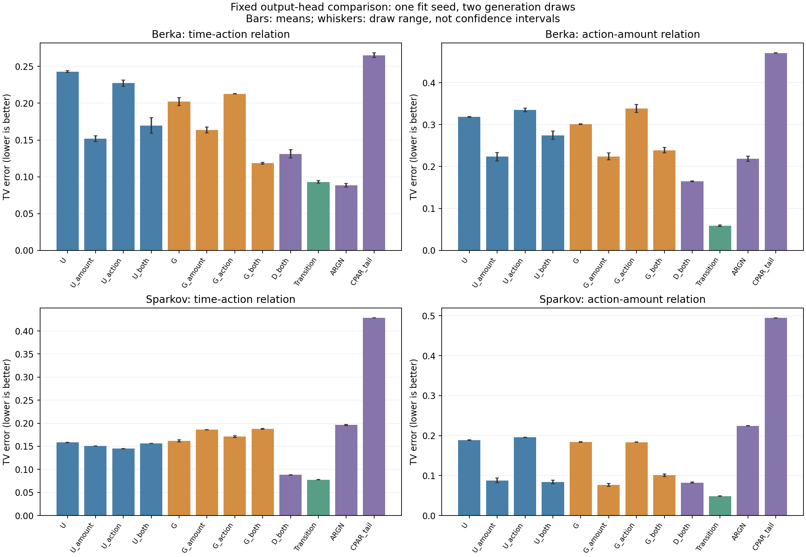
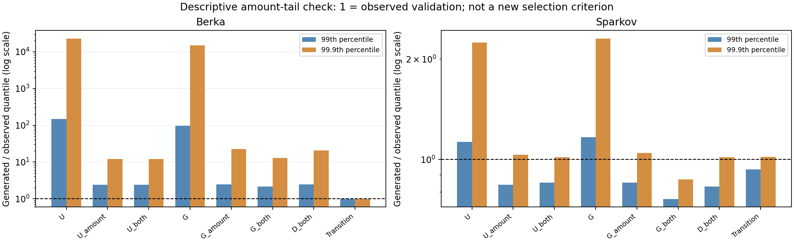

# 금액·행동 출력 비교 결과: 완료하고 정리 단계에서 종료

**금액 출력 보완의 효과는 확인했지만, 반복 전용 U/G 구조의 추가 기여는 확보하지 못했다.** 일반 행동 모델 D가 강한 대조군으로 나타났다. Berka에서는 G가 D보다 시간–행동 지표 일부를 개선하는 대신 금액 관계와 예측에서 비용을 냈다. Sparkov에서는 D가 수정 U/G보다 시간–행동 관계와 행동 예측에서 좋았다. U/G를 최종 구조로 채택하거나 시드 확대·추가 수정을 자동 실행하지 않는다.

**신규 신경망 학습 14회, 동일 방식의 보정 14회, 생성 56개(5,525,464거래)를 모두 완료했다.** 학습 seed 1개·생성 난수 2개의 탐색 비교다. 통계적 우수성, 독립 데이터 일반화, 사기 탐지 효용을 입증한 단계는 아니다. 기존 실패 판정도 유지한다.

모델부터 이해하려면 **[구조와 비교 목적 한 장 설명](model_explanation.md)**을 먼저 읽으면 된다. [정확한 수식](methods.md), [학습 전 고정한 판단 기준](preregistration.md)을 별도로 둔다.

## 무엇을 비교했나

U는 이전 행동 복사와 일반 행동 선택을 혼합하고, G는 반복 여부와 다른 행동 선택을 분리한다. 둘 다 기존부터 이력을 사용한다. _amount는 금액만, _action은 다른 행동 선택에 현재 간격을 추가한 것만, _both는 두 부분을 바꾼다. D_both는 같은 이력·간격·직전 행동을 받는 일반 MLP 행동 head와 새 금액 분포를 쓴다. **D도 우리 GRU 뼈대에서 직접 구현한 내부 대조군이며 외부 논문 모델이 아니다.**

외부 입력·최근 31거래·생성 순서·일반 likelihood·학습 예산은 유지했다. 새 금액 출력은 0이 관측되면 0 원자를 두고 양수 금액에 3성분 lognormal 혼합을 사용한다. 기존 학습 checkpoint에서 계속 학습한 결과가 아니라, 공통 초기 tensor를 맞춘 fresh fit이다. 일반 D와 U/G_both의 파라미터 수 차이는 0.14% 미만이다.

## 생성 결과

아래는 **보정 전 주 분석**, 생성 2회 평균이다. TV는 낮을수록 좋다. Berka는 날짜 간격–operation, Sparkov는 gap–직전/현재 category 관계다. 서로 다른 자료의 열끼리 난이도를 직접 비교하지 않는다.

| 모델 | Berka 시간–행동 | Berka 행동–금액 | Sparkov 시간–행동 | Sparkov 행동–금액 |
|---|---:|---:|---:|---:|
| 기존 U | 0.2430 | 0.3187 | 0.1586 | 0.1887 |
| U: 금액만 | 0.1518 | 0.2237 | 0.1509 | 0.0878 |
| U: 행동만 | 0.2272 | 0.3349 | 0.1449 | 0.1957 |
| U: 둘 다 | 0.1697 | 0.2747 | 0.1563 | 0.0839 |
| 기존 G | 0.2022 | 0.3012 | 0.1618 | 0.1843 |
| G: 금액만 | 0.1638 | 0.2241 | 0.1860 | 0.0765 |
| G: 행동만 | 0.2127 | 0.3387 | 0.1711 | 0.1835 |
| G: 둘 다 | 0.1184 | 0.2388 | 0.1881 | 0.1007 |
| 일반 D: 새 금액·전체 행동 예측 | 0.1311 | 0.1650 | 0.0880 | 0.0825 |
| 단순 관측 전이 | 0.0931 | 0.0587 | 0.0774 | 0.0488 |
| 단순 주변 분포 | 0.1490 | 0.0293 | 0.1652 | 0.0431 |
| 공식 ARGN — 이전 실행 | 0.0884 | 0.2185 | 0.1962 | 0.2244 |
| CPAR-tail — 이전 실행 | 0.2652 | 0.4708 | 0.4283 | 0.4944 |

선은 두 생성 난수의 최솟값–최댓값이며 신뢰구간이 아니다. [88개 생성 결과: 신규 56+기존 32](generation_metrics.csv), [전체 평균](generation_summary.csv), [예측 점수](prediction_metrics.csv), [변경 효과와 조합 차이](factorial_effects.csv)를 공개한다. 같은 6계수 보정 결과도 전부 보조 분석으로 남겼으며 좋은 variant로 주 분석을 대체하지 않았다.

## 무엇이 좋아졌고, 무엇은 채택하지 못했나

**1. 금액 출력 변경은 실질적인 개선을 만들었다.** 금액을 교체한 10개 모델의 40개 생성물에서 음수/비유한 금액은 0이었다. 금액만 바꾼 U/G의 행동–금액 TV는 Berka에서 약 29.8%/25.6%, Sparkov에서 약 53.5%/58.5% 감소했다. 금액 예측 log-MAE도 줄었다. 다만 다른 분포까지 포함한 등록된 금액 변경 기준은 **Berka G와 Sparkov U만 통과**했다. Berka U는 금액 KS 비용이 .0257로 허용 .01을 넘었고, Sparkov G는 시간–행동 관계 등이 악화했다. 양수 범위와 혼합 분포의 효과를 개별 분해한 결과는 아니다.

**2. 현재 gap을 다른 행동 선택에 넣는 효과는 일관되지 않았다.** Sparkov U의 행동만 변경한 시간–행동 TV는 .1586→.1449로 약 8.65% 감소했으나 등록한 10% 개선폭에는 못 미쳤다. G는 .1618→.1711로 악화했다. Berka G는 새 금액 출력 위에 행동 변경을 추가하면 시간–행동 TV가 .1638→.1184로 줄지만 행동–금액 TV가 .2241→.2388로 올라 허용 비용 .01을 넘었다. 모든 변경을 동시에 넣는 것이 항상 유리하지 않다.

**3. 반복 전용 구조의 필요성은 입증하지 못했다.** Sparkov D의 시간–행동 TV는 .0880으로 수정 U/G의 .1563/.1881보다 작았다. 실제 이력의 행동 NLL도 D 6.2469, 수정 U 6.4548/G 6.4507로 D가 좋았다. Berka에서는 G의 시간–행동 TV .1184가 D .1311보다 작았지만, 금액 TV는 .2388 대 .1650, 행동 NLL은 .2729 대 .2090, 반복 Brier는 .03896 대 .03459로 G의 비용이 컸다. 생성 지표 하나의 이득이 예측과 다른 관계의 공동 개선으로 이어진 것은 아니다.

| 등록된 판단 — raw 주 분석 | Berka U | Berka G | Sparkov U | Sparkov G |
|---|---|---|---|---|
| 금액만 변경: 효과+비용 | 미통과 | 통과 | 통과 | 미통과 |
| 행동만 변경: 효과+비용 | 미통과 | 미통과 | 미통과 | 미통과 |
| 둘 다 변경: 기존 모델 대비 공동 개선 | 미통과 | 통과 | 미통과 | 미통과 |
| 둘 다 변경: 일반 D 대비 추가 이득 | 미통과 | 미통과 | 미통과 | 미통과 |
| 외부 확대 후보 기준 전체 | 미통과 | 미통과 | 미통과 | 미통과 |

이 통과/미통과는 실행 전 정한 탐색 기준이며 통계적 검정 결과가 아니다. 보정 후에도 U/G의 전체 후보 기준은 통과하지 못했다. [모든 비교와 실패 위치](screens.csv).

## 음수 해결과 금액 분포 해결은 다르다

Berka에서는 새 금액 출력에도 큰 금액이 과도하게 생성됐다. 실제 validation 금액의 99.9분위는 약 62,934지만, 새 금액을 쓴 raw U/G/D의 생성 2회 평균 99.9분위는 약 752,234–1,423,423으로 **약 12–23배**다. D도 약 1,301,058로 약 20.7배다. D의 낮은 공동 TV를 금액 분포 전체가 적절해졌다는 의미로 설명하면 안 된다. Sparkov의 해당 분위는 실제 약 1,462, 새 모델 약 1,274–1,528이었다.

1은 실제 validation과 같은 크기다. 로그 축에 표시했다. [최댓값을 포함한 전체 분위](amount_quantiles_descriptive.csv)는 결과 후 기술적 점검이며 새로운 성공 기준이나 모델 선택에 쓰지 않았다. 생성값을 자르거나 기존 점수를 바꾸지 않았다.

## 여기서 확정하고 멈추는 내용

- **유지할 연구 근거:** 금액 출력의 기본 적합성이 예측·생성 품질에 큰 영향을 줬다. 시간–행동 지표만으로 전체 생성 품질을 판단할 수 없다. 일반적인 전체 행동 예측 구조가 강한 대조군이다.
- **확정하지 않는 주장:** 반복 전용 U/G가 일반 구조보다 필요한 최종 아키텍처라는 주장, 새로운 방법의 보편적 우수성, 실제 사기 탐지 기여.
- **실행 종료:** 등록된 비교와 검산을 완료했다. 추가 계수·성분 수·새 구조·학습 시드를 자동 실행하지 않는다. 현재 구조와 확인된 효과를 이해하고 연구 주장 범위를 정리하는 단계로 넘긴다.

일반 D를 최종 모델로 자동 채택하지도 않는다. 단순 전이보다 두 자료의 주요 관계 오차가 컸고, Berka 금액 꼬리 문제가 남는다. 단순 모델은 정적 특성에 조건화하지 않으므로 개인별 생성까지 해결한 결과는 아니다. 기존 ARGN의 자연 길이·전처리 차이와 CPAR 학습 충분성 문제도 유지한다. 일부 Berka 모델은 30epoch 상한에 도달했으므로 모든 방법의 충분한 최적화를 입증한 비교가 아니다. 이 개발 자료를 여러 차례 살펴봤으므로 독립 확인 실험으로 부르지 않는다.

## 검증과 보관

- CPU 34개 테스트 통과. 개발 자료 1,990,071거래의 금액 target support·경계 입력 검증, GPU 8개 조합의 유한 forward/backward 확인(가중치 갱신 0).
- 신규 생성 56개의 **1,064개 스칼라 독립 검산 통과**, 최대 차이 1.42×10⁻¹⁵. [검증](independent_verification.json).
- 저장 모델 14개×raw/보정 **28개 예측 평가 검산 통과**, 최대 차이 6.10×10⁻⁸. 초기 공통 tensor, 선택 epoch, optimizer update 수와 checkpoint 해시도 확인했다. [검증](checkpoint_audit.json).
- 과학 실행 실패·재시도 0. [실제 학습량](training_budgets.csv), [실행 기록](execution_notes.md), [GPU 배정](execution_resources.json), [입력 검사](preflight.json), [검사 요약](validation_summary.json).

학습 전 등록/과학 소스는 **e1d44f2**다. 결과를 본 뒤 과학 코드·설정은 변경하지 않았다. 코드·등록·집계·그림·설명은 **research/cs-saf-external-audit-v1**에 보관한다. 대용량 checkpoint와 생성물은 워크스테이션의 artifacts/cs_saf/external_controls_v1/에 남으며 GitHub가 그 전체 백업은 아니다.
