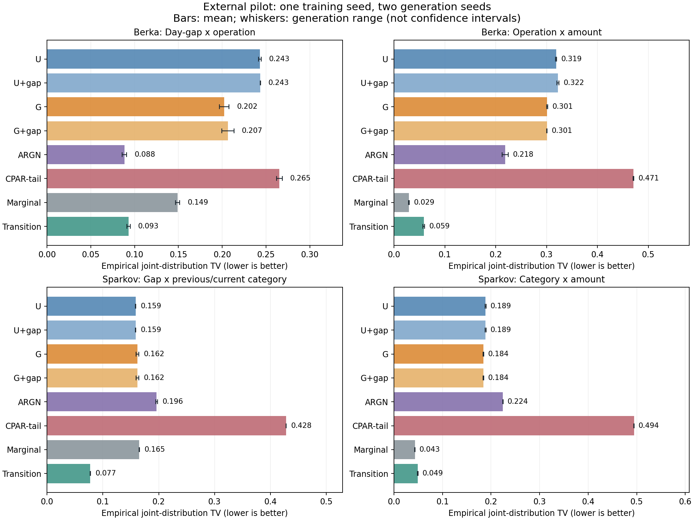
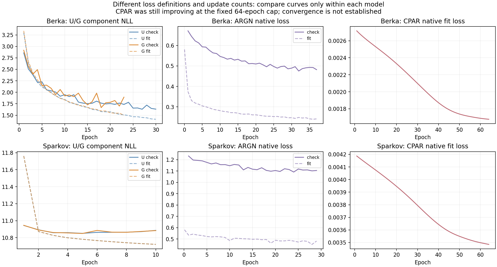

# Berka·Sparkov 외부 이식과 첫 비교 결과

이 보고서 이후의 **[금액·행동 출력 대조군 비교가 완료됐다](../external_controls_v1/README.md)**.
아래의 '아직 학습하지 않음'은 이 첫 파일럿을 마친 당시 상태이며, 후속 결과는 위 링크에서 확인한다. 이 파일럿의 결과와 한계는 그대로 유지한다.

**현재 U/G를 외부 자료의 최종 생성 모델로 확정할 근거는 얻지 못했다.** 외부 입력과 긴 거래열 처리를 구현·검증하고, 전체 fit 자료로 첫 비교를 수행했다. Sparkov에서는 U/G가 이번 설정의 TabularARGN보다 두 주지표에서 좋았지만, 단순 관측 전이 모델보다 오차가 컸다. Berka에서는 G가 U보다 생성 관계를 개선했으나 TabularARGN과 단순 전이 모델에 못 미쳤다. 데이터에 관계가 없어서 누구도 못 맞추는 상황은 아니다.

이는 **학습 seed 1개·생성 난수 2개의 탐색적 파일럿**이다. 학습 재현성, 최종 방법의 기여, 사기 탐지 효용을 입증한 실험은 아니다. 이전 인공 데이터의 실패 판정도 그대로 유지한다.

## 무엇을 구현했나

- 가짜 두 집단 없이 외부 정적 정보와 category/type을 입력하고 생성하는 U_ext/G_ext를 만들었다. 공유 rank-32 경로로 바꾼 이식이며, 이전 U/G를 그대로 동결한 결과가 아니다.
- 거래열을 32개에서 자르지 않고 모든 거래를 학습·생성한다. 각 예측의 과거 범위는 최근 31거래다. 멀리 떨어진 과거까지 무제한 사용하는 구조는 아니다.
- 같은 fit/check/validation 개체 분할과 공통 평가로 U/G, 같은 gap 보정을 붙인 U/G, 공식 TabularARGN, CPAR에 tail 보존 어댑터를 붙인 모델, 단순 주변/전이 모델을 비교했다.
- 정답 생성 법칙·test 결과·미래의 사기 여부를 학습 목표로 넣지 않았다. Berka는 날짜 내 순서 불확실성을 피한 일별 관계, Sparkov는 희박한 merchant 반복 대신 category 전이를 주지표로 삼았다.

구조의 핵심 차이는 U가 **이전 행동 복사와 새 행동 분포를 혼합**하고, G가 **반복 여부를 먼저 결정한 뒤 다른 행동을 선택**한다는 점이다. 두 모델 모두 기존 거래 이력을 이미 사용한다. [수식·입력·생성 순서와 비교 조건](methods.md)에 자세히 기록했다.

## 결과

아래는 생성 2회 평균이다. 공동분포 오차 TV는 **낮을수록 좋다**. Berka의 행동은 거래 종류, Sparkov의 범주는 가맹점 category다. 서로 다른 자료의 열끼리 난이도를 직접 비교하지 않는다.

<!-- primary:start -->
| 모델 | Berka 날짜 간격–종류 | Berka 종류–금액 | Sparkov 간격–범주 전이 | Sparkov 범주–금액 |
|---|---:|---:|---:|---:|
| U | 0.2430 | 0.3187 | 0.1586 | 0.1887 |
| U+gap | 0.2435 | 0.3224 | 0.1587 | 0.1887 |
| G | 0.2022 | 0.3012 | 0.1618 | 0.1843 |
| G+gap | 0.2066 | 0.3007 | 0.1618 | 0.1844 |
| ARGN | 0.0884 | 0.2185 | 0.1962 | 0.2244 |
| CPAR-tail | 0.2652 | 0.4708 | 0.4283 | 0.4944 |
| Marginal | 0.1490 | 0.0293 | 0.1652 | 0.0431 |
| Transition | 0.0931 | 0.0587 | 0.0774 | 0.0488 |
<!-- primary:end -->

`+gap`은 같은 fit-only 반복확률 보정이다. CPAR-tail은 공식 CPAR 네트워크에 마지막 짧은 거래 구간을 보존하는 입력 어댑터를 적용했다. Marginal은 범주별 주변 빈도, Transition은 gap×직전 범주의 관측 전이 빈도와 금액 재표본을 사용한다.

막대는 평균, 선은 생성 난수 2회 범위이며 신뢰구간이 아니다. [전체 32개 생성 결과](generation_metrics.csv), [평균·최솟값·최댓값](generation_summary.csv), [실제 이력 예측 점수](prediction_metrics.csv)를 함께 공개한다.

**확인한 개선과 남은 문제는 구분해야 한다.**

1. Berka에서 G의 날짜 간격–종류 오차는 약 0.202로 U의 약 0.243보다 작았다. 그러나 TabularARGN 약 0.088, 단순 전이 약 0.093에는 미치지 못했다. G로 바꾸는 것만으로 외부 관계가 충분히 재현되지는 않았다.
2. Sparkov에서 U/G의 간격–범주 전이 오차는 약 0.159/0.162로 이번 TabularARGN 약 0.196보다 작았다. 하지만 단순 전이 모델은 약 0.077이었다. U/G의 부분적인 개선은 있으나 새 구조의 필요성·우수성을 뒷받침하지는 못한다.
3. U/G의 반복확률 보정은 두 자료의 핵심 생성 오류를 해결하지 못했다. 특히 Sparkov의 merchant 반복은 원래 매우 드물다. 반복 gate만 바꿔 전체 category 전이와 금액 문제를 해결하겠다는 방향의 근거가 약하다.
4. 단순 주변 모델도 금액 공동분포에서는 강하다. 이는 정교한 순차 모듈 이전에 **금액의 조건부 분포를 제대로 표현하는 기본 대조군**이 필요하다는 결과다. 경험적 값 재표본의 장점을 제안 신경 모델의 기여로 가져오면 안 된다.

## 코드와 저장된 모델에서 확인한 문제

| raw 모델 | 생성 음수 금액: Berka | 생성 음수 금액: Sparkov | 실제 이력에서도 예상되는 음수 확률: Berka / Sparkov |
|---|---:|---:|---:|
| U | 2.27% | 1.31% | 0.66% / 1.09% |
| G | 2.28% | 1.28% | 0.82% / 1.08% |

첫 두 열은 생성 2회 평균이다. 마지막 열은 저장 checkpoint에 실제 이력과 현재 관측 gap/mark를 입력한 금액 분포의 음수 확률이다. **생성 과정에서 이력이 달라지는 현상 이전에도 문제가 있다.** 원인은 signed-log 공간의 Gaussian과 역변환이 음수 금액을 허용한다는 출력 설계다. [실제 개발 자료 1,990,071거래](observed_amount_support.json)에는 음수 금액이 없고, 0은 Berka 12건뿐이었다. 이 자료의 금액은 비음수 크기이므로 해당 출력 범위는 부적절하다.

다만 음수 제거만으로 해결되지는 않는다. Berka G의 종류–금액 TV 0.301에서 음수인 약 2.28%의 행만 고쳐서는 TV를 0.278 아래로 낮출 수 없다. 단순 전이 모델은 약 0.059다. Sparkov G도 같은 하한이 약 0.171로 단순 전이 약 0.049보다 크다. [수학적 하한과 조건](methods.md#6-검증과-재현), [전체 계산](amount_support_bound.csv)을 남겼으며, 실제 생성물을 고쳐 점수를 다시 제출하지 않았다. **유효한 금액 범위와 양수 금액의 분포 형태를 모두 다뤄야 한다.**

행동 경로에도 표현 범위의 제약이 있다. 현재 gap은 반복 gate에는 직접 들어가지만, ‘반복하지 않을 때 어떤 다른 행동을 고를지’의 상대확률에는 직접 들어가지 않는다. 이는 코드에서 확인되는 사실이다. 그러나 외부 오차가 전부 이 경로 때문에 발생했다고 증명한 것은 아니다. 이력 표현·금액 분포·학습량·범주별 희소성의 영향과 분리해야 한다.

## 비교의 한계와 실행 정정

- **CPAR의 학습 충분성은 미확인이다.** 고정 64epoch 마지막에도 fit loss가 감소했다. 이번 낮은 성능을 CPAR 논문 자체의 한계라고 주장하지 않는다. 공식 가변 길이 continuous-target 정렬 관례를 유지한 점도 결과 해석에 남긴다.
- ARGN은 같은 정적 context를 받지만 자연 길이를 생성했다. 다른 모델과 실현 거래 수·길이를 강제로 맞춘 비교는 아니다. 또 ARGN 인코딩 통계는 내부 check를 포함한 outer train을 사용한다. 구조의 효과만 분리한 비교가 아니다.
- 원 CPAR 실행에서 native 구간 분할의 tail 누락과 사용 불가능한 난수 API 호출을 발견했다. 원 시도 2개는 제외·보존하고, 별도 정정을 등록한 `CPAR_tail`로 다시 수행했다. 성능을 보고 설정을 바꾼 재시도는 아니다. [정정 기록](cpar_amendment.md), [제외된 시도](excluded_attempts.json).
- 공식 모델과 단순 모델은 각자의 조건부 분해·출력 처리를 유지한다. 단순 모델의 금액은 관측값 재표본이며 개인정보 보호·희귀 사기·탐지 효용은 평가하지 않았다. U/G와 같은 용량의 구조 기여 비교도 아니다.
- 이번 주지표는 개체를 합친 관계·분포다. 단순 모델은 정적 특성값에 조건화하지 않으므로, 개인별 조건부 생성까지 해결했다는 결과가 아니다. 그 과제를 주장하려면 별도 평가와 조건부 일반 대조군이 필요하다. 이번 비교의 미달을 새 지표로 덮어서는 안 된다.

서로 다른 모델의 native loss 높낮이를 직접 비교하면 안 된다. [실제 학습량·선택 epoch·파라미터 수](training_budgets.csv)와 [상세 방법](methods.md)을 함께 확인해야 한다.

## 다음 방향 — 아직 학습하지 않음

**반복확률 계수나 제약을 더 추가하는 방향은 이번 결과로 정당화되지 않는다.** 우선 아래의 기본적인 대조군을 충족해야 새 방법의 기여를 논할 수 있다.

1. **금액 출력부터 정상적인 기준을 만든다.** 비음수 금액을 지원하면서 여러 규모·꼬리를 표현하는 일반적인 분포를 사용한다. 예를 들면 양수 금액 분포에 필요한 경우 0의 질량을 따로 두는 방식이다. 현재 단일 Gaussian을 바꾸는 효과는 다른 구조 변경과 분리한다. 이는 먼저 해결할 모델링 문제이며 그 자체를 새로운 방법의 기여라고 부르지 않는다.
2. **일반적인 gap 조건 행동 모델을 강한 대조군으로 둔다.** 현재 gap을 반복 gate뿐 아니라 다른 행동 선택에도 제공한다. Sparkov에서는 category와 merchant의 관계를 활용하는 일반적인 분해도 검토 대상이다. 같은 정보·비슷한 용량에서 비교해야 하며, 금액 변경과 동시에 넣고 어느 부분 덕인지 설명하지 않는 실험은 피한다.
3. **제안 구조가 이 일반 대조군과 단순 전이 모델보다 추가 이득을 낼 때만 확장한다.** 이후 학습 시드 재현성과 외부 모델의 학습 충분성을 보강한다. 추가 이득이 없다면 반복 중심 구조의 기여 주장을 접거나 문제 정의를 재정리해야 한다. 이 결과는 연구 전체가 불가능하다는 증거는 아니지만, 현재 구조를 계속 미세 조정할 근거도 아니다.

위 항목은 이번 파일럿으로 좁힌 **후속 설계 방향**이다. 새 금액 분포·새 행동 head를 이미 학습해 성공한 것처럼 설명하지 않는다. 실제 사기 탐지 기여로 돌아가려면 별도의 라벨·전이·탐지 효용 과제를 설계해야 한다.

## 저장과 검증

코드·사전등록·집계·그림은 `research/cs-saf-external-audit-v1`에 보관한다. `main`은 이전 SAF 기반이다. 새 입력 어댑터·모델·평가기는 별도 파일이며 옛 통제 실험 구현 5개 파일은 기준 커밋과 동일함을 확인했다.

[입력 검사](input_verification.json), [생성 지표 독립 검산](independent_verification.json), [저장 checkpoint 검산](checkpoint_audit.json), [공식 ARGN checkpoint/용량 확인](native_metadata.json), [실행 기록](execution_notes.md), [전체 수치·해시](results.json).

원본·checkpoint·생성 거래열은 작업공간의 `artifacts/cs_saf/external_port_v1/`에 남는다. GitHub가 대용량 산출물 전체의 백업은 아니다.
