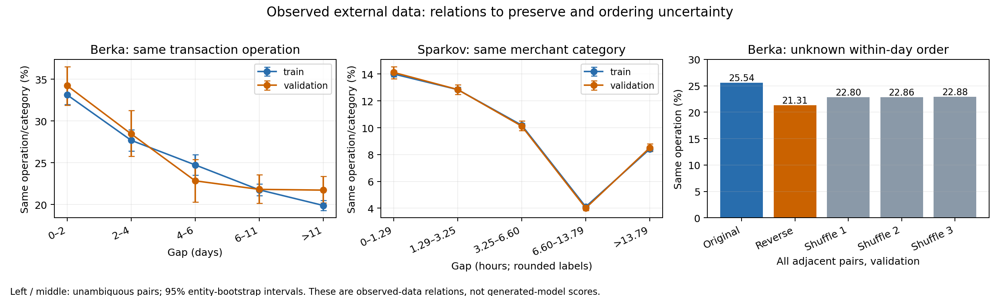

# Berka·Sparkov에서 무엇을 보존해야 하는가 — 2026-09-21

**완료: 원본/전처리 검증, 관측 관계 분석, 단순 예측표 비교. 신경망 학습 0회, 새 거래열 생성 0회.**

연구 목표는 **거래 간격·행동·금액의 관계가 생성 데이터에서도 유지되는지** 확인하는 것이다. 이번에는 먼저 외부 자료에 어떤 관계가 있는지 확인했다. Berka에서는 거래 간격과 거래 종류의 관계가, Sparkov에서는 간격과 업종 및 가맹점과 금액의 관계가 확인됐다. **동일 가맹점의 긴 연속 반복을 두 자료의 공통 핵심 목표로 삼는 것은 부적절하다.** 현재 U/G가 외부 자료에서 우수하거나 실패했다고 판정한 실험은 아니다.

## 1. 데이터와 분석 범위

| 자료 | 실제 의미 | 학습 / 검증 개체 | 분석 거래 수 | 순서가 명확한 검증 전이 |
|---|---|---:|---:|---:|
| Berka | 공개 실제 은행 거래, mark=거래 방식(operation, 결측 시 type), 일 단위 | 3,150 / 675계좌 | 895,507 | 61,295 / 156,986 = **39.04%** |
| Sparkov | 외부 공개 시뮬레이션, mark=가맹점, category=업종, 초 단위 | 688 / 147카드 | 1,094,564 | 177,844 / 177,850 = **99.997%** |

원본과 전처리 자료의 핵심 열을 **1,990,071거래에서 직접 대조해 일치**를 확인했다. 파일 해시도 기존 manifest와 일치했다. test 개체의 결과와 별도 fraudTest 파일은 분석하지 않았다. 기존 validation은 과거 연구에서도 사용되어, 이번 결과를 완전히 독립적인 확증 결과라고 부르지 않는다.

시간 간격 구간·어휘·금액 기준은 train 내부 fit 80%에서 정했다. 나머지 train 20%의 internal check와 기존 validation에서 방향을 확인했다. 주 전이 분석은 양 끝의 날짜/시각에 각각 거래가 하나뿐인 인접 쌍이다. Berka에서는 약 61%의 전이가 이 조건에서 제외되므로 **아래 전이 결과를 전체 은행 거래에 일반화하면 안 된다.**

## 2. 핵심 결과

| 확인한 내용 | 검증 자료 결과 | 해석 |
|---|---|---|
| Berka: 이전 거래 종류만 → 이전 거래 종류+현재 간격 | 행동 NLL **1.3604 → 1.2390, 8.92% 감소** | 관측된 현재 간격에 추가적인 예측 정보가 있다. 내부 check도 9.28% 감소 |
| Berka: 같은 날 거래 순서 변경 | 전체 반복률 **25.54% → 21.31%**(역순); 무작위 순서 22.80–22.88% | 같은 날짜의 참 순서는 알 수 없다. 순서 선택만으로 지표가 4.22%p 달라짐 |
| Sparkov: 동일 가맹점 연속 반복 | 전체 인접 전이의 **0.204%** | 인공 데이터의 높은 반복률/긴 반복 상태가 이 자료의 대표 과제는 아님 |
| Sparkov: 간격별 동일 업종 반복 | 다섯 구간에서 **14.12%, 12.85%, 10.12%, 4.01%, 8.50%** | train에서도 비슷한 모양. 단조 감소를 강제할 근거는 없음 |
| Sparkov: 전체 평균 → 현재 가맹점별 금액 평균 | log1p 금액 MAE **1.0788 → 0.8784, 18.58% 감소** | 가맹점–금액 관계를 함께 보존할 이유가 있음. 간격 추가 이득은 0.10%로 작음 |

그림 왼쪽/가운데는 **관측 자료**의 조건부 반복률이다. 생성 모델 성능 그림이 아니다. 구간은 학습 자료로 고정했으며 오차막대는 개체 단위 bootstrap 500회의 기술적 95% 구간이다. Berka mark는 수취인이 아니다. 양수 gap 구간은 왼쪽 경계를 제외하고 오른쪽을 포함한다.

Berka의 NLL 차이는 −0.12140, paired 95% 구간 [−0.13170, −0.11023]이다. 다중비교를 보정한 확증 검정이나 인과효과로 해석하지 않는다. 금액 예측은 **현재 mark와 간격을 관측한 조건부 평균표**이며, 이를 스스로 생성한 상황이나 최적 MAE 예측기와 혼동하지 않는다.

## 3. 좋지 않은 결과도 그대로 남겼다

같은 단순 전이표가 Sparkov에서는 오히려 나빠졌다. 이 결과를 빼고 관계가 잘 나온 항목만 보고하지 않는다.

| 단순 행동 예측표 — NLL, 작을수록 좋음 | Berka 내부 check | Berka 검증 | Sparkov 내부 check | Sparkov 검증 |
|---|---:|---:|---:|---:|
| M0: 전체 행동 빈도 | 1.4473 | 1.4410 | **6.4915** | **6.4927** |
| M1: 직전 행동별 빈도 | 1.3647 | 1.3604 | 7.2045 | 7.0539 |
| M2: 직전 행동×현재 간격별 빈도 | **1.2381** | **1.2390** | 8.5827 | 8.3999 |

M0의 pseudocount .5, M1/M2의 상위분포 pseudocount 20은 실행 전에 고정했다. 점수를 보고 계수를 바꾸지 않았다. Sparkov는 693개 가맹점이고, 사후 표본 수 진단에서 검증 거래의 **61.15%가 train에 없던 ‘직전 가맹점–간격 구간–현재 가맹점’ 조합**이었다. 관측된 조합의 학습 빈도 중앙값도 0이었다. 직전/현재 가맹점 쌍만 보면 미관측 비율은 14.22%, 학습 빈도 중앙값은 2였다.

이는 희소한 빈도표의 추정 문제를 점검해야 한다는 근거다. **시간 관계가 없다거나 새 복잡한 모델이 필요하다는 결론은 아니다.** 업종으로 정보를 공유하는 단순 대조군과 train 내부 검증으로 선택하는 평활화가 다음 비교에 필요하다. 위 기존 결과는 변경하지 않는다.

긴 반복 상태도 충분하지 않다. Sparkov 검증의 과거 연속 반복 길이 2–3 상태는 362전이, 그 다음에도 반복한 사례는 1건이다. 길이 4 이상 상태는 0건이다. Berka의 길이 8 이상은 20전이/11계좌다. 사전 기준 500전이/30개체 미만인 이 구간은 안정적인 주 성능 지표로 삼지 않는다. 관측되지 않은 구간까지 포함한 표는 [검산 기록](verification.json)에 있다.

## 4. 전처리와 현 구조에서 확인한 제약

- **Sparkov의 `entity_any_fraud`는 전체 기간 사기 여부다.** 과거 이력 기반 예측 입력으로 쓰면 미래 정보가 들어가므로 이번 예측표에서 제외했다. 기존 라벨 층화 split을 유지한 것과 모델 입력에 라벨을 넣는 것은 다르다.
- **Sparkov의 merchant로 category를 무조건 복원할 수 없다.** train의 가맹점명 7개가 둘 이상의 업종에 대응한다. 외부 비교에서 category를 단일 조회표로 임의 복원하면 안 된다.
- **Sparkov의 두 시간 열은 서로 다르다.** 문자열 시각과 제공 unix_time의 차이는 두 값이고 1일 차이가 난다. 기존 문자열 시각 기준을 유지한다.
- **현재 CS-SAF U/G는 외부 입력을 바로 받을 수 없다.** 정확히 두 context, 보조 필드 없음, 길이 32 이하라는 통제 실험 계약을 강제한다. 검증 개체 중 32거래를 넘는 비율은 Berka 98.37%, Sparkov 91.84%다. 처음 32개만 남겨 전체 거래열 비교라고 보고하면 안 된다.
- **현재 G의 gap 경로는 반복 여부를 바꾸며 비반복 후보 사이의 상대확률은 직접 바꾸지 않는다.** 외부 자료의 다양한 업종 전이를 다룰 때 점검할 표현력 제약이다. 아직 외부 G의 실패 원인으로 확인한 것은 아니다.

Sparkov의 사기 비율은 검증 거래의 0.644%(1,146건)다. 학습 fit의 금액 95% 기준(191.1)보다 큰 거래에서는 7.88%, 나머지에서는 0.166%였다. [전체 표](sparkov_fraud_profiles.csv)에 희소 구간·개체 평균도 보관했다. **사기 라벨의 관측 연관성일 뿐 탐지 효용 실험은 아니다.** Berka에는 이번 과제의 거래별 사기 정답이 없어 사기 탐지 성능을 보고하지 않는다.

## 5. 다음 단계와 연구 주장

**다음은 [외부 비교 준비 기준](next_comparison_contract.md)에 따른 공통 입력 처리와 평가기 구현이다.** 그 뒤 U/G의 외부용 이식판, 공식 TabularARGN, CPAR, 충분히 점검한 단순 전이 모델을 비교한다. 외부 이식에서 바뀌는 부분은 이름·설정·파라미터 수를 따로 기록한다. 현재 구조를 데이터 의미에 맞지 않게 강제로 넣거나 이미 U/G 외부 비교가 끝났다고 보고하지 않는다.

1. Berka는 같은 날짜 내부 순서에 의존하지 않는 평가를 포함한다. 순서가 명확한 부분의 전이 결과는 별도로 공개한다.
2. Sparkov는 **간격–업종 전이와 가맹점/업종–금액**을 주 관계로 둔다. 동일 가맹점 반복은 보조 항목이다.
3. 동일 데이터·필드·분할에서 예측, 자유 생성 관계, 기본 분포를 함께 비교한다. 실제 데이터를 비교할 때 인공 자료처럼 정답 조건부 확률을 안다고 가정하지 않는다.
4. 남는 중요한 오류가 실제로 관측될 때만 그 오류를 겨냥한 후보 한 개와 대조군을 별도로 고정한다. 단순 모델이 충분하면 복잡한 관계 구조의 필요성을 주장하지 않는다.

**이번 결과는 보존할 관계와 잘못 잡을 수 있는 평가 목표를 구체화한 진전이다. 새로운 방법의 차별성·외부 성능 우수성·탐지 효용은 아직 입증하지 않았다.** 이전 E/ER/C/B/P의 실패는 그대로 유지한다.

## 6. 재현과 보관

- 실행 전 등록 `e9e61d2`, 실행 코드 `6726a8e`; [등록](preregistration.md), [설정](../../../configs/cs_saf_external_relations_v1.json), [실행 manifest](run_manifest.json).
- 실제 실행 호스트 `finx-System-Product-Name`, CPU 분석 약 39.73초(검산·문서 작성 제외). 별도 SSH/GPU 실행이라고 주장하지 않는다.
- 경계·반복 이력·미등록 mark·라벨 비사용 등의 단위 검사 **7개 통과**. 본 계산을 import하지 않은 별도 구현으로 관계표 270행과 예측표 40행의 값/개체 평균/표본 수를 검산했다. 최대 차이 **3.34×10⁻¹⁴**. 신뢰구간 자체를 별도 구현으로 재계산한 것은 아니다.
- [검산 코드](../../../experiments/verify_external_relations_v1.py), [검산 결과](verification.json), [실행 안내](execution_notes.md). 표·그림·입력 해시를 이 폴더에 보관한다. 개인별 거래나 ID는 Git에 추가하지 않는다.
- 저장 branch: `research/cs-saf-external-audit-v1`. **main에 병합하지 않았다.**
