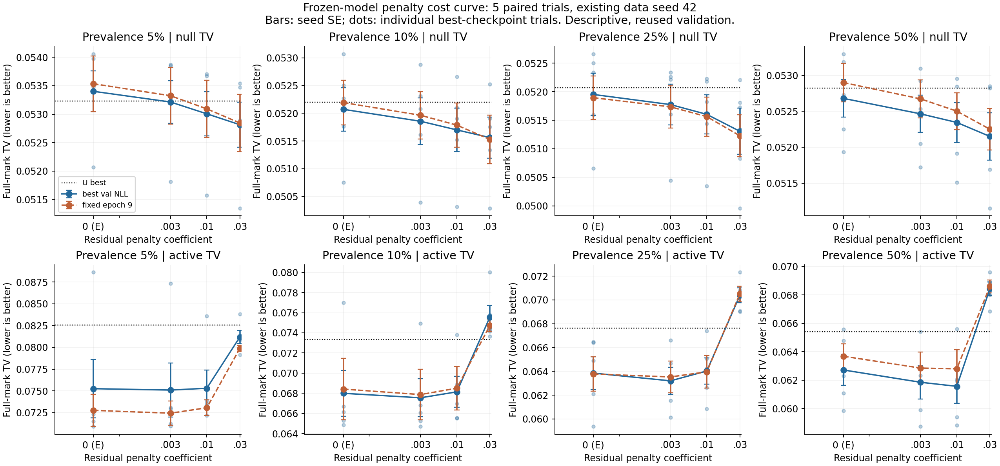
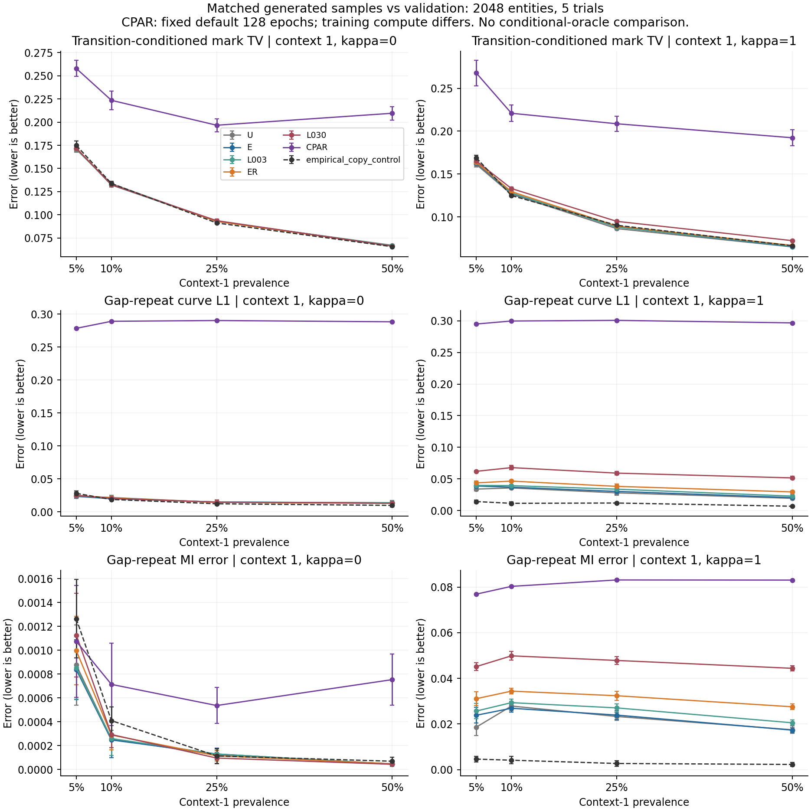

# CS-SAF 규제 비용·집단 비율·CPAR 비교 결과

2026-09-17. [사전등록](followup_v1_preregistration.md) · [전체 수치·검증 근거](followup_v1_result.json).

## 실행과 범위

이전 replication의 FAIL 판정은 그대로다. 사용자 요청으로 별도 사전등록한 탐색 확장을 완료했다. 비율 5%에서 두 규제 강도 20회, 비율 10/25/50%에서 U 및 네 규제 강도 150회: **신규 내부 학습 170회**, 기존 30회 재사용. CPAR는 네 비율×두 kappa×다섯 trial, **40회**, 각128 epochs. 이력/잔차 기울기는 기존 E/ER의40개 snapshot에서 분석했다.

모델·데이터·학습 예산·판정 기준을 고정하고 모든 등록 cell을 결과 방향과 무관하게 완료했다. 진단의 GPU backward 오류와 CPAR 손실 동등 가속은 별도 실행 보완으로 기록했다. 각 launch 전에 compute process가 없는 GPU를 확인하여 우리 작업을 하나씩 배정했다. 이후 다른 작업이 GPU에 진입해 일시적으로 중첩된 구간은 있었으며, 실행 내내 독점 사용했다는 뜻은 아니다. 점유가 확인된 동안 신규 배정을 기다렸다. 학습 seed와 route-bank seed 및 생성 seed는 이전 다섯 trial 그대로다. 데이터 생성 seed42와 같은 train/validation을 재사용하며, 신규 데이터·test·실데이터 확인은 아니다.

## 내부 모델: 조건부 분포 정확도

TV는 낮을수록 좋다. null은 세 비활성 cell의 동일 가중 평균, active는 kappa1/context1이다. 평균±SD는 다섯 학습 trial의 기술 통계다. 반응 PASS는 기존 copy/repeat 기준을 모두 만족한 trial 수다.

| 비율 | 모델 | null TV | active TV | 반응 PASS |
|---|---|---:|---:|---:|
| 5% | U | 0.0532338 ± 0.0009393 | 0.0825495 ± 0.0050101 | 2/5 |
| 5% | E (λ=0) | 0.0534013 ± 0.0007972 | 0.0752477 ± 0.0075163 | 1/5 |
| 5% | λ=.003 | 0.0532133 ± 0.0008351 | 0.0750929 ± 0.0069131 | 5/5 |
| 5% | ER (λ=.01) | 0.0530062 ± 0.0008662 | 0.0752955 ± 0.0046783 | 5/5 |
| 5% | λ=.03 | 0.0528144 ± 0.0008816 | 0.0811864 ± 0.0016823 | 5/5 |
| 10% | U | 0.0522002 ± 0.0007383 | 0.0733344 ± 0.0046400 | 5/5 |
| 10% | E (λ=0) | 0.0520708 ± 0.0008756 | 0.0680004 ± 0.0050855 | 5/5 |
| 10% | λ=.003 | 0.0518558 ± 0.0009358 | 0.0675571 ± 0.0041993 | 5/5 |
| 10% | ER (λ=.01) | 0.0517000 ± 0.0008761 | 0.0681442 ± 0.0034433 | 5/5 |
| 10% | λ=.03 | 0.0515613 ± 0.0008297 | 0.0755686 ± 0.0026097 | 5/5 |
| 25% | U | 0.0520673 ± 0.0006813 | 0.0676123 ± 0.0011282 | 5/5 |
| 25% | E (λ=0) | 0.0519510 ± 0.0008307 | 0.0638509 ± 0.0030715 | 5/5 |
| 25% | λ=.003 | 0.0517739 ± 0.0007981 | 0.0632010 ± 0.0025519 | 5/5 |
| 25% | ER (λ=.01) | 0.0516026 ± 0.0007703 | 0.0640288 ± 0.0024729 | 5/5 |
| 25% | λ=.03 | 0.0513055 ± 0.0009056 | 0.0703889 ± 0.0013855 | 5/5 |
| 50% | U | 0.0528239 ± 0.0004234 | 0.0654207 ± 0.0018937 | 5/5 |
| 50% | E (λ=0) | 0.0526803 ± 0.0005882 | 0.0627099 ± 0.0024296 | 5/5 |
| 50% | λ=.003 | 0.0524648 ± 0.0005783 | 0.0618440 ± 0.0026274 | 5/5 |
| 50% | ER (λ=.01) | 0.0523450 ± 0.0006198 | 0.0615577 ± 0.0026898 | 5/5 |
| 50% | λ=.03 | 0.0521502 ± 0.0007352 | 0.0684302 ± 0.0010571 | 5/5 |



## E에 규제를 추가한 효과

양수 active ΔTV는 악화다. 95% t 구간은 paired training trial n=5/df4에 대한 기술 통계로 다중 비교 보정이 없다. validation을 반복 사용한 탐색 결과이므로 통계적 우위/동등성 입증으로 해석하지 않는다.

| 비율 | λ | null ΔTV | active ΔTV [95% t 구간] | active 개선 시드 | epoch9 active ΔTV | 원래 기준의 진단 결과 |
|---|---:|---:|---|---:|---:|---|
| 5% | λ=.003 | -0.0001880 | -0.0001548 [-0.0010989, +0.0007893] | 2/5 | -0.0003249 | PASS |
| 5% | ER (λ=.01) | -0.0003951 | +0.0000478 [-0.0035754, +0.0036710] | 1/5 | +0.0002978 | FAIL |
| 5% | λ=.03 | -0.0005869 | +0.0059388 [-0.0015947, +0.0134723] | 1/5 | +0.0071174 | FAIL |
| 10% | λ=.003 | -0.0002150 | -0.0004432 [-0.0015840, +0.0006975] | 4/5 | -0.0005408 | PASS |
| 10% | ER (λ=.01) | -0.0003707 | +0.0001438 [-0.0023545, +0.0026421] | 1/5 | +0.0000901 | FAIL |
| 10% | λ=.03 | -0.0005094 | +0.0075683 [+0.0043450, +0.0107916] | 0/5 | +0.0063163 | FAIL |
| 25% | λ=.003 | -0.0001772 | -0.0006499 [-0.0026355, +0.0013356] | 3/5 | -0.0002516 | PASS |
| 25% | ER (λ=.01) | -0.0003485 | +0.0001779 [-0.0015658, +0.0019215] | 1/5 | +0.0001786 | FAIL |
| 25% | λ=.03 | -0.0006456 | +0.0065380 [+0.0037257, +0.0093502] | 0/5 | +0.0067341 | FAIL |
| 50% | λ=.003 | -0.0002155 | -0.0008660 [-0.0018654, +0.0001334] | 4/5 | -0.0008341 | PASS |
| 50% | ER (λ=.01) | -0.0003353 | -0.0011522 [-0.0025951, +0.0002906] | 4/5 | -0.0008887 | PASS |
| 50% | λ=.03 | -0.0005301 | +0.0057202 [+0.0036558, +0.0077847] | 0/5 | +0.0049205 | FAIL |

기존 기준을 적용한 위 PASS/FAIL은 이 별도 탐색 확장의 진단이다. 이전 등록 실험의 FAIL을 재분류하지 않는다. 고정 epoch9의 빠진 snapshot은 대체하거나 학습을 연장하지 않는다. 전체 snapshot별 factual TV/repeat BCE/잔차 RMS와 각 null cell 수치는 JSON에 보존했다.

## 저장 checkpoint의 기울기 진단

각 train context에서 고정된 최대256 entities를 추출하고 mark NLL/base NLL과 λ=.01 잔차 규제의 기울기를 비교했다. 실제 optimizer step은0회이며 checkpoint 파일과 tensor hash가 유지됐다. negative cosine은 해당 위치에서 두 목적의 하강 방향이 충돌함을 뜻하며, 이것만으로 학습 실패의 역사적 원인을 단정할 수 없다.

| 모델 | snapshot | cell | 공유 encoder cosine 평균 | 음수 시드 | route-context cosine 평균 | 규제/mark gradient norm 비 평균(encoder) |
|---|---|---|---:|---:|---:|---:|
| E | best | κ0/y0 | -0.1356 | 4/5 | -0.0318 | 0.0013 |
| E | best | κ0/y1 | -0.2101 | 4/5 | -0.2375 | 0.0047 |
| E | best | κ1/y0 | -0.0659 | 3/5 | +0.0236 | 0.0011 |
| E | best | κ1/y1 | +0.0566 | 3/5 | -0.0182 | 0.0522 |
| E | epoch_9 | κ0/y0 | -0.1462 | 5/5 | -0.0155 | 0.0013 |
| E | epoch_9 | κ0/y1 | -0.1455 | 4/5 | -0.0746 | 0.0046 |
| E | epoch_9 | κ1/y0 | -0.0484 | 3/5 | +0.0400 | 0.0011 |
| E | epoch_9 | κ1/y1 | +0.1326 | 2/5 | +0.1106 | 0.0525 |
| ER | best | κ0/y0 | +0.0982 | 2/5 | -0.0371 | 0.0004 |
| ER | best | κ0/y1 | -0.2348 | 5/5 | -0.2164 | 0.0017 |
| ER | best | κ1/y0 | -0.0408 | 3/5 | -0.0019 | 0.0004 |
| ER | best | κ1/y1 | -0.0691 | 4/5 | -0.3067 | 0.0604 |
| ER | epoch_9 | κ0/y0 | +0.1340 | 1/5 | -0.0072 | 0.0004 |
| ER | epoch_9 | κ0/y1 | -0.1595 | 5/5 | -0.0730 | 0.0016 |
| ER | epoch_9 | κ1/y0 | -0.0045 | 3/5 | -0.0029 | 0.0004 |
| ER | epoch_9 | κ1/y1 | -0.0420 | 3/5 | -0.2084 | 0.0629 |

활성 cell(κ1/y1), ER best checkpoint의 블록별 비교:

| 파라미터 블록 | mark-vs-penalty cosine 평균 | 규제/mark 기울기 norm 비 최소–최대 |
|---|---:|---:|
| encoder | -0.0691 | 0.0118–0.1024 |
| route_context | -0.3067 | 0.1037–0.2731 |
| gap_embedding | -0.1642 | 0.1169–0.2559 |
| route_gap_interaction | -0.8428 | 0.4201–1.0920 |
| history_alpha | 해당 없음(규제 기울기 0) | 0.0000–0.0000 |
| copy_base | 해당 없음(규제 기울기 0) | 0.0000–0.0000 |

이력 계수 alpha에 대한 직접 규제 기울기와 공유 특징을 통한 간접 영향은 구분해야 한다. h와 raw gap reference mean에 대한 penalty-descent 방향 미분은 원본 JSON에 함께 보존한다. 이 수치는 유한한 재학습 개선이나 경로 분리 성공의 증거가 아니다.

## CPAR와 공통 생성 평가

CPAR는 SDV1.38.0/DeepEcho0.8.1의 고정 wrapper, 전체 train, 최종128 epoch를 사용했다. CPAR 손실은 고정된 DeepEcho0.8.1 수식과 기울기를 검증한 벡터화 구현을 사용했다([실행 보완 기록](followup_v1_execution_amendment_02.md)). CS-SAF는 기존 best-validation NLL checkpoint다. 같은 train-source indices·정적 context·길이 계획·2048개 생성 수를 사용했다. CPAR는 연속 gap을 유지했다. 아래 지표는 생성 표본을 validation과 비교한 값으로, 위 oracle 조건부 TV와 다른 지표다. CPAR의 존재하지 않는 copy-head 점수나 비교 불가능한 raw likelihood를 대체해 넣지 않았다.

주요 세 생성 지표의 context1 평균(다섯 trial). pooled/context0 및 나머지 marginal/lag/length 지표, 모든 paired 차이와 구간은 JSON에 있다.

| 비율 | κ | 모델 | transition mark TV | gap-repeat L1 | gap-repeat MI error |
|---|---:|---|---:|---:|---:|
| 5% | 0 | U | 0.170493 | 0.024164 | 0.000876 |
| 5% | 0 | E (λ=0) | 0.171584 | 0.023610 | 0.000837 |
| 5% | 0 | λ=.003 | 0.171246 | 0.024548 | 0.000851 |
| 5% | 0 | ER (λ=.01) | 0.171884 | 0.025260 | 0.000997 |
| 5% | 0 | λ=.03 | 0.171769 | 0.025104 | 0.001127 |
| 5% | 0 | CPAR | 0.257870 | 0.278402 | 0.001074 |
| 5% | 0 | empirical_copy_control | 0.174852 | 0.028165 | 0.001264 |
| 5% | 1 | U | 0.161184 | 0.033951 | 0.018611 |
| 5% | 1 | E (λ=0) | 0.163029 | 0.038831 | 0.023815 |
| 5% | 1 | λ=.003 | 0.164009 | 0.039846 | 0.025661 |
| 5% | 1 | ER (λ=.01) | 0.163631 | 0.043793 | 0.031076 |
| 5% | 1 | λ=.03 | 0.165154 | 0.062048 | 0.045138 |
| 5% | 1 | CPAR | 0.267758 | 0.294926 | 0.076883 |
| 5% | 1 | empirical_copy_control | 0.168929 | 0.014242 | 0.004592 |
| 10% | 0 | U | 0.133551 | 0.021811 | 0.000257 |
| 10% | 0 | E (λ=0) | 0.132263 | 0.019992 | 0.000248 |
| 10% | 0 | λ=.003 | 0.132322 | 0.020511 | 0.000259 |
| 10% | 0 | ER (λ=.01) | 0.132713 | 0.021138 | 0.000289 |
| 10% | 0 | λ=.03 | 0.132405 | 0.020523 | 0.000293 |
| 10% | 0 | CPAR | 0.223525 | 0.289074 | 0.000714 |
| 10% | 0 | empirical_copy_control | 0.133823 | 0.018896 | 0.000410 |
| 10% | 1 | U | 0.126486 | 0.035771 | 0.027847 |
| 10% | 1 | E (λ=0) | 0.127660 | 0.036959 | 0.026876 |
| 10% | 1 | λ=.003 | 0.127758 | 0.039436 | 0.029332 |
| 10% | 1 | ER (λ=.01) | 0.129490 | 0.046583 | 0.034379 |
| 10% | 1 | λ=.03 | 0.133115 | 0.067877 | 0.049847 |
| 10% | 1 | CPAR | 0.220885 | 0.299623 | 0.080288 |
| 10% | 1 | empirical_copy_control | 0.124924 | 0.011483 | 0.004123 |
| 25% | 0 | U | 0.092872 | 0.014475 | 0.000120 |
| 25% | 0 | E (λ=0) | 0.093076 | 0.015041 | 0.000130 |
| 25% | 0 | λ=.003 | 0.093201 | 0.014868 | 0.000129 |
| 25% | 0 | ER (λ=.01) | 0.092977 | 0.014529 | 0.000115 |
| 25% | 0 | λ=.03 | 0.093696 | 0.014883 | 0.000096 |
| 25% | 0 | CPAR | 0.196638 | 0.290240 | 0.000536 |
| 25% | 0 | empirical_copy_control | 0.091222 | 0.012355 | 0.000113 |
| 25% | 1 | U | 0.086376 | 0.028020 | 0.023276 |
| 25% | 1 | E (λ=0) | 0.088492 | 0.030285 | 0.023888 |
| 25% | 1 | λ=.003 | 0.088098 | 0.033830 | 0.027035 |
| 25% | 1 | ER (λ=.01) | 0.089477 | 0.038294 | 0.032368 |
| 25% | 1 | λ=.03 | 0.094850 | 0.059221 | 0.047829 |
| 25% | 1 | CPAR | 0.208640 | 0.300653 | 0.083099 |
| 25% | 1 | empirical_copy_control | 0.090262 | 0.011947 | 0.002674 |
| 50% | 0 | U | 0.067095 | 0.013268 | 0.000047 |
| 50% | 0 | E (λ=0) | 0.066573 | 0.013743 | 0.000044 |
| 50% | 0 | λ=.003 | 0.066622 | 0.013935 | 0.000046 |
| 50% | 0 | ER (λ=.01) | 0.066172 | 0.012984 | 0.000048 |
| 50% | 0 | λ=.03 | 0.066192 | 0.013115 | 0.000044 |
| 50% | 0 | CPAR | 0.209542 | 0.288313 | 0.000754 |
| 50% | 0 | empirical_copy_control | 0.065647 | 0.009893 | 0.000069 |
| 50% | 1 | U | 0.065129 | 0.019398 | 0.017449 |
| 50% | 1 | E (λ=0) | 0.065289 | 0.020487 | 0.017291 |
| 50% | 1 | λ=.003 | 0.065791 | 0.022852 | 0.020518 |
| 50% | 1 | ER (λ=.01) | 0.066741 | 0.029527 | 0.027531 |
| 50% | 1 | λ=.03 | 0.072357 | 0.051638 | 0.044380 |
| 50% | 1 | CPAR | 0.192326 | 0.296677 | 0.083046 |
| 50% | 1 | empirical_copy_control | 0.066420 | 0.006864 | 0.002265 |

### 실제 이력의 조건부 정확도와 자유 생성은 다른 평가다

아래는 활성 context1/kappa1의 공통 생성 지표에서 같은 trial끼리 뺀 차이다. 양수는 악화다. 개선 수는 다섯 trial 중 음수인 개수이며, oracle grid TV의 개선 수와 동일한 의미가 아니다.

| 비율 | 비교 | transition TV Δ (개선 수) | repeat L1 Δ (개선 수) | MI error Δ (개선 수) |
|---|---|---:|---:|---:|
| 5% | E-U | +0.0018447 (2/5) | +0.0048797 (1/5) | +0.0052037 (0/5) |
| 5% | L003-E | +0.0009802 (2/5) | +0.0010148 (2/5) | +0.0018459 (1/5) |
| 5% | ER-E | +0.0006026 (1/5) | +0.0049618 (1/5) | +0.0072611 (0/5) |
| 5% | L030-E | +0.0021259 (1/5) | +0.0232176 (0/5) | +0.0213228 (0/5) |
| 10% | E-U | +0.0011741 (2/5) | +0.0011885 (2/5) | -0.0009704 (3/5) |
| 10% | L003-E | +0.0000976 (3/5) | +0.0024770 (0/5) | +0.0024553 (0/5) |
| 10% | ER-E | +0.0018303 (0/5) | +0.0096235 (0/5) | +0.0075023 (0/5) |
| 10% | L030-E | +0.0054554 (0/5) | +0.0309181 (0/5) | +0.0229709 (0/5) |
| 25% | E-U | +0.0021166 (0/5) | +0.0022649 (1/5) | +0.0006112 (2/5) |
| 25% | L003-E | -0.0003946 (4/5) | +0.0035449 (0/5) | +0.0031471 (0/5) |
| 25% | ER-E | +0.0009852 (0/5) | +0.0080085 (0/5) | +0.0084801 (0/5) |
| 25% | L030-E | +0.0063577 (0/5) | +0.0289352 (0/5) | +0.0239409 (0/5) |
| 50% | E-U | +0.0001595 (2/5) | +0.0010889 (2/5) | -0.0001571 (3/5) |
| 50% | L003-E | +0.0005021 (1/5) | +0.0023644 (0/5) | +0.0032264 (0/5) |
| 50% | ER-E | +0.0014526 (1/5) | +0.0090399 (0/5) | +0.0102399 (0/5) |
| 50% | L030-E | +0.0070681 (0/5) | +0.0311511 (0/5) | +0.0270885 (0/5) |

CPAR 실제 neural parameter 수: [11370]. fit 소요 시간 최소–최대: 104.0–107.9초, sampling: 167.3–172.5초. 공유 workstation의 실제 실행 시간이며 정밀한 속도 우위 실험은 아니다.




Whole-trajectory resampling은 원본 train trajectory를 복사하는 대조군이다. 좋은 fidelity만으로 새로운 생성 방법의 성공을 뜻하지 않는다. CPAR 기본 예산 비교는 동일 연산량/optimizer 비교가 아니며, CPAR 하나로 모든 외부 순차 모델보다 좋다고 주장할 수 없다. 전체 loss history와 소요 시간도 산출물에 남겼다.

## 검증과 재현

- 최종 실행 source: `e4089664d7e50ea29a662bc78952220bd79014f1`; 사전등록 `0bbd049`. 신규 내부 fits는 `fccc7bb` 20회, `926b505` 20회, `e408966` 130회다. 기존 30회는 `e35c6c2`이며, 기울기 진단 10개 job은 `926b505`, CPAR 40회는 `e408966`이다.
- 초기 기울기 진단 3개 실행의 기술 실패와 [수정 기록](followup_v1_execution_amendment_01.md)을 보존했다. 최종 고유 GPU 작업 220개와 CPU 생성 평가 200개는 모두 완료했다. 고정 모델/예산을 바꾸는 과학적 재시도는 하지 않았다.
- 구현 검증: 현 실행 코드의 대상 GPU regression 17개 PASS, 별도의 같은 source CPU gate PASS. 최종 산출물은 아래 원본 검증기로 재계산했다.
- CPU: 다섯 설정 각2회 반복/reload/loss/validity 및 CPAR adapter smoke PASS.
- artifact checksum 2,500건, checkpoint tensor 400건, entity 배열 1,600개 검증.
- CS-SAF+CPAR 생성 entity 491,520개. 전체 공통 지표는 같은 계획으로 계산.
- 누락 snapshot: 0건. 데이터와 학습·생성 계획의 대응 및 paired 통계 재계산 PASS.
- 원격 원본: `artifacts/cs_saf/followup_v1/`; 대형 checkpoint/생성 parquet/npz는 GitHub에 포함하지 않음.

## 해석과 다음 수정

**이번 단계의 결론은 ‘약한 규제의 평균 조건부 오차 이득과 CPAR 대비 생성 지표 개선은 관찰했지만, 새 규제가 더 좋은 시퀀스 생성기를 만든다는 주장은 아직 성립하지 않는다’이다.** 기존 ER replication의 실패는 보존한다. 이 별도 확장에서는 L003이 네 비율의 보조 판정을 통과했다는 긍정 결과도 함께 보고한다.

### 관측한 진전과 남은 실패

1. **이력 보정의 이득과 규제의 이득을 분리했다.** E−U의 활성 grid TV는 네 비율 각각 5/5 trial에서 개선됐다. 평균 차이는 5/10/25/50%에서 −.0073018/−.0053340/−.0037614/−.0027107이다. E에는 이력 계수 32개가 더 있으므로 이 결과를 잔차 규제의 기여로 설명할 수 없다. 같은 trial을 비율마다 재사용했으므로 이를 독립적인 20회 확인으로 세지 않는다.
2. **약한 규제는 검토할 후보지만 확증된 해법은 아니다.** L003의 null 평균 TV는 네 비율 모두 E보다 낮고, active 평균도 낮아 기존 평균 기준의 보조 판정은 모두 PASS다. 그러나 active 개선 trial 수는 2/4/3/4개이며, 네 paired 95% t 구간 모두 0을 포함한다. 기존에 없던 ‘4/5 개선’ 기준을 만들어 PASS를 FAIL로 바꾸거나, 평균 PASS를 통계적 우위로 바꾸지 않는다. 이 validation에서 확인한 λ=.003은 독립 확인이 필요한 탐색 후보다.
3. **규제의 비용은 집단 비율에 따라 달라진다.** λ=.01은 5/10/25%의 active 평균을 악화시키지만 50%에서는 −.0011522 개선(4/5)하고 보조 판정을 통과한다. λ=.03은 모든 비율의 active 평균을 악화시킨다. 고정 epoch 9에서도 강한 규제의 악화 방향이 유지되므로 checkpoint 선택만 바꾸면 해결된다는 설명은 부족하다.
4. **조건부 정확도와 자유 생성 품질 사이의 간극을 확인했다.** L003−E의 활성 생성 repeat L1와 MI error 평균은 네 비율 모두 증가한다. 특히 10/25/50%에서는 두 지표가 각각 5/5 trial에서 악화한다. E−U도 실제 이력의 grid TV 개선과 달리 생성 repeat L1 평균은 모든 비율에서 증가한다. 따라서 oracle TV의 작은 개선을 전체 생성 성능 향상으로 대체해 설명하지 않는다.
5. **외부 비교의 관측 범위는 명확하다.** 활성 context1/κ1의 등록된 세 생성 지표에서는 U/E/L003/ER/L030 모두, 각 비율의 5/5 trial에서 이 고정 CPAR 실행보다 오차가 작았다. 예를 들어 5%에서 E의 transition TV/repeat L1/MI error는 .163029/.038831/.023815, CPAR는 .267758/.294926/.076883이다. 하지만 U도 같은 비교에서 더 좋으므로 CPAR 대비 차이를 새 규제의 효과로 귀속할 수 없다. 일부 비활성·주변 지표에는 예외가 있고, 모든 지표·모든 cell의 우위라는 주장을 하지 않는다.

원본 trajectory 복사 대조군은 활성 repeat L1/MI error에서 모든 비율의 내부 신경 모델 평균보다 낮다. 이 대조군은 새로운 생성 능력이나 개인정보 보호를 입증하는 방법이 아니다. 현재 신경 모델의 행동 분포 재현에 개선 여지가 남아 있다는 기준으로 해석한다. 길이는 모든 모델에 같은 계획으로 주었으므로 length 오차의 동률은 길이 생성 능력의 동등성 증거가 아니다.

### 모델과 규제 수식이 설명하는 범위

E와 세 규제 모델의 예측 logit은 모두 `b(c)+h(c)+r(c,k)`다. U에는 `h`가 없다. `c`는 과거만 보는 GRU와 관측된 정적 context의 특징이다. 각 context의 rank-16 경로에서 `u=tanh(W_c c+b_c)`, `h=αᵀu/4`, `r=(w⊙u)ᵀtanh(W_g E_gap(k))/4`다. E 계열은 133,581개, U는 133,549개 파라미터를 갖는다. 현재 실험의 차이는 예측식 변경이 아니라 λ=0/.003/.01/.03이다.

규제에서만 train-context의 gap 주변 빈도 π를 써서 `δ_k=r_k−Σ_j π_j r_j`를 계산하고, `R=sqrt(Σ_k π_k δ_k²+ε²)−ε`(ε=1e−4)를 목적함수에 더한다. 고정 c에서 `∂R/∂r_k=π_k δ_k/sqrt(Σ_j π_j δ_j²+ε²)`이고 이 도함수들의 합은 0이다. 따라서 gap에 공통인 상수 이동에는 불변이지만, 활성 집단에서 필요한 gap 변화에도 비용을 부과한다. 강한 λ에서 확인한 active 비용은 이 수축 효과와 일치한다. 이것만으로 학습 이력의 유일한 원인을 증명한 것은 아니다.

`α`와 copy-base에는 직접 penalty gradient가 없지만 h와 r가 공유하는 u 및 encoder에는 gradient가 있다. ER best의 활성 cell에서 공유 encoder cosine 평균은 −.0691이고, route-gap/interaction 블록은 −.8428이다. 공유 특징을 통한 간접 이력 변화도 측정됐다. 그러나 이는 고정 train subset에서의 국소 raw gradient이며 실제 전체 minibatch·AdamW 상태·학습 궤적의 재구성이 아니다. 블록별 norm 비로 원인의 중요도를 인과적으로 순위 매기거나, 특징 분리만으로 문제가 해결된다고 단정하지 않는다.

Grid TV는 각 실제 이력에서 gap bin별 mark TV를 train-context 주변 빈도 π로 가중하고, entity 내부 전이를 평균한 뒤 entity를 동일 가중한다. π는 `p(gap|history,context)`가 아니므로 자연 발생 조건부 위험과 같지 않다. factual TV는 관측 gap bin에서 따로 보존했다. 이 oracle는 고정한 gap 표현에 맞춘 것으로 연속시간 전체 분포의 정확도를 모두 측정하지 않는다. 규제의 중심화를 실제 공동분포의 모든 주효과·상호작용을 직교화한 것으로 해석하지 않는다.

실제 반복 확률은 `q_copy+(1−q_copy)q_fresh(previous)`다. copy 변수 자체의 완전한 식별과 전체 mark 분포의 정확도는 다르며, gap 반응은 인과적 do(gap) 효과가 아니라 조건부 예측 의존성이다. null TV가 약 .05 수준으로 남는 사실은 gap 민감도를 거의 제거해도 전체 오차가 사라지지 않는다는 뜻이다. 남은 오차를 gap과 무관한 반복 확률 보정 및 fresh-mark 분포로 나눠 점검할 필요가 있지만, 현재 full TV−repeat L1를 fresh-head의 독립적인 인과 기여라고 간주하지 않는다.

### 외부 비교와 데이터의 한계

CPAR는 11,370개 파라미터의 공식 기본 구조와 최종 128 epochs를 썼다. 내부 모델과 파라미터 수, optimizer, 업데이트 횟수 및 checkpoint 선택이 같지 않다. 특히 고정 DeepEcho0.8.1의 가변 길이 continuous loss는 마지막 length개 target을 쓰고 다른 채널은 앞의 length개 target을 쓰는 정렬 관행을 포함한다. 벡터화는 이 관행과 N² 정규화를 그대로 보존했다. 수식·gradient 동등성 검증은 했지만 부동소수점 합산 순서까지 bitwise 동일한 학습을 약속하지 않는다. **이 pinned 구현의 비교 결과를 CPAR 계열 전체의 한계 또는 일반적인 SOTA 우위로 확대할 수 없다.** 독립 구현의 sanity check와 추가 순차 baseline이 필요하다.

CPAR wrapper는 entity ID·event index·누적 timestamp를 생성 특징에서 제외하고 gap·mark·numeric value를 모델링한다. 첫 gap은 라이브러리 호환을 위해 학습 입력에서 0으로 두고 생성 후 구조상 missing으로 복원한다. 내부 모델은 해당 첫 gap의 loss를 mask한다. CPAR에는 정적 context와 계획 길이를 전달하고, 내부 모델은 같은 길이를 생성 종료 계획으로 사용한다. 이러한 전처리·표현 차이를 포함한 고정 wrapper 비교이며 동일 architecture/input encoding 비교가 아니다.

생성 수는 전체 2,048개로 고정했으며 5% 집단은 trial별 90/91/90/109/93개다. 비율이 증가하면 학습 표본뿐 아니라 생성 평가에 쓰이는 소수집단 표본 수도 증가한다. 따라서 생성 지표 곡선의 하강을 학습 개선만으로 해석하지 않는다. 다섯 trial에는 학습 초기화·route bank·생성 난수가 함께 달라지며, 같은 데이터 seed42와 validation을 재사용했다. 다중 비교 보정, 독립 데이터 확인, held-out test, 실데이터 검증은 수행하지 않았다.

순차 조건부 합성은 [PAR](https://arxiv.org/abs/2207.14406), copy/new 혼합은 [pointer-generator](https://aclanthology.org/P17-1099/), 주효과/상호작용 식별은 [functional ANOVA purification](https://proceedings.mlr.press/v108/lengerich20a.html) 등에서 이미 다뤘다. 현재의 차별성 후보는 이 구성요소의 최초 제안이 아니라 희소 context의 유용한 의존성과 비활성 context의 불필요한 반응을 구분하고, 그 해결책을 조건부 정확도와 자유 생성에서 함께 검증하는 데 있다. 이번 결과만으로 방법의 최종 기여나 학회 수준의 우수성을 확정하지 않는다.

### 다음 단계: λ 탐색을 늘리기 전에 원인을 분리한다

아래는 **제안이며 아직 사전등록·실행하지 않았다.** 이번에 등록한 학습 범위는 전부 완료했고 결과를 보고할 수 있다.

1. **저장 checkpoint로 생성 오차의 출처를 분리한다.** U/E/L003을 고정하고 실제 이력에서의 예측, 실제 gap 경로를 공급하는 mark 생성, 자체 gap까지 생성하는 경우를 비교하는 진단을 별도로 설계한다. 단계별 오차와 여러 고정 생성 난수로 표본 변동을 함께 점검한다. 실제 gap 공급은 원래 생성 분포의 조건부 표본과 같지 않을 수 있으므로 모델 성능 순위나 인과 효과의 증명이 아닌 민감도 진단으로 한정한다. 이 결과가 gap decoder, 공유 특징, 생성 이력 누적 오차 중 어느 변경을 우선할지 정할 근거가 된다.
2. **공유 특징의 영향이 수정 대상으로 남으면 별도 대조군을 둔다.** E의 예측 구조를 유지한 상태에서 규제 gradient가 공유 encoder로 전달되는 범위만 바꾸는 arm과 그에 대응하는 λ=0 대조군을 등록한다. 필요하다면 용량을 맞춘 특징 분리 arm을 별도로 둔다. 현재 확인된 직접 gap 경로의 수축 비용도 함께 측정한다. 용량 증가와 규제 효과를 섞거나 성공할 때까지 λ를 계속 추가하지 않는다.
3. **외부 증거를 보강한 뒤 독립 확인으로 넘어간다.** CPAR의 target 정렬·기본 예산에 대한 별도 sanity/민감도 비교와 REaLTabFormer 또는 TabularARGN 같은 두 번째 순차 baseline을 등록한다. 그 뒤 고정 후보를 새로운 데이터 생성 seed와 학습 seed에서 확인한다. 후보가 기존 E보다 실제 생성 품질도 개선하지 못하면 규제의 성능 향상 주장을 줄이고, 진단 프로토콜과 관측한 효과·비용을 연구 결과로 정리한다.

연구 전체를 중단할 근거로 단정할 단계는 아니다. 다만 지금부터는 ‘규제 계수를 더 찾아 좋은 숫자를 얻는 것’보다 **조건부 정확도와 자유 생성 사이의 차이를 설명하고 해결하는 것**이 우선이다.


## 원격 산출물의 재검증

동일 원격 워크스페이스와 원본 artifacts가 있는 환경에서 아래 명령으로 JSON과 그림을 재생성한다. 저장된 manifest의 절대 경로도 이 워크스페이스를 가리킨다. GitHub만 clone한 환경에는 원본 checkpoint와 데이터가 포함되지 않는다. 해석 문서는 자동 생성 초안이 아니라 검토된 결과이므로 아래 명령은 이를 덮어쓰지 않는다.

```bash
CUDA_VISIBLE_DEVICES='' OMP_NUM_THREADS=1 MKL_NUM_THREADS=1 OPENBLAS_NUM_THREADS=1 python scripts/summarize_cs_saf_followup.py
MPLCONFIGDIR=/tmp/cs_saf_matplotlib python scripts/plot_cs_saf_followup.py
```
