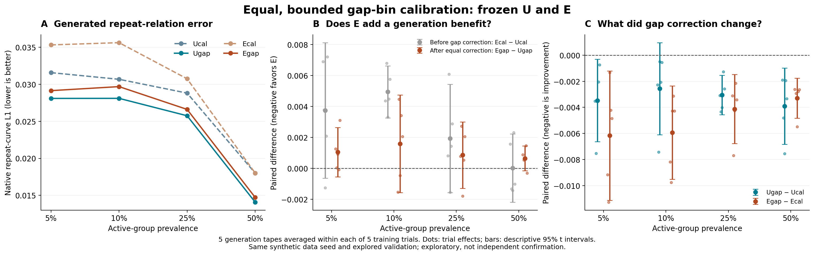
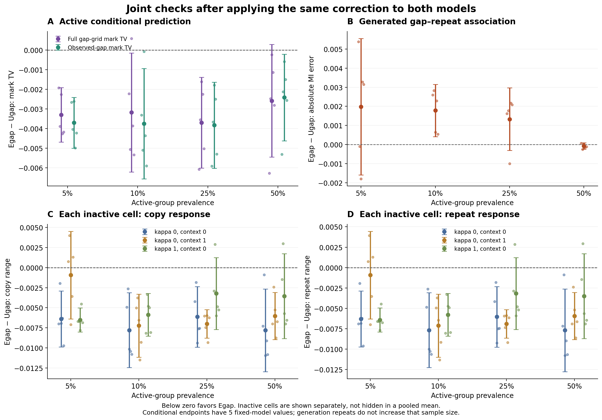

# 간격별 보정의 효과와 E 구조의 추가 기여 — 2026-09-20

**결론: 제한된 간격별 보정은 두 모델의 생성 관계 오차를 일관되게 줄였습니다. 그러나 같은 보정을 적용한 U보다 E가 더 잘 생성한다는 주장은 이번에도 뒷받침되지 않았습니다.** E는 조건부 예측과 비활성 반응에서 상대적 이점을 유지하지만, 보정 자체는 두 모델 모두의 비활성 반응을 조금 키웠습니다. 전체 목표를 동시에 해결한 최종 모델로 채택하지 않습니다.

4개 집단 비율 × 2개 관계 조건 × 5개 학습 시드 × 2개 모델의 **80개 보정, 400개 새 생성 데이터셋**을 완료했습니다. CPU 테스트 6개, CPU/GPU gate, 원자료 독립 검증을 통과했고 GPU 작업은 종료됐습니다. 최초 메타데이터 검사 오류와 2개 동일 재실행 기록도 보존했습니다.

[교수님 보고용 짧은 정리](professor_brief_gap_calibration_2026_09_20.md) · [전체 통계·보정값](gap_calibration_v1_result.json) · [모든 생성 지표 CSV](gap_calibration_v1_all_metrics.csv) · [사전등록](gap_calibration_v1_preregistration.md)

## 1. 실제 생성 오차는 줄었는가

거래 간격·행동·수치값을 모두 스스로 생성한 데이터에서, 간격 구간별 행동 반복률을 검증 데이터의 관측 반복률과 비교했습니다. 아래는 기존 집단별 선형 보정에 **간격별 보정을 추가했을 때의 변화**입니다. 음수는 개선입니다.

| 집단 비율 | U 생성 오차 변화 | E 생성 오차 변화 | 개선된 학습 시드 |
| --- | --- | --- | --- |
| 5% | -11.0% | -17.5% | 각각 5/5 |
| 10% | -8.4% | -16.7% | 각각 5/5 |
| 25% | -10.6% | -13.4% | 각각 5/5 |
| 50% | -21.7% | -18.3% | 각각 5/5 |

네 비율 각각의 5개 학습 시드에서 두 모델 모두 생성 L1이 감소해, 두 비교 모두 사전등록한 **주 지표 개선 선별 기준을 충족**했습니다. 다만 아래에서 보듯 생성 품질의 모든 지표가 개선된 것은 아닙니다.

## 2. 그렇다면 E의 추가 이력 구조가 U보다 좋은가

아래 오차는 낮을수록 좋습니다. 두 모델에 같은 보정 능력을 준 뒤 비교해야 E 구조의 추가 이득과 일반적인 보정 효과를 구분할 수 있습니다.

| 집단 비율 | U+구간 보정 | E+구간 보정 | E−U 오차 | E의 상대 오차 증가 | E의 오차가 작은 학습 시드 |
| --- | --- | --- | --- | --- | --- |
| 5% | 0.028078 | 0.029126 | +0.001048 | +3.7% | 1/5 |
| 10% | 0.028086 | 0.029669 | +0.001583 | +5.6% | 2/5 |
| 25% | 0.025740 | 0.026597 | +0.000857 | +3.3% | 1/5 |
| 50% | 0.014090 | 0.014730 | +0.000640 | +4.5% | 1/5 |

**Egap−Ugap의 주 지표 개선 기준은 0/4 비율에서 충족했고, 반대 방향의 비용 선별 기준은 5%·25%·50%에서 충족했습니다.** E의 생성 우수성 주장은 수정해야 합니다. 다만 시드 간 참고 95% 구간과 고정 모델의 생성 난수에 대한 조건부 MC 구간은 네 비율 모두 0을 포함합니다. 이 선별 결과를 모든 환경에서 E가 통계적으로 열등하다는 확정으로 해석하지 않습니다.

5%·10%·25%에서는 보정으로 E가 U보다 더 크게 개선돼 이전 오차 차이를 줄였으나, 순위를 역전하지는 못했습니다. 50%에서는 U의 개선 폭이 더 컸습니다. **“E 자체가 개선됐다”와 “E의 구조적 추가 이득이 확인됐다”는 서로 다른 결론입니다.**

## 3. 잘 나온 부분과 함께 남은 비용

다음 표는 모두 **동일한 구간 보정 후 E−U**의 평균 차이이며 음수는 E에 유리합니다. TV는 정답 생성 법칙으로 평가한 전체 행동분포 오차, copy/repeat 반응은 같은 이력에서 간격만 바꿨을 때의 확률 범위입니다. 정답 법칙은 평가에만 사용했습니다.

| 비율 | 생성 MI 오차 차이 | grid TV 차이 | factual TV 차이 | 비활성 평균 copy 차이 | 비활성 평균 repeat 차이 |
| --- | --- | --- | --- | --- | --- |
| 5% | +0.001980 | -0.003298 | -0.003699 | -0.004611 | -0.004537 |
| 10% | +0.001781 | -0.003176 | -0.003746 | -0.006964 | -0.006853 |
| 25% | +0.001329 | -0.003696 | -0.003826 | -0.005452 | -0.005364 |
| 50% | -0.000082 | -0.002581 | -0.002413 | -0.005802 | -0.005708 |

- **남아 있는 E의 이점:** 활성 집단의 grid/factual 조건부 TV와 비활성 세 조건 각각의 평균 반응이 모두 U보다 낮습니다. grid TV는 10%에서 4/5, 나머지 비율에서 5/5 시드가 E에 유리했고, factual TV는 모든 비율에서 5/5였습니다. 비활성 세 조건의 평균 반응도 각 비율의 5/5 시드에서 낮았습니다. 개별 비활성 조건의 모든 시드가 개선된다는 뜻은 아닙니다.
- **새 보정의 공통 비용:** 보정 전과 비교하면 U/E 모두 **세 비활성 조건 각각의 평균 copy·repeat 반응이 네 비율 모두 증가**했습니다. 세 조건 평균 copy 반응의 증가는 U에서 +0.000376~+0.000881, E에서 +0.000822~+0.001314입니다. 평균 변화가 작아도 허용 범위를 사후에 정해 공동 성공으로 바꾸지 않았습니다.
- **생성 지표 사이의 차이:** U의 새 보정은 5%·10%에서 생성 MI 오차를 각각 +0.002222, +0.001302 높였습니다. E는 보정 전보다 MI 오차도 낮아졌지만, 보정된 U와 비교하면 5%·10%·25%에서 여전히 MI 오차가 높았습니다. 반복률 L1의 개선을 전체 생성 분포의 우수성으로 확대하지 않습니다.
- **최종 판단:** 이번 두 보정 추가 비교와 E/U 비교 모두 공동 개선 기준은 충족하지 못했습니다. 이는 부분 개선이 없다는 뜻이 아니라, 필요한 관계 재현과 불필요한 반응 억제를 함께 해결했다는 주장을 아직 할 수 없다는 뜻입니다.

## 4. 연구 주장과 다음 방향의 수정

**유지할 연구 질문:** 조건부 예측이 좋아지는 것과 실제 생성 데이터에서 필요한 관계가 보존되는 것을 구분하고, 관계가 없는 집단의 반응까지 함께 통제할 수 있는가.

**이번에 확보한 근거:** 신경망을 다시 학습하지 않고 학습 표본의 관측 반복 여부만 이용한 제한된 보정으로 두 모델의 생성 L1을 개선했습니다. 그러나 같은 방법이 U에도 효과적이고, E의 조건부 이점은 생성 순위의 우위로 이어지지 않았습니다. 학습 반복 NLL을 낮추는 보정이 비활성 반응까지 억제해 주지도 않았습니다. 이 관찰은 특정 편향을 줄인 효과를 보여주지만 모든 실패 원인을 하나로 확정하지 않습니다.

**수정하는 주장:** “추가 이력 구조 E가 생성 관계 보존을 개선하는 핵심 구성요소다”를 현재 결론으로 사용하지 않습니다. E는 조건부 정확도·비활성 반응의 이점과 생성 오차의 비용을 가진 비교 대상으로 남깁니다. 기본 U도 이력을 사용하며, 일반적인 확률 보정 자체를 새로운 방법론적 기여로 제시하지 않습니다. 기존 ER 실패도 그대로 유지합니다. 이 비교만으로 E의 32개 추가 계수만이 문제의 유일한 원인이라고 확정할 수도 없습니다.

**다음 제안은 추가 계수 탐색이 아닙니다.** Ucal/Ugap을 생성 관계 성능의 기준으로, Ecal/Egap을 추가 구조의 비교 대상으로 고정한 뒤, 다음 실행 전에 (1) 우선할 생성 지표와 비활성 반응의 허용 비용을 목적에 근거해 정하고 (2) 새로운 데이터 생성 시드·학습 시드의 독립 확인을 별도로 사전등록하는 것이 타당합니다. 허용 기준을 뒷받침할 근거가 없다면 이번 공동 실패 판정을 유지합니다. 새로운 비교에서도 E의 생성 이득이 없으면 최종 생성 구조에 E를 필수로 넣지 않는 방향을 검토해야 합니다. 이후 동일한 보정 기회와 평가 조건을 제공하는 외부 baseline 비교, 행동–사기 관계와 실제 탐지 효용 검증이 필요합니다. **이 후속 독립 실험과 새 외부 비교는 아직 실행하지 않았습니다.**

## 무엇을 확인하는 실험인가

연구 목표는 **거래 간격에 따라 필요한 행동 관계를 재현하면서, 관계가 없는 집단에는 불필요한 반응을 만들지 않는 순차 생성 모델**입니다. 기본 모델 U도 과거 이력을 사용합니다. E는 반복확률 계산부에 이력 보정 계수 32개를 추가한 모델이며, 순차 생성이나 과거 이력 사용 자체가 새로운 기여는 아닙니다.

이전에는 E가 조건부 예측에서 이점을 보였지만, 스스로 생성한 데이터의 반복관계 오차는 동일하게 보정한 U보다 컸습니다. 같은 생성 이력을 입력해도 남는 간격별 예측 편향을 확인했으므로, 이번에는 **간격별 편향을 제한적으로 보정하면 생성 품질도 개선되는지, 그 후에도 E 구조의 추가 이득이 있는지**를 비교했습니다. 이 실험은 앞선 결과를 보고 설계한 탐색적 후속 실험입니다.

| 이름 | 의미 | 이번에 새로 학습한 부분 |
|---|---|---|
| Ucal | 기본 U + 기존 집단별 선형 로짓 보정 | 없음: 기존 모델·생성 결과를 대조군으로 유지 |
| Ecal | 추가 이력 보정 E + 같은 기존 확률 보정 | 없음: 기존 모델·생성 결과를 대조군으로 유지 |
| Ugap | Ucal + 간격 5구간별 제한된 보정 | 집단별 5개 값, 제약 포함 총 유효 자유도 8 |
| Egap | Ecal + **동일한** 간격별 보정 | 동일한 데이터·자유도·상한·규제·최적화 예산 |

U는 내부 구조 대조군이며 외부 생성 모델의 새 실험이 아닙니다. 기존 규제형 ER의 실패 판정은 유지합니다.

## 고정한 설계와 실제 실행 범위

- **범위:** 집단 비율 5·10·25·50%, 관계 유무 2조건, 기존 학습 시드 5개, 새 보정 2모델 = 80개 보정. 신경망 재학습은 없습니다.
- **보정 데이터:** 학습 데이터의 실제 행동 반복 여부만 사용했습니다. 정답 생성 법칙·잠재 상태·validation 오차·생성 결과를 적합 목표에 넣지 않았습니다. 기존 모델과 기존 선형 보정값은 모두 동결했습니다. 원래 checkpoint 선정에 사용된 validation 이력까지 새 독립 검증으로 바꾸는 것은 아닙니다.
- **구간:** 기존 이산 간격 표현에서 학습 표본의 20·40·60·80% 분위수로 5구간을 정했습니다. U/E 및 모든 학습 시드에서 같은 구간·빈도를 사용합니다. 생성 평가 지표의 기존 구간은 별도로 유지했습니다.
- **허용 변화:** 보정값은 −0.5~0.5, 학습 빈도로 가중한 보정 로짓 평균은 0, 고정 제곱 규제 계수는 0.001입니다. 10개 저장값에서 집단별 평균 제약 2개를 제외한 유효 자유도는 8입니다. 로짓 중심화가 평균 반복확률을 그대로 보존하는 것은 아닙니다. 이 0.001은 새 보정값에만 붙는 안정화 규제로, 이전 ER 신경망 규제 실험의 계수와는 별개입니다.
- **생성:** 각 모델의 고정된 2,048개 시퀀스 계획에서 기존에 등록한 생성 난수 5개를 사용했습니다. 간격·행동·수치값을 모두 재귀적으로 생성한 **새 데이터셋 400개, 819,200개 시퀀스**입니다. 기존 Ucal/Ecal 데이터셋 400개를 대응 대조군으로 재사용했습니다.
- **통계 단위:** 생성 5회는 각 학습 시드 안에서 먼저 평균한 뒤 5개 학습 시드를 비교했습니다. 25개의 독립 학습 결과로 세지 않았습니다. 조건부 평가는 고정 모델당 한 번의 평가이며 생성 횟수만큼 표본 수를 늘리지 않았습니다.

모델의 반복확률은 `q + (1−q) × 이전 행동의 fresh 확률`로 계산하므로, 새로운 행동을 뽑는 경로에서 우연히 같은 행동이 나오는 경우도 포함합니다. 새 보정은 `q = sigmoid(기존 보정 로짓 + 집단·간격구간별 값)`에만 적용했습니다. 첫 행동 분포는 동일하고, 이후에는 달라진 생성 이력이 후속 간격·행동·수치값에 영향을 줄 수 있습니다.

## 판단 기준

주 지표는 관계가 존재하는 집단의 **생성 데이터 간격별 행동 반복률 오차(L1)**입니다. 각 비율에서 평균 오차가 작고 5개 학습 시드 중 4개 이상에서 개선되는 조건이 4비율 중 3비율 이상이면 일관된 개선 선별 기준을 충족합니다. 반대 방향의 비용 기준도 대칭으로 확인합니다.

공동 개선 후보는 위 조건에 더해 생성 MI 오차, 활성 집단의 grid/factual 행동분포 TV, 그리고 관계가 없는 세 조건 각각의 copy/repeat 반응에서 평균 비용이 없어야 합니다. **모든 지표·모든 시드가 개선돼야만 부분적인 진전을 인정하는 기준은 아닙니다.** 다만 결과를 본 뒤 허용 손실을 정하거나 부분 개선을 공동 성공으로 바꾸지 않습니다. 불확실성 구간은 5개 시드의 기술적 t 구간이며 다중비교를 보정한 확증 검정이 아닙니다.

## 검증과 보존 기록

| 확인 항목 | 결과 |
|---|---|
| CPU 단위/회귀 검증 | 6개 통과 |
| 같은 실행 커밋의 CPU/GPU gate | 통과; GPU에서 기존 Ucal/Ecal 및 0-보정 모델의 2,048개 전체 표본 정확 재현 |
| 새 보정 80개: 원래 신경망·선형 보정·checkpoint | 모두 그대로 유지 |
| 학습 거래 쌍·구간·레이블·제약·적합 목적함수 재구성 | 80개 통과; 적합 목적함수 재계산 오차 0 |
| 보정 제약 | 160개 집단 최적화 모두 수렴; 경계 도달 0개; 최대 절댓값 0.386088; 가중 중심 제약 오차 최대 1.39e−17 |
| U/E 조건부 평가 기준 분포 | 40쌍 모두 정확히 동일 |
| 조건부 평균 재계산 | 2,240개 값 일치; 오차 0 |
| 기존 대조군 조건부 평가 재실행 | 기존 기록과 평균 차이 0 |
| 원시 생성 표본의 L1·MI 독립 재계산 | 1,200개 집단 평가의 2,400개 값 일치; 오차 0 |
| 정밀 반응 계산·zero-gap 통제 | 80개 모두 통과; 정밀 경로의 최대 개체 차이 3.77e−8; 간격 경로 제거 시 반응 0 |
| 원시 지표에서 요약·대응 비교 재구성 | 2,268개 통계 블록과 모든 선별 판정 일치; 오차 0 |
| 전체 지표 공개 | 4모델 × 모든 조건의 2,400 CSV 행, 생성 지표 31,200개 |

최초 두 작업에서 메모리의 tuple과 저장 JSON의 list를 직접 비교해 같은 평가 설정을 다르게 판정하는 기술 오류가 있었습니다. [실행 수정 기록](gap_calibration_v1_execution_amendment_01.md)대로 원래 출력 전체를 보존하고 JSON 형태를 정규화한 검사로 수정했습니다. 재실행한 두 작업의 보정값·전체 상태·조건부 평가·첫 생성 표본은 수정 전과 정확히 동일했습니다. **유효한 비교 모델은 80개이며 기술적 재실행 2개를 새 독립 증거로 세지 않았습니다.** CPU/GPU gate의 소표본 적합도 기술 검증일 뿐입니다.

보고용 후처리에서는 “세 비활성 조건 평균 중 최댓값”과 “각 시드에서 최댓값을 고른 뒤 평균한 값”을 별도로 저장했습니다. 전자가 등록한 worst-cell mean이며 후자는 추가 기술통계입니다. 공동 판정은 원래대로 세 조건을 각각 확인하므로 이 구분이 판정을 바꾸지 않습니다. 모델 적합·생성·조건부 및 native 평가 정의는 변경하지 않았습니다. 최종 독립 검증에는 거래 쌍의 완전한 순서와 구간 재구성 확인을 추가했습니다.

- 등록 커밋 `db76b85`; 모든 완료된 과학 실행은 `547bce0c0dde6a2c59d7513b0b020f010c9d87b8`입니다. 실행 계약 SHA-256은 `4d3811ceca90b31b6a7637a1ae9b5cff59a5482bbd070bfc3b1b6c9c1b5aea7a`입니다.
- 실행은 원격 워크스테이션에서 한 번에 최대 2개 빈 GPU, 낮은 우선순위·20% allocator 상한·프로세스당 CPU 스레드 1개로 수행했습니다. 다른 작업으로 모든 GPU가 점유됐을 때 자동 대기했고 빈 GPU가 생기자 재개했습니다. 기존 작업을 중지하지 않았습니다. 실험 GPU 프로세스는 모두 종료됐습니다.
- 원시 경로·checkpoint·학습 특징·실패 기록은 워크스테이션의 `artifacts/cs_saf/gap_calibration_v1/` 및 `gap_calibration_v1_attempt01_failed/`에 있습니다. Git에는 구현·등록·모든 스칼라/보정값·검증 요약·그림·보고서를 저장하며 대용량 원시 자료 전체를 백업하는 것은 아닙니다.
- 같은 인공 데이터 seed42와 이미 검토한 validation을 재사용했습니다. 새 독립 데이터·학습 시드, test, 실제 데이터, 사기 탐지 효용은 이번에 검증하지 않았습니다. 생성 L1/MI는 유한 validation 표본에 대한 오차이며 모집단 정답 오차와 같다고 보장하지 않습니다. 생성 계획도 학습 시드마다 달라 시드 간 변동에 포함됩니다.

[모델 구현](../../models/cs_saf_gap_calibration.py) · [학습·평가 절차](../../experiments/cs_saf_gap_calibration.py) · [실행기](../../scripts/run_cs_saf_gap_calibration.py) · [독립 검증](../../scripts/verify_cs_saf_gap_calibration.py) · [집계](../../scripts/summarize_cs_saf_gap_calibration.py) · [집계 검증](gap_calibration_v1_reporting_check.json) · [그림 재생성](../../scripts/plot_cs_saf_gap_calibration.py)

## 상세 표

### 이전 모델까지 포함한 절대 오차와 불확실성

| 집단 비율 | U+기존 보정 | U+구간 보정 | E+기존 보정 | E+구간 보정 | E구간−U구간 | E구간이 좋은 학습 시드 | 차이의 참고 95% 구간 |
| --- | --- | --- | --- | --- | --- | --- | --- |
| 5% | 0.031552 | 0.028078 | 0.035293 | 0.029126 | +0.001048 | 1/5 | [-0.000546, +0.002643] |
| 10% | 0.030656 | 0.028086 | 0.035597 | 0.029669 | +0.001583 | 2/5 | [-0.001575, +0.004740] |
| 25% | 0.028794 | 0.025740 | 0.030726 | 0.026597 | +0.000857 | 1/5 | [-0.001290, +0.003004] |
| 50% | 0.018003 | 0.014090 | 0.018022 | 0.014730 | +0.000640 | 1/5 | [-0.000161, +0.001442] |

### 비활성 조건별 E구간−U구간 차이

| 비율 | 비활성 조건 | copy 차이 | repeat 차이 |
| --- | --- | --- | --- |
| 5% | k0/c0 | -0.0063907 | -0.0062883 |
| 5% | k0/c1 | -0.0009292 | -0.0009128 |
| 5% | k1/c0 | -0.0065138 | -0.0064088 |
| 10% | k0/c0 | -0.0077902 | -0.0076651 |
| 10% | k0/c1 | -0.0072269 | -0.0071106 |
| 10% | k1/c0 | -0.0058757 | -0.0057817 |
| 25% | k0/c0 | -0.0061289 | -0.0060299 |
| 25% | k0/c1 | -0.0070018 | -0.0068888 |
| 25% | k1/c0 | -0.0032256 | -0.0031741 |
| 50% | k0/c0 | -0.0078141 | -0.0076879 |
| 50% | k0/c1 | -0.0060328 | -0.0059350 |
| 50% | k1/c0 | -0.0035576 | -0.0035009 |

### 비활성 조건 평균 중 가장 큰 copy 반응

| 비율 | Ucal | Ugap | Ecal | Egap |
| --- | --- | --- | --- | --- |
| 5% | 0.057233 | 0.059310 | 0.056075 | 0.058380 |
| 10% | 0.040242 | 0.040632 | 0.032670 | 0.033406 |
| 25% | 0.029033 | 0.029999 | 0.021807 | 0.022997 |
| 50% | 0.026012 | 0.026459 | 0.021914 | 0.022901 |

### 활성 집단 생성 지표 전체의 E구간−U구간 차이

| 지표 | 5% | 10% | 25% | 50% |
| --- | --- | --- | --- | --- |
| amount_ks | +0.000106 | -0.001840 | -0.000219 | +0.001605 |
| amount_lag1_acf_error | +0.000166 | +0.000046 | +0.000143 | +0.000120 |
| amount_scaled_w1 | +0.000123 | -0.002309 | -0.000342 | +0.001089 |
| gap_conditioned_mark_tv | -0.000228 | +0.000628 | +0.000267 | -0.000220 |
| gap_ks | -0.000366 | +0.000420 | -0.000460 | -0.000506 |
| gap_lag1_acf_error | -0.001230 | -0.000871 | -0.001074 | +0.000425 |
| gap_repeat_mi_error | +0.001980 | +0.001781 | +0.001329 | -0.000082 |
| gap_scaled_w1 | +0.000392 | +0.000463 | -0.000495 | -0.000112 |
| gap_zero_rate_error | +0.000000 | +0.000000 | +0.000000 | +0.000000 |
| length_scaled_w1 | +0.000000 | +0.000000 | +0.000000 | +0.000000 |
| mark_sparse_tv | -0.000064 | +0.000629 | +0.000693 | +0.000002 |
| short_gap_repeat_curve_l1 | +0.001048 | +0.001583 | +0.000857 | +0.000640 |
| transition_conditioned_mark_tv | -0.000368 | +0.000797 | +0.000009 | +0.000193 |

길이 계획은 두 모델에서 동일하게 고정했습니다. 이번 비교에서 길이·간격 0 비율 지표의 차이가 0인 것을 그 항목의 새로운 학습 성과로 해석하지 않습니다. pooled와 각 비활성 집단까지 포함한 나머지 모든 값은 CSV에 공개했습니다.

### 보정 효과의 상호작용: (Egap−Ecal)−(Ugap−Ucal)

| 비율 | E의 보정 이득−U의 보정 이득 | 음수 시드 | 참고 95% 구간 |
| --- | --- | --- | --- |
| 5% | -0.002692 | 4/5 | [-0.006408, +0.001024] |
| 10% | -0.003358 | 5/5 | [-0.005606, -0.001110] |
| 25% | -0.001075 | 5/5 | [-0.002731, +0.000582] |
| 50% | +0.000622 | 2/5 | [-0.001080, +0.002323] |
