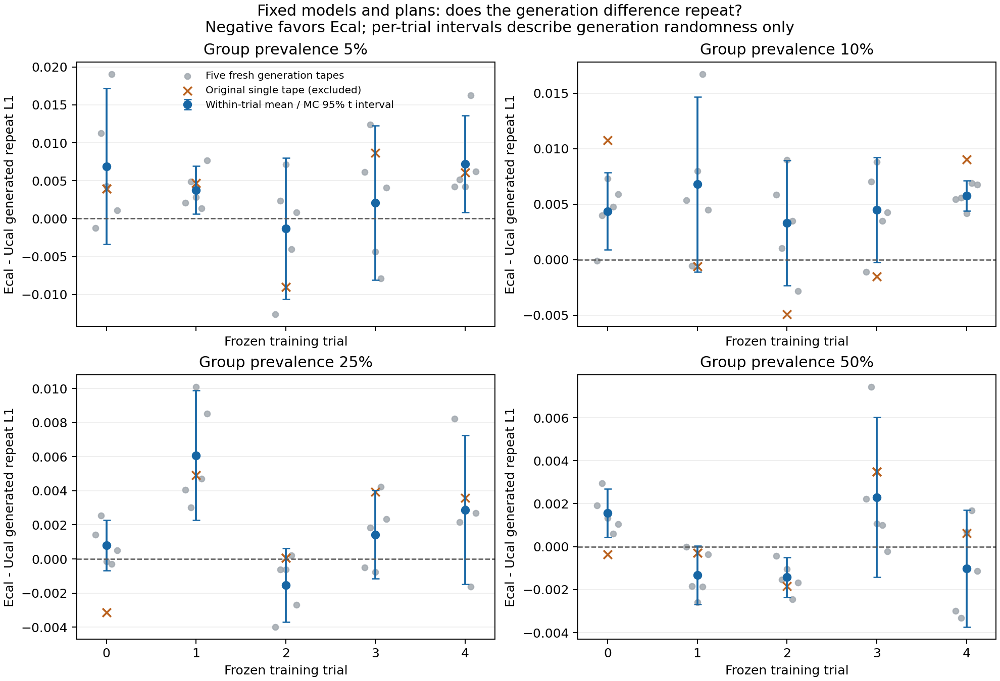
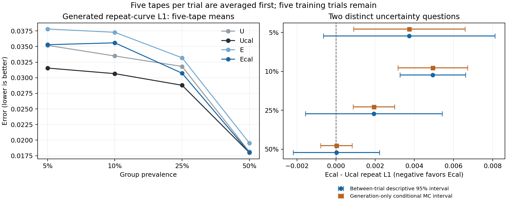

# CS-SAF: 모델을 고정한 다섯 번의 생성 반복 평가

2026-09-20 · `research/cs-saf` · 800회 생성 평가 완료

**생성 난수를 바꾸어 평균해도, E+보정의 생성 반복관계 오차는 U+보정보다 5%·10%·25% 조건에서 반복해서 컸다. 50%에서는 평균 차이가 작고 방향이 섞였다. 앞선 차이를 단일 생성 표본의 우연만으로 설명하기 어렵다는 근거가 강화됐다.**

[사전등록](generation_repeats_v1_preregistration.md) · [반복값·통계·검증](generation_repeats_v1_result.json) · [전체 31,200개 지표 값 CSV](generation_repeats_v1_all_metrics.csv) · [짧은 보고](professor_brief_generation_repeats_2026_09_20.md)

## 1. 무엇을 확인했는가

기준 U도 거래 이력을 사용하는 순차 생성 모델이며 E는 행동 반복확률 계산부에 추가 이력 보정을 넣은 구조다. Ucal/Ecal은 같은 형식의 확률 보정(매개변수 네 개)을 각 모델에 적용한 것이다. 보정값은 이전 실험에서 모델별로 적합했으며, 이번에는 그 값을 그대로 고정했다. 이전 비교에서는 Ecal이 Ucal보다 조건부 예측 정확도·불필요한 반응 억제는 좋았지만, 실제 생성된 반복관계의 평균 오차는 컸다.

이번에는 **모델을 개선하거나 다시 학습하지 않고**, 그 차이가 생성 난수를 바꾸어도 반복되는지 확인했다.

- 기존 상태 160개(U/Ucal/E/Ecal × 네 비율 × 두 kappa × 다섯 학습 시드)를 그대로 사용했다. 원래 신경망 80개와 그 보정판본 80개이며, 이번 신경망 학습·보정 적합은 0회다.
- 저장 모델마다 **새 생성 난수 5개**, 총 **800개 생성 데이터셋·1,638,400개 거래열**을 만들었다.
- 매회 2,048개 거래열의 집단 구성·길이·순서·배치 크기 256을 고정했다. 간격·행동·수치값을 모두 순차 생성하는 난수만 바꾸었다.
- 이전 생성 난수 1개는 참고용으로 보존했고, 새 다섯 번의 주 분석 평균에 포함하지 않았다.
- 기존 데이터 생성 시드 42와 validation을 재사용했다. 새로운 학습 시드·데이터 생성 시드·실제 사기 탐지 검증이 아니다.

**집계 순서:** 같은 저장 모델에서 다섯 번 생성한 오차를 먼저 평균하고, 그다음 다섯 학습 시드의 모델끼리 비교했다. 생성 25회를 독립적으로 학습한 모델 25개처럼 세지 않았다. 여러 생성 데이터셋을 합쳐 더 큰 표본의 오차로 바꾸지도 않았다.

## 2. 생성 반복관계 오차

활성 집단의 간격별 행동 반복률 L1이다. 낮을수록 좋다. 각 값은 **다섯 생성 난수의 평균을 낸 뒤 다섯 학습 시드에서 평균**한 결과다.

| 집단 비율 | U | Ucal | E | Ecal |
|---|---:|---:|---:|---:|
| 5% | 0.035188 | 0.031552 | 0.037810 | 0.035293 |
| 10% | 0.033487 | 0.030656 | 0.037283 | 0.035597 |
| 25% | 0.031810 | 0.028794 | 0.033195 | 0.030726 |
| 50% | 0.018139 | 0.018003 | 0.019548 | 0.018022 |

**주 비교 Ecal−Ucal:** 음수는 Ecal이 좋고 양수는 Ucal이 좋다는 뜻이다.

| 비율 | 이전 한 번의 차이 | 새 다섯 번 평균 차이 | Ecal이 나은 학습 시드 | 학습 시드 간 참고 95% 구간 |
|---|---:|---:|---:|---|
| 5% | +0.002877 | +0.003740 | 1/5 | [-0.000641, +0.008121] |
| 10% | +0.002542 | +0.004941 | 0/5 | [+0.003262, +0.006621] |
| 25% | +0.001873 | +0.001932 | 1/5 | [-0.001566, +0.005430] |
| 50% | +0.000326 | +0.000019 | 3/5 | [-0.002187, +0.002224] |

Ecal의 생성 개선 기준은 **미충족**이며, 반대 방향으로 비용이 반복되는 기준은 **충족**했다. 5%·10%·25%에서 평균 오차가 크고 각각 4/5·5/5·4/5 학습 시드에서 같은 방향이었다. 등록 기준은 이러한 방향 일치가 네 비율 중 최소 세 비율에서 나오는 것이었다. 오차의 상대 증가는 Ucal 대비 약 **11.9%·16.1%·6.7%**다.

이는 탐색 연구의 일관성 판정이다. 학습 시드 간 참고 구간은 5%·25%에서 여전히 0을 포함하며, 확증적 우월성·열등성 판정으로 확대하지 않는다. 50%의 평균 차이는 약 0.000019로 작고, 다섯 시드 중 세 개에서는 Ecal이 더 좋았다. 이 조건의 동등성도 입증한 것은 아니다.

## 3. 생성 난수의 변동과 학습 시드 사이의 차이

두 종류의 구간은 질문이 다르다. 위 표의 구간은 다섯 학습 시드별 평균의 차이를 반영한다. 아래 구간은 **현재 다섯 저장 모델과 생성 계획을 고정했을 때 새 난수 때문에 남는 불확실성만**을 반영한다. 아래 구간이 0을 벗어나더라도 새로운 모델 학습이나 새로운 데이터에서 우수성이 입증되는 것은 아니다.

| 비율 | Ecal−Ucal 평균 | 생성 난수만의 MC 표준오차 | 생성 난수만의 조건부 95% 구간 |
|---|---:|---:|---|
| 5% | +0.003740 | 0.001339 | [+0.000892, +0.006588] |
| 10% | +0.004941 | 0.000820 | [+0.003158, +0.006724] |
| 25% | +0.001932 | 0.000494 | [+0.000870, +0.002994] |
| 50% | +0.000019 | 0.000362 | [-0.000788, +0.000825] |

생성 난수 구간은 다섯 모델 각각의 생성 반복 분산으로 계산한 Satterthwaite t 구간이다. 서로 다른 학습 시드의 생성 난수는 겹치지 않게 고정했다. 학습 시드 간 구간은 기존 df=4 t 구간이다. 둘 다 다중 비교 보정이나 새로운 데이터의 불확실성을 포함한 확증 구간이 아니다.

**해석:** 5%·10%·25%의 생성 난수만의 구간은 0보다 크다. 현재 저장 모델·고정 계획에서 평균 차이가 있다는 설명은 한 번의 난수 때문이라는 설명보다 지지된다. 그러나 모델 학습을 새로 했을 때의 차이까지 포함하면 불확실성이 더 크다. 두 구간이 다르다는 사실은 모순이 아니다.

회색 점은 새 생성 결과 다섯 개, 파란 점은 그 평균, 파란 선은 해당 저장 모델 쌍에서의 생성 난수 구간이다. 주황색 ×는 이번 평균에서 제외한 이전 한 번의 결과다.

| 비율 | 생성 반복 차이의 평균 분산 W | 다섯 번 평균 후 trial 간 관측 분산 | MC 성분을 뺀 trial 분산 추정(절단 전) |
|---|---:|---:|---:|
| 5% | 4.484e-05 | 1.245e-05 | +3.481e-06 |
| 10% | 1.682e-05 | 1.830e-06 | -1.535e-06 |
| 25% | 6.111e-06 | 7.938e-06 | +6.716e-06 |
| 50% | 3.281e-06 | 3.155e-06 | +2.499e-06 |

마지막 열은 `trial 평균의 관측 분산−W/5`다. 음수가 나오면 0으로 절단한 값과 원래 음수를 수치 파일에 함께 보존한다. 다섯 trial은 학습 모델뿐 아니라 고정된 생성 계획도 서로 다르므로 이를 **순수한 학습 변동**이라고 해석하지 않는다. 이 작은 표본의 분산 분해만으로 한 원인의 기여율을 확정하지 않는다.

## 4. 보정 효과와 다른 생성 지표

| 비율 | Ucal−U 생성 L1 | 개선 학습 시드 | Ecal−E 생성 L1 | 개선 학습 시드 |
|---|---:|---:|---:|---:|
| 5% | -0.003636 | 5/5 | -0.002517 | 3/5 |
| 10% | -0.002831 | 4/5 | -0.001686 | 3/5 |
| 25% | -0.003016 | 4/5 | -0.002469 | 4/5 |
| 50% | -0.000136 | 3/5 | -0.001526 | 3/5 |

Ucal−U는 5%·10%·25%에서 주 지표의 개선 일관성 기준을 충족했다. 감소율은 네 비율 순서로 약 10.3%·8.5%·9.5%·0.8%다. Ecal−E도 평균 오차는 네 비율 모두 줄었지만 시드 일관성 기준에 해당한 비율은 25% 하나로, 전체 개선 기준은 충족하지 못했다. 과거 단일 생성 결과의 판정은 고치지 않고 이번 결과를 별도로 기록한다.

두 보정 비교 모두 MI 오차는 각 비율 5/5 학습 시드에서 줄었다. 하지만 U 보정은 고정된 비활성 개입 반응을 조금 높였고, 새 반복 평가의 행동 전이 TV 평균도 네 비율에서 조금 높였다. 따라서 U 보정의 **주 지표 개선**을 모든 지표의 공동 개선으로 설명하지 않는다. 등록한 공동 개선 기준은 모든 비교에서 미충족이다.

| 비율 | Ecal−Ucal MI 오차 | 개선 학습 시드 | Ecal−Ucal 행동 전이 TV | 개선 학습 시드 |
|---|---:|---:|---:|---:|
| 5% | +0.007181 | 1/5 | +0.001388 | 1/5 |
| 10% | +0.005920 | 0/5 | +0.000988 | 1/5 |
| 25% | +0.001841 | 1/5 | +0.000366 | 2/5 |
| 50% | -0.000830 | 4/5 | +0.000071 | 3/5 |

모든 13개 생성 지표와 pooled/context_0/context_1 결과, 세 비활성 조건의 생성 오차, 다섯 대조 및 결합 효과는 수치 파일에 보존했다. 주 지표가 좋다는 이유로 다른 지표의 악화를 숨기거나 합성 점수로 상쇄하지 않았다.

**조건부 TV와 비활성 개입 반응은 새로 좋아지거나 나빠진 값이 아니다.** 모델을 고정했으므로 이전에 검증한 값을 그대로 참조한다. Ecal이 Ucal보다 해당 지표에서 네 비율 각각 5/5 시드에서 좋았다는 관측은 유지된다. 생성 반복을 늘렸다고 이 관측의 독립 표본 수가 늘어난 것은 아니다. 비활성 개입 반응은 사기 탐지 오탐률이 아니다.

## 5. 결론과 다음 진행

1. **생성 오차 차이를 난수 문제로만 넘기지 않는다.** 이번에 확인한 것은 고정된 모델·계획에서의 반복성이다. 특히 10%에서는 다섯 학습 시드 모두 Ecal의 오차가 컸다. 생성 난수를 계속 추가하며 좋은 결과가 나올 때까지 확인하는 방식으로 진행하지 않는다.

2. **현재 기여 주장의 범위를 명확히 한다.** 추가 이력 구조 E의 조건부 예측·불필요한 반응 억제 이점은 유지된다. 그러나 같은 보정을 받은 U보다 실제 생성 관계를 잘 재현한다는 주장은 지지되지 않는다. 일반 보정의 이득은 U에서도 더 일관되게 나타났으므로 E만의 기여로 제시하지 않는다. Ucal을 생성 관계의 중요한 기준 모델로 유지한다.

3. **다음에는 수정할 부분을 구분하는 한 가지 진단을 제안한다.** 이번에 저장한 Ucal/Ecal의 원시 생성 이력을 재사용해, 동일한 이력·현재 간격을 두 모델에 넣고 조건부 행동 분포와 반복확률을 교차 평가한다. 같은 이력에서도 나타나는 예측식의 차이와, 각 모델이 스스로 만든 이력 분포의 차이를 분리해 본다. 이는 기여를 분해하는 진단이며 유일한 인과 원인을 확정하는 방법은 아니다. 기존 E/L003 중심의 진단과 구분하여 **현재 보정된 U/E 비교로 별도 사전등록할 제안이며, 아직 실행하지 않았다.**

그 진단을 근거로 추가 이력 경로를 단순화할지, 학습 목표와 순차 생성의 관계를 보완할지 결정한다. 현재 결과만으로 모델 전체를 폐기하거나 모든 문제를 이력 경로 하나의 결함으로 단정하지 않는다. 수정 후보가 생기면 변경 하나와 대조군을 고정하고, 이후 새로운 데이터·학습 시드와 외부 baseline에서 재검증해야 한다.

이번 분석은 같은 크기의 유한 생성 표본에서 발생하는 난수 변동을 평가한다. **2,048개라는 표본 크기 자체가 L1 등의 비선형 오차에 주는 편향, 고정 validation 표본의 오차, 새로운 데이터·학습 모델에 대한 일반화는 분리하지 않았다.** 여러 난수의 결과를 평균해도 이 한계가 자동으로 사라지지 않는다.

## 6. 검증과 저장

- 사전등록 `70ce09d`, 실행 소스 `16bd9acfb6d7f36808f0b886d6d02df1f75c66ba`. CPU 테스트 6개와 동일 소스 CPU/GPU gate 통과.
- 같은 난수의 재현성, 다른 난수에서도 동일한 집단·길이 계획, 모델·보정값 불변, 모델 및 생성 배열 재적재를 확인했다. GPU에서는 네 모델 모두 과거 2,048개 생성 배열을 정확히 재현했다.
- 전체 기존 13개 지표의 1,248개 역사적 값을 비교해 최대 차이 8.327e-17로 일치했다. 기준 통계 재사용과 동등한 집계 연산으로 계산을 줄였으며 지표 정의는 유지했다.
- 새 생성 배열의 L1·MI **4,800개 값**을 독립 재계산했다. 최대 차이는 **0.000e+00**다. 모든 생성 결과와 입력 모델 해시를 검증했다.
- 저장 배열 800개의 모델 상태·난수·집단·길이·순서가 등록 계획과 일치했다. 31,200개 전체 지표 값은 CSV로, 시드별 평균·구간·분산 분해는 JSON으로 저장했다. 생성 실행의 기술적 실패·재시도는 0회다.
- 실행이 끝난 뒤 검증 스크립트의 파일 경로 타입 처리를 정리하고 저장 배열의 식별자 검사를 추가했다. 생성·평가 정의는 바꾸지 않았다. GPU 0·1의 이번 작업은 모두 종료됐으며 기존 작업을 중단하지 않았다.
- raw evidence: `artifacts/cs_saf/generation_repeats_v1/`. Git에는 등록·소스·모든 scalar 결과·표·그림을 저장하며, 전체 생성 배열과 checkpoint는 워크스테이션에 보관한다.
- 이전 실험의 수치와 실패 판정은 보존한다. test 접근, 신경망 재학습, 보정 재학습, 추가 구조 탐색은 수행하지 않았다.
