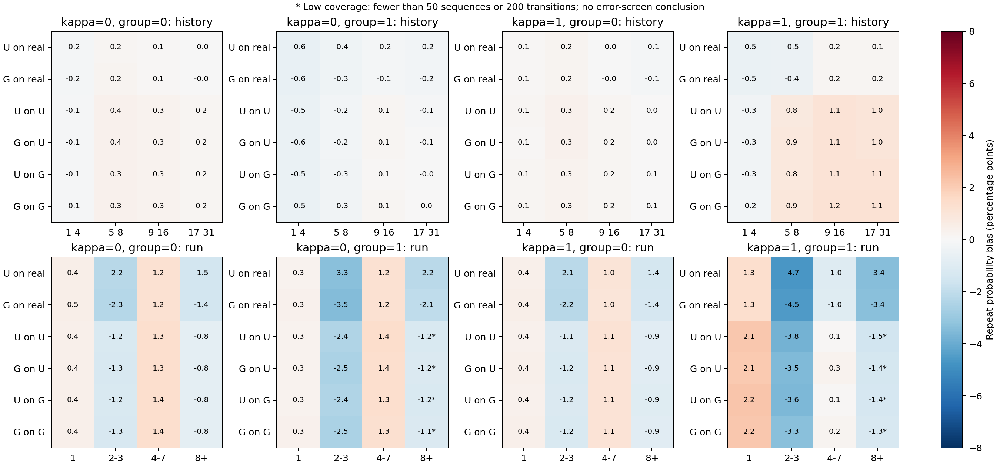
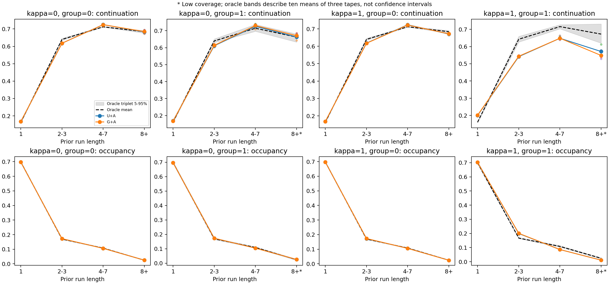

# 이력 길이·연속 반복 상태 진단: 완료

**U/G+기존 보정은 전체 평균 뒤에 숨은 반복 상태별 오류가 남는다.** 활성 집단에서 같은 행동이 2–3번 이어진 뒤의 반복확률을 실제 이력에서도 약 4.5–4.7%포인트 낮게 예측한다. 자유 생성에서는 해당 상태의 반복 지속률이 정답 생성기보다 약 10%포인트 낮다. 단순히 이력이 길어질수록 붕괴한다는 패턴은 등록한 평균 편향 기준에서 확인하지 못했다.

수식·구현 점검에서 기존 U/G 결과를 무효로 만드는 오류는 발견하지 않았다. **이것은 설계의 완전성이나 연구 기여의 입증을 뜻하지 않는다.** 정확한 수식, 손실의 의미, 연속/이산 이력 차이, C 제약의 한계, 선행 접근과의 관계를 [상세 감사](architecture_audit.md)에 구분했다.

## 무엇을 실행했는가

사전등록 `1fd005d`, 진단 구현 `4bd9eec`, 사전 감사·학습 데이터 구간 점검 `36d9050` 이후 실행했다. 기존 인공 데이터 seed42, 집단 비율10%, κ0/1, U/G 각3개 학습 시드를 유지했다.

- 저장된 U/G+A 생성물 36개를 U/G 양쪽에 교차 입력하고 실제 validation 이력도 평가: **84회 고정 모델 예측 평가**.
- 저장된 정답 생성물 120개를 같은 이력 구간으로 집계. 모델의 생성3회 평균과 맞추기 위해 oracle30회를 미리 정한 순서의 **10개 비중복 3회 묶음**으로 비교.
- 신경망 학습0회, 보정 학습0회, 새로운 생성0회. CPU1스레드, GPU 사용 없음. 진단 본 실행 약146.5초; 사전 감사·검사·보고서 생성 시간은 별도.
- 1–4/5–8/9–16/17–31개의 과거 거래, 직전까지 연속 반복1/2–3/4–7/8+ 구간을 고정했다. 현재/미래 행동으로 구간을 정하지 않았고 거래열 종료를 반복 중단으로 세지 않았다.

## 결과 1: 전체 평균이 맞아도 반복 상태별 오류가 남는다

다음은 **활성 집단(κ1, group1)의 실제 이력**에서 같은 입력을 준 비교다. 숫자는 정답 조건부 반복확률 대비 예측 편향이며 음수는 과소 예측이다. 각 모델의3개 학습 시드 평균이다.

| 직전 연속 반복 길이 | U+A 편향 | G+A 편향 | 해석 |
|---|---:|---:|---|
| 1 | +1.35%p | +1.31%p | 반복 시작 쪽의 과대 예측 경향 |
| 2–3 | **−4.66%p** | **−4.51%p** | 두 모델 모두 등록한 국소 오류 기준 통과 |
| 4–7 | −1.03%p | −0.96%p | 등록한2%p 실무 기준 미만 |
| 8+ | −3.43%p | −3.35%p | 실제 이력에서는 표본 기준 충족·오류 후보 |
| 전체 평균 | −0.074%p | −0.060%p | 반대 방향의 오류가 평균에서 상쇄됨 |

2–3회 상태의 평균 정답 조건부 확률은 **64.78%**, U 예측60.12%, G 예측60.27%다. 같은 실제 관측값의 반복률은63.04%로, 정답 확률의 평균과 구분한다. 642개 거래열의2,600개 해당 전이를 평가했다.

이 상태의 U 편향은 시드별 −5.09/−4.32/−4.57%p, G는 −4.94/−4.03/−4.55%p였다. 거래열 단위 bootstrap의 각 시드별 기술적95% 구간도 모두0 아래였다. 이는 같은 데이터의 재학습 시드에서 반복된 탐색 결과이며, 독립 데이터의 확증 검정은 아니다.

비활성 세 조건에서도 실제 이력의2–3회 상태를 U/G가 평균 약2.1–3.5%p 낮게 예측했다. 따라서 활성 집단의 gap 반응만으로 모든 잔여 오류를 설명할 수 없다. 한편 실제 이력의 길이별 평균 편향은 모든 조건에서 절댓값0.61%p 미만으로 등록한2%p 기준에 못 미쳤다. **긴 이력의 평균 편향 증거가 없다는 것과 개별 예측이 정확하다는 것은 다르다.** 활성 실제 이력의 확률 MAE는 U4.98%p/G4.97%p로 남는다.

각 행은 예측 모델과 입력 이력 출처다. `G on U`는 U가 생성한 이력을 G가 평가했다는 뜻이다. 별표는 표본 부족이다. [전 시드 표](prediction_by_parent.csv), [모든 구간 판정](prediction_screens.csv).

## 결과 2: 실제 생성에서도 반복 상태의 차이가 재현된다

아래는 활성 집단에서 **각자 생성한 이력**의 다음 행동이 동일하게 이어질 비율이다. 모델은 시드마다 생성3회를 먼저 평균한 뒤3개 학습 시드를 평균했다. 정답 생성기는 같은 길이·집단·2,048개 거래열 계획을 사용한다(활성 집단214개).

| 직전 연속 반복 길이 | 정답 생성기 평균 | 정답 생성3회 평균의5–95% 범위 | U+A | G+A |
|---|---:|---:|---:|---:|
| 1 | 16.04% | 15.74–16.40% | **19.98%** | **20.14%** |
| 2–3 | 64.26% | 62.61–65.89% | **54.14%** | **54.36%** |
| 4–7 | 71.58% | 70.30–72.66% | **64.81%** | **64.83%** |
| 8+ | 67.24% | 61.98–73.10% | 57.12% | 54.83% |

1/2–3/4–7 구간의 차이는 모델3개 부모 시드 모두 oracle 참고 범위의 같은 쪽에 있고,2%p 실무 기준과 표본 기준을 충족했다. **8+ 생성 구간은 독립 거래열 수가 부족해 판정을 보류한다.** 5–95% 범위는 oracle10묶음의 표본 변동 범위이며 신뢰구간·성능 하한·동등성 검정이 아니다.

2–3회 반복 상태에 머무는 전이 비중은 oracle16.74%에 비해 U19.93%/G20.08%로 높고,4–7회 상태는 oracle10.83%에 비해 U8.61%/G8.60%로 낮다. **전체 반복 수준이 비슷해도 짧은 반복을 시작하고 유지하는 방식은 다를 수 있다.** 연속 gap oracle에서도2–3회 지속률63.92%,4–7회71.38%로 같은 방향의 차이가 보였다.

[시드별 생성 결과](generation_by_parent.csv), [oracle10묶음](oracle_triplets.csv), [표본 부족을 포함한 전체 판정](generation_screens.csv).

## 결과 3: 예측과 생성 이력 구성이 함께 관여한다

같은 이력에 U/G를 교차 입력해도 오차는 비슷했다. 활성 조건의 확률 MAE는 다음과 같다.

| 입력 이력 | U+A 예측 MAE | G+A 예측 MAE |
|---|---:|---:|
| 실제 이력 | 4.980%p | 4.965%p |
| U 생성 이력 | 5.719%p | 5.704%p |
| G 생성 이력 | 5.757%p | 5.738%p |

실제 이력은 과거 연속 gap·현재 bin, 생성 이력은 과거/현재 bin이라는 정답 정보 조건이 다르므로 위 차이를 순수한 feedback의 인과효과로 해석하지 않는다. 생성 이력의 과거 대표값을 연속값으로 간주하는 대체 oracle과의 차이는 전체 평균 약0.0063–0.0065%p로, 이번 결과가 그 두 평가 해석의 차이만으로 사라지지는 않았다. 이것이 학습/생성 입력 불일치 전체의 영향이 작다는 증명은 아니다.

2–3회 구간 생성 지속률 차이를 부호를 유지한 항등식으로 쓰면 다음과 같다. 모두 정답 생성물과의 차이이며, 아래 구성은 **인과적 원인별 기여율이 아니다.**

| 모델 | 전체 지속률 차이 | 같은 생성 이력에서 예측−정답 확률 | 두 출처에서 평균 정답 확률의 차이 | 나머지 생성 표본 항 |
|---|---:|---:|---:|---:|
| U+A | −10.11%p | −3.79%p | −6.60%p | +0.28%p |
| G+A | −9.90%p | −3.33%p | −7.00%p | +0.44%p |

동일하게2–3회 반복 상태여도 **현재 gap과 그 이전 전체 이력의 구성이 다르기 때문에** 정답 조건부 확률 자체의 평균도 다르다.4–7회 구간에서는 같은 생성 이력의 예측 편향이 U+0.11%p/G+0.22%p인데도 생성 지속률 차이는 약−6.75%p였다. 따라서 모든 생성 오류를 해당 행동 예측기의 국소 편향으로 환원할 수 없다.

추가 기술 집계에서 실제 이력2–3회 상태의 짧은4개 gap 구간은 과소 예측, 가장 긴 구간은 과대 예측이었다. 예를 들어 가운데 구간은 U−7.93/G−7.71%p, 가장 긴 구간은 U+3.32/G+3.64%p다. 이 세부 구간은 새로 확증된 가설이 아니라 등록된 보조 집계다. 반복 길이 하나의 상수 보정을 전체 gap에 일괄 적용하면 충분하다고 말할 근거도 없다. [gap 조건별 표](gap_conditioned_prediction.csv), [부호를 보존한 항등식](signed_descriptive_identity.csv).

## 다음 결정

1. **단순 gap 구간 보정의 전체 평균만으로 관계 재현을 평가하면 부족하다.** 다음 수정이 해결할 대상은 ‘짧은 반복이 시작된 뒤 gap과 전체 이력에 맞는 지속확률을 유지하는 문제’로 좁힌다.
2. **U를 G로 바꾸는 것만으로 해결되지는 않았다.** 두 모델에 비슷한 상태별 오류가 남는다. GRU 전체를 즉시 교체하거나 C를 되살릴 근거는 아니다.
3. 먼저 기존 이력에서 계산할 수 있는 반복 상태를 명시적으로 사용하는 **단순한 조건부 예측/보정 대조군**이 이 오류를 줄이는지 확인할 가치가 있다. 다음 실험에서는 gap과 반복 상태의 상호작용, 정보·용량 증가 효과를 분리하고 학습 목표는 관측 학습 데이터만 사용해야 한다. 단순 대조군으로 충분하면 새 복잡한 구조의 기여를 주장하지 않는다.
4. 구조 후보를 제안하더라도 동일 정보·비슷한 용량·같은 목표의 일반 구조보다 예측과 생성 상태 재현을 함께 개선해야 한다. 이번 진단 결과로 새로운 방법이 이미 확보되었다고 하지 않는다. 그 후 독립 데이터/학습 시드와 외부 모델 비교가 필요하다.

**이번 작업은 진단에서 종료했다.** 후속 구조·보정 학습은 사전등록하거나 실행하지 않았다. 기존 U/G+A 유지, C와 B/P 실패 유지. 총192개 국소 예측 화면 중23개,128개 생성 비교 화면 중17개가 탐색 기준을 충족했다. 서로 연관된 여러 구간을 본 결과이지23/17개의 독립 발견이 아니다. 모든 결과와 부족한 표본도 함께 공개했다.

## 검증과 재현

- 자동 검사106개 통과.12개 저장 모델의 이력 인과 순서·확률 정규화·observable repeat 식·checkpoint 선택·train-only 보정·가중치 불변성을 확인했다.
- 전체 이력 재입력과 단계별 이력 계산의 반복확률 차이 최대8.35×10⁻⁸. 기존 실제 이력 저장 예측과의 차이0.
- 원본 생성물에서 **1,687,392개 전이의 상태/결과**를 별도 반복문으로 재계산해 일치. **13,608개 지표**의 독립 집계 최대 차이8.88×10⁻¹⁶.
- 원본156개 생성 파일과 과거 실패 결정 파일이 변경되지 않았음을 확인했다. [감사](audit.json), [독립 검산](verification.json), [사전등록](preregistration.md).
- Git에는 코드·문서·표·그림·검증·manifest를 저장한다. 상세 전이별 예측과bootstrap 배열은 워크스테이션 `artifacts/cs_saf/history_diagnostic_v1/`에 남는다. 원본 모델/데이터를 Git 전체 백업으로 간주하면 안 된다.

기존 결과 집계·그림은 `scripts/report_cs_saf_history_diagnostic_v1.py`, 별도 검산은 `scripts/verify_cs_saf_history_diagnostic_v1.py`로 재현한다. 추론은 `experiments.cs_saf_history_diagnostic_v1.run()`이며 기존 완료 결과를 덮어쓰지 않는다. Notion·Slack은 수정하지 않았다.
