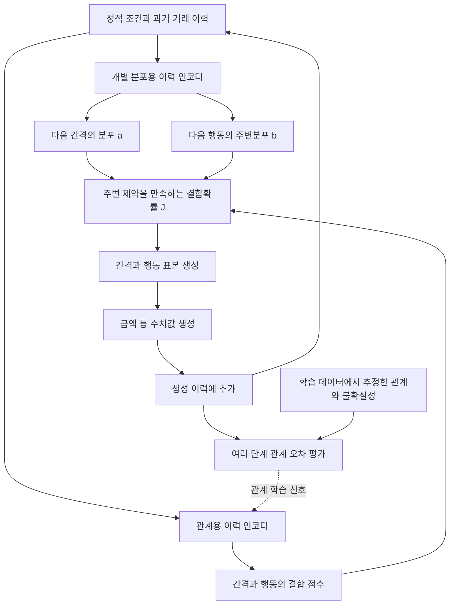

# CS-SAF 후속 방법 설계 메모 — 2026-09-20

> **공식 소스 확인 후 정정 (2026-09-20):** TabDiT HEAD `cbb2b9a`에는 평가 코드와 생성 데이터만 있고, VAE/DiT 학습·생성 구현이 없습니다. 아래의 TabDiT 직접 실행 계획은 코드 확보를 전제로 한 보류 항목입니다. 우선 실행 대표 모델은 공식 TabularARGN 2.4.0으로 변경했습니다. 이 제약은 TabDiT의 성능 한계가 아닙니다. [소스 목록](external_audit_v1/source_inventory.json).

**상태: 문헌과 현재 결과에 근거한 연구 후보. 미구현·미학습·미사전등록.** 새 모델의 우수성, 신규성 또는 학회 게재 가능성을 확정하지 않는다. 기존 U/E/ER 및 보정 실험 기록은 그대로 유지한다.

연결 문서: [문헌 검토](literature_review_and_research_direction_2026_09_20.md), [현재 결과](gap_calibration_v1_report_2026_09_20.md).

## 1. 무엇을 연구하려는가

거래를 한 건씩 잘 예측하는 것과, 거래를 이어서 생성했을 때 행동 관계를 잘 보존하는 것은 현재 실험에서 같은 결과가 아니었다. E의 조건부 예측 개선은 자유 생성 우위로 이어지지 않았다. gap 보정은 U에도 효과가 있었고, 관계가 없는 조건의 반응까지 늘렸다.

따라서 다음 목표를 제안한다.

> 거래 간격과 행동의 관계를 수정할 때 각 변수의 분포를 불필요하게 바꾸는 효과를 제한하고, 그 수정이 이후 생성 이력으로 전파되는 영향까지 학습에 반영한다.

“거래는 순차적이다”, “분포만 맞춰서는 부족하다”, “이력을 넣는다” 자체는 새 발견이 아니다. 새 방법이 되려면 아래의 제한된 결합 업데이트가 단순한 예측 손실·보정·일반 rollout 학습보다 실제로 유리해야 한다.

## 2. 현재 구현에서 유지할 것과 바꿔 검토할 것

| 요소 | 현재 | 후보에서의 처리 |
|---|---|---|
| 과거 이력 | U부터 GRU로 사용 | 초기 검증에서는 같은 이력 정보와 비슷한 용량 유지 |
| gap | 31개 대표값의 범주형 표현 | 먼저 동일 표현으로 비교; 연속 복원은 별도 문제로 남김 |
| mark | fresh 분포와 이전 mark copy의 혼합 | gap–mark의 관측 결합분포를 직접 모델링하는 변형 검토 |
| E | copy 경로의 추가 이력 보정 | 필수 부품으로 고정하지 않고 비교군으로 유지 |
| ER | 중심화 잔차 크기에 비용 부과 | 모든 관계를 0으로 줄이는 항을 핵심 목적함수로 사용하지 않음 |
| 사후 보정 | 관측 반복 여부로 학습 | Ugap 등 강한 대조군으로 유지 |
| amount | 이력·gap·mark 조건부 생성 | 최초 비교에서는 동일 계열 유지; 전체 joint 보존이라고 주장하지 않음 |
| 정적 context·길이 | 생성 계획으로 제공 | 동일 계획 비교를 먼저 하고, 전체 생성기 확장 시 별도 학습·평가 |

copy 확률 q와 실제 반복확률은 다르다. 실제 반복확률은 `q + (1−q) × fresh(이전 mark)`이다. 관측된 mark만으로 q의 해석이 항상 유일해지는 것도 아니므로, 주된 정확도·관계 평가는 **관측 가능한 mark 분포와 반복률**로 한다. 현재 모델의 추가 구조 가정 아래 어떤 식별성이 있는지는 별도로 분석해야 한다.

## 3. 문제를 수식으로 분리하기

정적 조건을 s, t번째 거래 직전의 전체 이력을 H_t, 거래를 X_t=(D_t,M_t,A_t)라 하자. D는 간격, M은 행동, A는 금액 등 수치값이다. 실제 분포 P와 생성 분포 Q는 각자의 이력 분포 d_t^P, d_t^Q를 만든다.

관계 측정 함수 φ(H_t,X_t)를 하나 고르고

\[
m_t^P(h)=\mathbb E_P[\phi(h,X_t)\mid H_t=h],\quad
m_t^Q(h)=\mathbb E_Q[\phi(h,X_t)\mid H_t=h]
\]

라 두면, 기대값이 존재하는 범위에서 다음은 단순한 항의 더하기·빼기 항등식이다.

\[
\mathbb E_P\phi-\mathbb E_Q\phi
=\underbrace{\mathbb E_{d_t^P}[m_t^P-m_t^Q]}_{\text{같은 실제 이력에서의 예측 차이}}
+\underbrace{(\mathbb E_{d_t^P}-\mathbb E_{d_t^Q})m_t^Q}_{\text{생성 이력 분포의 차이}}.
\]

이 식은 새 정리가 아니다. 또한 두 항이 서로 상쇄될 수 있어 한 항의 절댓값 감소가 전체 오차 감소를 보장하지 않는다. TV/NLL 하나와 다른 φ의 오차를 같은 값처럼 비교해서도 안 된다.

기존 교차 이력 입력 실험은 이 구분의 동기를 제공한다. 그러나 U/E 두 모델의 교차 비교만으로 실제 P에 대한 두 항을 완전히 추정했다고 말할 수는 없다. 인공 데이터의 oracle은 **평가에만** 사용해 이 분해를 확인하고, 실제 데이터에서는 held-out 표본에 근거한 추정으로 한계를 명시한다.

## 4. 후보 아키텍처: 개별 분포와 결합을 분리

인코더를 분리하는 이유는 “두 network라서 새롭다”가 아니라, 관계 업데이트가 이미 학습한 개별 분포의 파라미터를 같이 바꾸는 경로를 차단하기 위해서다. [TPP 기울기 충돌 연구](https://arxiv.org/html/2412.08590)와 반드시 비교해야 한다.

### 4.1 유한 gap–mark 결합

최초 검증은 현재와 같은 gap 범주 K개와 mark C개를 사용한다. 현재 설정 K=31, C=64이면 이력 하나당 1,984개의 결합 셀이다. 이는 초기 계산 규모의 설명이며 전체 학습 메모리가 작다는 보장은 아니다.

\[
a_k(h,s)=Q(D=k\mid h,s),\qquad
b_j(h,s)=Q(M=j\mid h,s).
\]

별도 관계 network의 점수를 S_{kj}(h,s)라 하고

\[
K_{kj}=a_k b_j\exp S_{kj},\qquad
J=\operatorname{diag}(u)K\operatorname{diag}(v)
\]

로 둔다. u,v는 다음 제약을 만족하도록 행·열 스케일링한다.

\[
\sum_jJ_{kj}=a_k,\qquad \sum_kJ_{kj}=b_j.
\]

생성은 D~a 다음 M~J[D,:]/a[D] 순으로 할 수 있다. **같은 이력 h에서** gap과 mark의 주변분포는 유지하면서 결합관계를 바꿀 수 있다. S=0이면 그 이력에 조건부인 독립 결합이다. 이력과 mark의 관계까지 제거한다는 뜻은 아니다.

알려진 IPFP/Sinkhorn 구성으로, 이것 자체는 새 방법이 아니다. [TACTiS-2](https://arxiv.org/html/2310.01327)와 [amortized vine copula](https://arxiv.org/html/2604.20568)가 가까운 비교점이다.

### 4.2 반드시 인정할 구조적 한계

- 양의 확률과 가능한 support에서의 수렴을 가정한다. finite iteration은 정확한 등식이 아니므로 최대 행/열 오차와 수렴 실패를 기록한다. log-space 계산을 사용한다.
- 구조적으로 불가능한 셀을 0으로 강제하면 지정 주변분포와 양립하지 않을 수 있다. 실제 support mask를 쓰기 전 feasibility를 확인한다.
- S에 행별·열별 상수를 더해도 scaling 뒤 같은 J가 나올 수 있다. 원시 점수 크기를 곧 “관계 강도”로 해석하지 않는다. joint 확률·odds ratio 등 관측 함수로 비교한다.
- a,b 자체가 틀리면 동결이 그 오류까지 보존한다. 동결은 보편적 성능 보장이 아니라 부작용을 분리하는 장치다.
- gap과 mark를 보존해도 amount·길이·개체 간 관계까지 보존한 것은 아니다.
- 고차원 mark에 K×C 행렬은 비싸다. 저랭크/계층화를 추가하면 표현 제약이 생기므로 초기 검증 전에 복잡한 모듈을 늘리지 않는다.
- hidden state가 전체 이력을 압축하면 그 상태에 대한 독립성이 원래 전체 이력에 대한 독립성과 같다고 보장되지 않는다.

### 4.3 국소 보존과 전체 시퀀스 보존은 다르다

이진 gap·mark의 첫 거래를 생각하자.

\[
J_0=\begin{pmatrix}.25&.25\\.25&.25\end{pmatrix},\qquad
J_1=\begin{pmatrix}.45&.05\\.05&.45\end{pmatrix}.
\]

둘 다 각 변수의 주변분포는 (.5,.5)다. 그런데 다음 거래에서 “직전 gap과 mark가 같으면 gap=1의 확률 .9, 다르면 .1”이라는 **동일한** 이력 조건부 규칙을 사용하면, 두 시퀀스의 다음 gap=1 확률은 각각 .5와 .82다.

따라서 **같은 이력에서 주변분포를 보존해도, 달라진 이력의 발생 빈도 때문에 전체 생성 분포는 변한다.** 이 예는 간단한 반례이며 새로운 실험 결과나 독창적인 정리로 주장하지 않는다. 다음 단계의 학습이 필요한 이유를 명시하는 용도다.

## 5. 새로 검토할 핵심: 이후 생성에 주는 비용을 반영한 결합 수정

### 5.1 실제 데이터의 관계를 목표로 사용

길이 L의 실제 생성 궤적 τ~Q에서 측정한 관계 특징을 Φ_r(τ)라 하자. 예시는 간격 구간과 반복 여부의 joint indicator, 행동 전이, 여러 lag의 연속 반복·burst 빈도이다.

각 집단에서 학습 데이터로 얻은 목표 평균을 \hat m_r, 표본 불확실성 범위를 ε_r라 두고 후보 목적함수를 다음처럼 쓸 수 있다.

\[
\mu_r(Q)=\mathbb E_{\tau\sim Q}\Phi_r(\tau),\qquad
\mathcal L_{rel}=\sum_r w_r\left[\max\{0,|\mu_r(Q)-\hat m_r|-\epsilon_r\}\right]^2.
\]

이는 초안이다. ε를 크게 정해 손실을 쉽게 통과하게 만들면 안 된다. 데이터 양에 따른 불확실성과 과제에서 허용할 성능 손실은 서로 다른 개념이다.

- 목표·구간·불확실성은 학습 데이터에서만 추정한다. 개체 단위 분할/재표집을 사용하고 거래 행을 독립 표본처럼 세지 않는다.
- 집단은 관측 가능한 조건으로 정의한다. oracle의 active/null 표식과 생성 법칙은 학습 입력·목표·model selection에 넣지 않는다.
- “유의하지 않음”을 “관계 없음”으로 판정해 해당 집단의 관계를 0으로 만드는 hard gate를 두지 않는다.
- 반복률만 맞추려고 간격 구간의 빈도를 바꾸는 해를 막기 위해 joint mass와 구간 점유율을 함께 확인한다.
- train에서 사용하는 관계 특징과 최종 평가 특징·horizon을 완전히 같게만 두지 않는다. 보지 않은 관계 함수와 긴 구간에서도 확인한다.
- 필요한 관계까지 0으로 만드는 반응 크기 규제와 달리, 관측 관계와의 차이를 줄이는 목적이다. 하지만 moment matching 자체도 기존 방법이며 이것만으로 신규성이 없다.

### 5.2 수송 제약 아래의 업데이트 후보

생성 이력 h에서 gap–mark 쌍을 택했을 때 이후 여러 단계의 관계 손실에 주는 영향을 C_h(k,j)로 추정한다. 고정된 개별 분포 a(h),b(h)에 대해 다음 local step을 검토한다.

\[
J^{new}_h=\arg\min_{J\in\mathcal U(a(h),b(h))}
\langle C_h,J\rangle+\eta^{-1}\mathrm{KL}(J\Vert J^{old}_h),
\]

\[
\mathcal U(a,b)=\{J\ge0:J\mathbf1=a,\ J^\top\mathbf1=b\}.
\]

양의 행렬에서 이는 `J_old × exp(−η C)`를 주어진 주변분포로 다시 scaling하는 형태다. **이 mirror/entropic projection 계산 자체는 기존 최적화 기법이다.**

새 기여로 검토할 부분은 C를 단순 다음 거래의 분류 오차로 두지 않고, 실제 생성 중 생기는 집단별 관계 왜곡의 여러 단계 효과로 추정하며, 이산 사건에서 계산량·추정 오차·분포 변화 비용을 함께 다루는 방법이다. 이 단계가 단순 rollout loss보다 추가 가치를 주는지 확인해야 한다.

### 5.3 구현 전에 해결해야 할 학습상의 문제

1. **학습 순서:** 개별 분포와 결합을 관측 데이터로 먼저 적합한다. 관계 미세조정에서는 개별 분포 network를 동결한 군과 같은 용량의 비동결 대조군을 구분한다. 금액 경로도 초기에는 고정해 원인을 줄인다.
2. **정확한 이산 생성:** hard sampled mark를 실제 이력에 되넣는다. soft/Gumbel surrogate 결과만으로 실제 생성 개선을 주장하지 않는다.
3. **기울기:** 아주 작은 상태공간에서는 모든 궤적을 열거해 정확한 목적함수·기울기를 계산한다. 그 뒤 score-function gradient와 baseline/critic을 비교한다. self-sampled moment의 계수와 reward를 같은 batch에서 추정하면 생기는 편향도 확인한다.
4. **여러 단계 비용:** 비선형 moment 오차를 현 Q에서 선형화한 비용을 쓰는 것과, 고정된 sample loss를 쓰는 것은 다르다. 연쇄미분과 occupancy 변화 항을 빠뜨리지 않아야 한다. critic/gradient 절단을 쓰면 근사임을 명시한다.
5. **계산량:** 모든 h마다 K×C개의 후속 궤적을 생성하면 비싸다. 작은 정확 계산 뒤 공유 critic·amortization 등의 근사를 하나씩 검증한다. 근사 network가 새로운 효과를 만드는지 ablation한다.
6. **일반화:** 저장된 train 궤적의 몇 개 통계만 외우는 해를 찾지 않도록 held-out validation과 별도 test를 둔다. 검증 데이터를 목표에 추가하는 것은 금지한다.

이 항목이 해결되지 않은 상태에서 “새 architecture 확정” 또는 “이론적으로 생성 품질 보장”이라고 쓰지 않는다.

## 6. 무엇이 알려진 내용이고 무엇을 입증해야 하는가

| 내용 | 지위 | 논문 기여로 쓰기 위한 추가 조건 |
|---|---|---|
| 이력 기반 순차 생성 | 기존 접근 | 신규성 없음 |
| 주변분포/의존성 분리 | copula 계열의 기존 접근 | 분리만으로 기여 주장 불가 |
| Sinkhorn/IPFP의 주변 제약 | 알려진 계산 | 같은 이력에서의 보존 성질만 명확히 기술 |
| 생성 이력으로 학습 | Professor/Self Forcing 등 기존 방향 | 혼합형 사건의 학습·계산 문제를 구체적으로 해결 |
| 관계 통계에 대한 matching | 기존 moment/IPM 계열 | 단순 보조 손실 대조군을 넘는 효과 필요 |
| 여러 단계 비용을 쓰는 결합 제약 업데이트 | 현재 연구 후보 | 가장 가까운 제약 policy/생성 학습과 신규성 추가 대조, 정확성·효율·효과 검증 |
| 희소 집단의 관계 소실/가짜 관계 분석 | 부분적으로 기존 평가와 겹침 | 외부 모델·다른 법칙에서 새로운 일반적 결과 필요 |

제안의 이론 목표도 구분한다. finite-state, bounded feature, 양의 support 같은 제한된 가정 아래 **local surrogate 개선과 실제 궤적 오차 사이의 차이**를 추정·분포 이동·projection 오차로 나누는 분석을 검토한다. 아직 증명하지 않았으며, 무조건적인 장기 성능 개선 정리는 기대하지 않는다.

## 7. 무한 수정으로 가지 않기 위한 단계

아래는 실행 범위 제안이며 사전등록 완료본이 아니다. 구체적인 seed·학습 예산·수치 허용치는 CPU 타당성 확인 후 실행 전 파일로 고정한다.

### 단계 0 — 대표 선행모델에서 해결할 문제가 남는지 먼저 확인

사용자의 후속 질문을 반영한 우선순위 보완: **새 구조를 채택하기 전에 외부 모델의 문제 확인을 먼저 한다.** 아래 단계 A의 수학적 가능성 확인은 유용하지만, 그것만으로 실제 선행모델의 한계가 확인되는 것은 아니다.

- **대표 실행 모델: TabularARGN 순차 모드.** 공식 2.4.0 배포판으로 별도 사전등록한 외부 진단을 실행한다. 2.7.0 최신 HEAD와 구분하며, 기존 모델을 확장한 구현이므로 새 모델의 성과로 쓰지 않는다. [실행 계약](external_audit_v1/preregistration.md).
- **문헌상 가까운 비교점: TabDiT (ICLR 2025).** 이질적 거래 시퀀스 및 금융 데이터 평가가 관련되지만 공식 HEAD에 생성 모델 코드가 없어 직접 재현은 보류한다. 현재 후보를 “TabDiT 개량판”으로 쓰지 않는다.
- **한계 후보:** 유한 데이터와 집단 불균형에서, 평균적인 생성 품질이 양호해도 집단별 gap–mark 관계가 약화되거나 왜곡되는가. 기존 목적함수에 별도 관계 항이 없다는 사실만으로 실패를 결론짓지 않는다. joint distribution을 정확히 학습하면 관계도 재현되므로 “기존 방법은 원리상 관계를 학습할 수 없다”는 주장은 하지 않는다.
- **TabDiT 진단 (학습·생성 소스 확보 이후에만 가능):** 실제 시퀀스를 VAE로 재구성했을 때의 관계 오차와, diffusion으로 새 시퀀스를 생성했을 때의 오차를 구분한다. 전자는 표현/복원 단계, 후자는 추가적인 생성 단계 문제를 찾는 진단이다. 둘의 차이를 순수한 인과적 분해로 해석하지 않는다. 원문의 행 내부 AR decoder를 시간축 자기회귀 생성과 혼동하지 않는다.
- **TabularARGN 진단:** 관측 이력에서의 예측과 실제 반복 생성을 구분한다. 가능한 확률 출력과 생성 표본 지표를 사용하며, 존재하지 않는 copy head 값을 만들지 않는다.
- **비교 전제:** 원래 공개 설정의 sanity check와 검증 기반 tuning 기회를 제공한다. 동일 학습 데이터·조건 정보·평가 대상에서 비교하고, 적은 예산의 미학습을 구조 한계로 오인하지 않는다. 현 copy 법칙 외의 법칙도 포함한다.
- **결정:** 문제가 없으면 해당 모델의 한계를 해결한다는 주장을 하지 않는다. 재구성 단계만 문제라면 표현/decoder 개선을 검토하고, 생성 분포에서 문제가 커질 때에만 해당 생성 학습의 수정 후보를 검토한다. 제안한 결합/rollout 구조를 진단 결과와 무관하게 채택하지 않는다.

최종 외부 비교의 핵심 후보는 TabDiT, TabularARGN, REaLTabFormer, CPAR이다. gap–mark event forecasting까지 방법의 범위를 주장하면 ADiff4TPP 등 가까운 TPP 방법을 같은 관측/생성 조건에서 추가한다. TabDiff/TabCascade 같은 flat 생성기와 금융 가격 경로 모델은 데이터 형식과 과제가 달라 보조 비교 또는 방법 참고로 구분한다. TabStruct/Seq2Synth는 평가 연구이므로 생성 모델 순위표에 넣지 않는다. 이는 최종 제출 시점의 관련 문헌을 다시 확인해 갱신할 비교군이며, 유리한 결과가 나오는 모델만 선택하는 기준이 아니다.

모든 논문을 실행해야 한다는 뜻은 아니지만, 직접 경쟁하는 최신 강한 방법을 이유 없이 제외해서는 안 된다. 같은 대표 계열의 중복, 과제 불일치, 코드 부재 등 제외 이유와 구현 대안은 기록한다. 단순 보정·재가중·용량 증가 대조군도 별도로 필요하다.

### 단계 A — 학습 전에 수학·작은 계산으로 탈락시킬 수 있는가

- 이진 gap/mark, 짧은 시퀀스에서 정확 궤적 열거를 사용한다.
- 관계 없음, 즉시 관계, 이력 피드백 관계의 세 경우를 둔다.
- normalization, independence limit, 주변 보존 오차, 수치 기울기, local/global 차이를 확인한다.
- 정확한 비용으로도 제약 때문에 목표 관계를 회복할 수 없으면, 대형 network로 확장하지 않는다. 어느 제약이 불가능성을 만드는지 기록한다.
- **이 단계는 실제 데이터 학습 성공이 아니며 GPU 대규모 실험도 필요 없다.**

### 단계 B — 구조와 학습 효과를 분리한 제한된 파일럿

| 군 | 목적 |
|---|---|
| A0: 일반 순차 모델 + 관측 likelihood | 기준 성능 |
| A1: 주변/결합 분리 + 관측 likelihood | 분리 구조 자체의 효과 |
| A2: 일반 순차 모델 + 같은 rollout 관계 손실 | rollout 학습만의 효과 |
| A3: 분리 구조 + 한 단계 비용의 제약 수정 | local 보정만으로 충분한지 |
| A4: 분리 구조 + 여러 단계 비용의 제약 수정 | 후속 피드백을 반영하는 추가 효과 |

최초 탐색 규모 제안은 **2개 법칙 × 한 개 집단 비율(10%) × 3개 학습 시드 × 5개 군 = 30회 신경망 적합**이다. 기존 copy 법칙과 copy decoder를 전제로 하지 않는 별도 상태 전이 법칙을 사용한다. 각 법칙 안에 관계가 있는 조건과 없는 조건을 둔다. 보정된 A0도 대조군으로 보고, 보정만의 최적화는 신경망 30회와 별도로 센다. 이는 아직 실행하지 않은 예산 제안이다.

처음부터 E·ER·여러 λ·여러 backbone·모든 비율을 다시 펼치지 않는다. A4가 A1/A2/A3보다 낫지 않으면 그 구성요소의 주장을 줄인다. 다른 법칙에서 효과가 없어도 기존 copy 법칙에서의 우위를 일반 기여로 확대하지 않는다.

### 단계 C — 강한 외부 기준을 조기에 확인

- TabularARGN 순차 모드를 우선 실행한다. TabDiT는 공식 생성 코드가 없어 보류한다. CPAR은 완료된 비교를 보존하되 공정 조건에서 보완한다.
- REaLTabFormer, marked TPP/ADiff4TPP는 schema·생성 조건·공식 구현 호환성을 확인한 뒤 범위에 맞게 추가한다. 가격 경로 모델을 거래 mark 생성의 직접 baseline으로 잘못 쓰지 않는다.
- static 정보, gap 표현, 길이 계획, teacher forcing 여부, 보정 기회와 tuning 예산을 맞춘다. 같은 epoch가 같은 계산 예산은 아니다.
- 실제 거래 후보는 우선 계정 ID·시간·행동·금액이 있는 Berka 등으로 검토한다. 다운로드 가능성·사용 조건·schema를 실행 전에 확인한다. 해당 데이터에 사기 정답이 있다는 가정은 하지 않는다.
- 모델마다 원래 표현을 사용하는 실용 비교와 동일한 전처리로 맞춘 기전 비교를 구분한다. baseline을 일부러 31개 gap 대표값에 묶어 약화시키지 않는다.

### 단계 D — 살아남은 후보의 독립 확인

- 구조·feature·loss·보정·checkpoint 선택을 고정한다.
- **새 데이터**는 우선 같은 생성 법칙에서 이전에 보지 않은 난수 seed로 뽑은 새 개체/거래 표본을 뜻한다. 이것만으로 새로운 법칙에 일반화한 것은 아니다.
- 별도 법칙, 실제 데이터의 새 개체와 이후 기간에 대한 검증은 각각 별개다.
- data seed, training seed, generation tape를 계층적으로 분석한다. 생성 반복을 독립 학습으로 세지 않는다.
- 집단 비율 변화와 희소 집단의 절대 표본 수 변화를 분리하는 조건을 추가한다. 지금까지의 비율 변화만으로 “불균형에 의한 학습 희석”을 확정하지 않는다.

### 단계 E — 원래 금융 목표로 연결

사기 탐지 기여를 주장하려면 실제 검증된 entity/time/label이 있는 데이터가 필요하다. 합성 AML 데이터나 proxy entity의 성과를 실제 은행 사기 탐지 성과로 바꾸어 쓰지 않는다.

- 생성기 train과 탐지기 test를 분리하고 모든 모델을 같은 실제 held-out test에서 비교한다.
- real-only, synthetic-only(TSTR), real+synthetic을 비교한다. augmentation 양·class prior·탐지기 tuning budget을 통제한다.
- AP/PR-AUC와 정해진 경보 예산의 recall 등 용도에 맞는 지표를 사전에 정한다. class 비율에 의존하는 값을 서로 다른 test 분포에서 비교하지 않는다.
- 사기 label을 행동 규칙으로 사후 수정하고 그 규칙의 재현을 탐지 성과로 제시하지 않는다. 원래 label 생성·관측 경로를 명시한다.
- 시퀀스 재현이 좋아지며 실제 훈련 경로를 복제할 가능성도 점검한다. 관계 보존만으로 privacy를 주장하지 않는다.

## 8. 모든 수치가 좋아야만 다음 단계로 갈 수 있는가

그렇지는 않다. 모델은 성능–비용의 trade-off를 가질 수 있다. 다만 다음을 실행 **전에** 정해야 한다.

1. 주목적: 어떤 생성 관계 또는 실제 탐지 효용을 우선할 것인지.
2. 보호 지표: 조건부 정확도, 비활성 반응, 주변분포 등에 얼마까지 비용을 허용할지와 그 과제상 근거.
3. 비교 판단: 주목적의 실질 개선과 보호 지표의 비열등성을 불확실성 구간으로 평가할 방법.

허용 손실을 기존 결과가 통과하도록 뒤늦게 정하지 않는다. real–real 변동은 표본 잡음의 기준이지 실무상 허용 비용을 자동으로 정해주지는 않는다. 근거 있는 수치 한계가 아직 없으면 개선/비용의 전체 곡선을 탐색 결과로 보고한다.

## 9. 성공·수정·중단의 해석

| 결과 | 해석과 다음 행동 |
|---|---|
| 분리만으로 좋아지고 여러 단계 수정의 추가 이득 없음 | 복잡한 학습 알고리즘 주장을 버리고 기존 분리 방법 대비 무엇이 다른지 재평가 |
| rollout만으로 비슷하게 좋아짐 | 별도 결합 구조의 필수성 주장을 버림 |
| Ugap 같은 단순 보정과 차이 없음 | 새 모델의 비용을 정당화하지 못함; 알고리즘 확대 중단 |
| copy 법칙에서만 효과 | decoder 친화적 toy 효과로 범위를 제한하고 일반 우수성 주장 중단 |
| 관계 오차는 감소하지만 보호 지표 비용이 큼 | trade-off로 보고; 사전 허용치 밖이면 해당 용도 후보 탈락 |
| 강한 순차 baseline보다 이득 없음 | 현재 목표의 새 생성기 기여는 미확인; 진단 연구로 전환할 증거가 충분한지 별도 판단 |
| 다른 법칙·독립 표본·실제 거래에서 재현, 계산 비용도 합리적 | 구조를 고정하고 금융 효용과 논문 작성 단계로 이동 |

**권고:** 현 시점에는 E의 계수를 더 조정하는 실험을 자동으로 이어가기보다, 단계 0에서 대표 외부 모델의 오류와 원인을 먼저 확인하고 그에 맞는 후보를 단계 A에서 검증한다. 기존 간격 보정의 독립 재현은 보정 효과를 정리하는 별도 작업으로 남긴다. 새 모델의 성공을 이미 예정한 연구 계획으로 쓰지 않는다.
