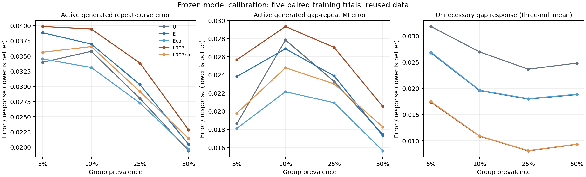

# 교수님 보고용: 반복확률 보정 후속 실험

2026-09-20 · [상세 결과](calibration_v1_report_2026_09_20.md) · [전체 수치](calibration_v1_result.json)

**기존 모델의 반복확률을 보정하니 실제 생성 오차는 평균적으로 줄었지만, 규제를 함께 쓰는 비용과 기준 모델 대비 불확실성은 남았습니다.**

기준 U도 이미 과거 이력을 사용합니다. E는 행동 반복확률 계산부에 이력 보정을 추가한 모델이고, L003은 같은 구조를 규제와 함께 학습한 모델입니다. 이번에는 저장된 E/L003의 신경망을 고정하고 각 관측 집단의 확률 위치·기울기만 train 데이터로 맞췄습니다. E / E+보정 / L003 / L003+보정을 비교하고 U를 기준으로 유지했습니다. 네 집단 비율·두 조건·다섯 학습 시드에서 보정 80개를 완료했습니다.

**실제로 생성한 거래열의 간격별 행동 반복률 오차(L1, 낮을수록 좋음):**

| 집단 비율 | U | E | E+보정 | L003 | L003+보정 |
|---|---:|---:|---:|---:|---:|
| 5% | 0.033951 | 0.038831 | 0.034517 | 0.039846 | 0.035615 |
| 10% | 0.035771 | 0.036959 | 0.033105 | 0.039436 | 0.036547 |
| 25% | 0.028020 | 0.030285 | 0.027262 | 0.033830 | 0.029154 |
| 50% | 0.019398 | 0.020487 | 0.019670 | 0.022852 | 0.021421 |

- **잘된 부분:** 보정 후 E와 L003 모두 네 비율에서 평균 생성 오차가 줄었습니다. 관계 강도 오차(MI)도 각 비율 5/5 시드에서 감소했습니다.
- **남은 문제:** 주 지표 L1은 5%·50%에서 두 모델 모두 3/5 시드만 개선됐습니다. 등록한 일관성 기준(최소 세 비율에서 4/5 이상 개선)을 충족하지 못했습니다. 보정한 규제 모델은 보정한 E보다 불필요한 반응이 적지만, 필요한 관계의 생성 L1은 평균 3.2~10.4% 더 컸습니다. E+보정의 U 대비 L1 개선도 네 비율 중 두 비율의 평균에만 나타났습니다.
- **다음 방향:** 규제를 최종 구조의 필수 요소로 확정하기보다, U에도 같은 보정을 적용한 대조군을 포함해 추가 이력 구조의 가치를 분리하는 비교를 먼저 설계하려 합니다. 새 데이터·학습 시드와 생성 난수 반복을 고정한 별도 검증이 필요합니다. 이 후속 비교는 아직 실행하지 않았습니다.

현재는 같은 통제된 인공 데이터와 validation을 재사용한 구성요소 실험입니다. 실제 사기 탐지 성능이나 최종 방법의 우수성을 입증한 단계는 아닙니다. 지표 1,200개를 독립적으로 재계산해 일치함을 확인했고, 실행 중의 수치 검증 수정과 이전 실패 판정도 함께 보존했습니다.
