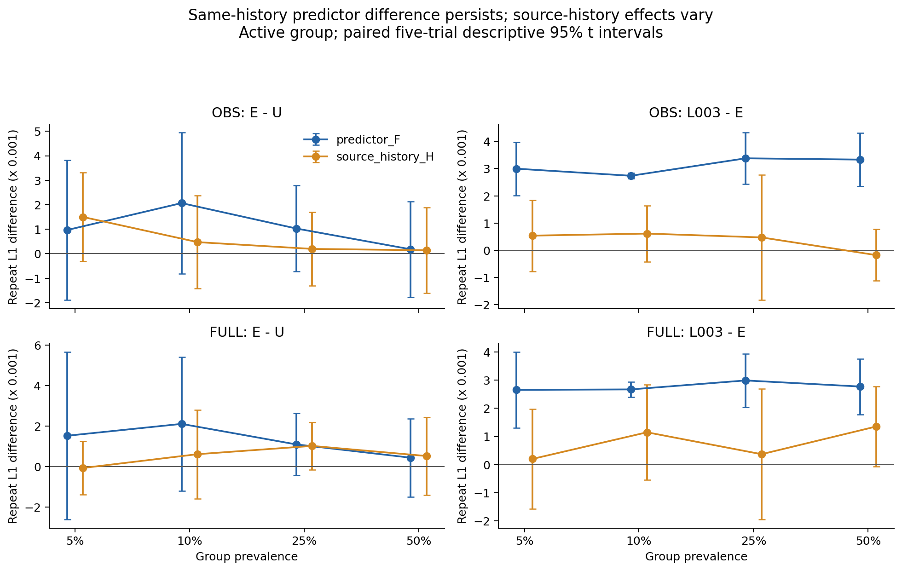
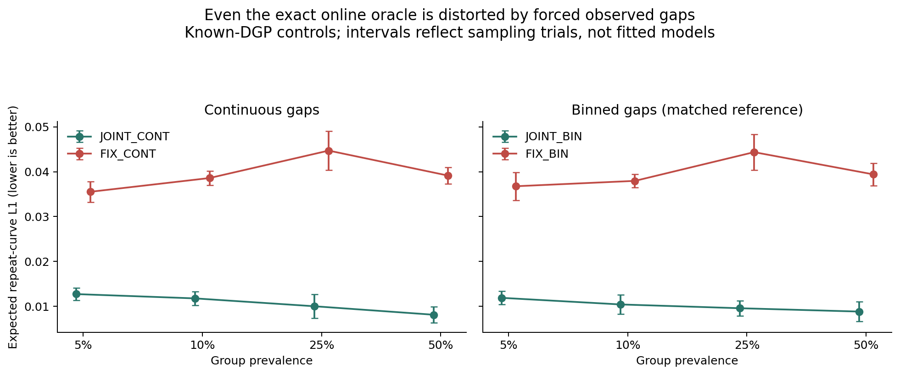
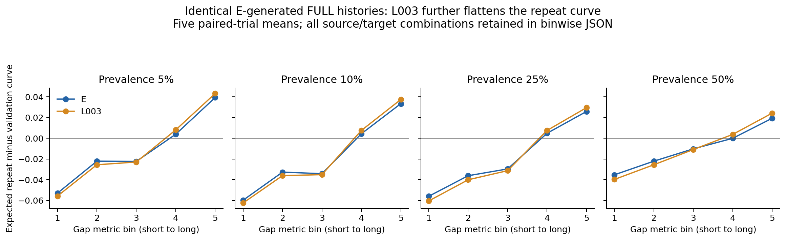

# CS-SAF 동일 이력 교차 평가와 joint-oracle 대조군

2026-09-17. 기준 `30f2d37`, 사전등록 `5eb7217`, 학습 없는 전체 실행 코드 `6e022a7373d11035da4ec2ef64ec62e0b6794443`.
[사전등록](replay_oracle_v1_preregistration.md) · [전체 대비 수치](replay_oracle_v1_result.json) · [모든 bin별 보정 수치](replay_oracle_v1_binwise.json) · [별도 검증](replay_oracle_v1_verification.json) · [교수님 보고용](professor_brief_replay_oracle_2026_09_17.md).

**기존 수치는 재현됐지만 원인 해석을 수정한다.** 정확한 online oracle도 실제 gap 경로를 고정하고 mark만 재생성하면 반복관계가 왜곡된다. 따라서 이전 OBS 결과만으로 신경망의 mark 이력 피드백이 고장났다고 결론낼 수 없다. 한편 **같은 생성 이력을 넣어도 L003은 E보다 반복곡선 보정 오차가 크다.** 이 차이는 OBS/FULL, 네 집단 비율, 각 5/5 paired trials에서 양수다. 다음 수정의 우선 대상은 이력 인코더를 무작정 바꾸는 것보다 생성 이력에서의 반복 확률 보정이다. 새 학습이나 해결된 모델의 우수성은 이번에 주장하지 않는다.

## 1. 완료 범위와 Git 위치

- U/E/L003의 기존 best checkpoint 120개, 비율 5/10/25/50%, κ=0/1, 5개 paired model trials. 새 학습·checkpoint 재선택 0회.
- 기존 256-entity panel, OBS/FULL 경로와 3개 난수 tape를 그대로 사용했다. 각 경로에 U/E/L003을 교차 적용한 **2,160회 예측 평가**, 총 **552,960회 entity sequence 재평가**다. 독립 학습 표본 수가 아니다.
- 연속/이산 joint oracle 및 3개 고정-gap 대조군으로 **153,600개 oracle sequence**를 생성했다. oracle의 5개 trial은 생성 난수 반복이지 학습 시드나 독립 데이터 반복이 아니다.
- 전 과정을 원격 워크스테이션에서 수행했다. 빈 GPU 3을 확인해 한 평가 프로세스만 사용했고 다른 프로세스를 중단하지 않았다. 최대 관측 GPU 메모리는 464 MiB, allocator 한도 25%, CPU thread 1, nice 10. 평가 종료 후 compute process가 없음을 확인했다.
- 데이터 seed42와 validation을 재사용했다. test·실데이터·새 외부 baseline·독립 데이터 확인은 수행하지 않았다. oracle만 알려진 DGP 법칙을 사용하며, 학습 모델에는 실제 latent나 활성 집단 여부를 제공하지 않았다.

최근 연구는 **`research/cs-saf`**에 누적되고 있다. `main`은 `de8fa70`의 이전 SAF 기준 버전으로, 최신 CS-SAF 실험 전체를 포함하지 않는다. 이번도 기존 연구 브랜치에 추가하며 main으로 자동 병합하지 않는다. 최신 상태는 [STATUS](STATUS.md), 구현은 `models/cs_saf_v3.py`, 이번 진단은 `benchmarks/cs_saf_joint_oracle.py`와 `experiments/cs_saf_replay_oracle.py`에서 확인한다. Git에는 구현·설정·검증·보고서·수치 근거를 저장하고, 대형 checkpoint·데이터·원시 생성 경로는 워크스테이션에 보존한다. GitHub만으로 원시 checkpoint까지 백업됐다는 뜻은 아니다.

## 2. 같은 이력에 다른 모델을 적용했을 때

U는 기본항과 gap 경로, E는 여기에 32개 이력 보정 계수를 추가한다. L003은 E와 같은 예측 구조/133,581개 파라미터를 사용하되 학습 당시 중심화 gap 잔차에 λ=.003 규제를 적용한 모델이다. 이번에는 모든 가중치를 고정했다.

C[a,b]는 **b가 생성한 경로에 a의 예측 함수를 적용**해 계산한 expected repeat-curve L1이다. gap별 예측 반복 확률을 train에서 고정한 5개 metric bin별로 평균하고, validation의 관측 반복곡선과 비교한다. 같은 이력에서 평가하므로 target 모델 사이에 과거 mark·gap·수치값이 정확히 같다. 모델별 fresh-mark 분포까지 포함한 관측 반복 확률을 사용하며, copy 확률만 비교하지 않는다.

\[
F=\tfrac12\{C[A,A]-C[B,A]+C[A,B]-C[B,B]\},\quad
H=\tfrac12\{C[A,A]-C[A,B]+C[B,A]-C[B,B]\}.
\]

\[
C[A,A]-C[B,B]=F+H.
\]

F는 같은 경로에서 target predictor를 바꾼 차이, H는 predictor를 고정하고 source 경로를 바꾼 차이다. OBS의 H는 mark 이력 차이이며, FULL에서는 gap·mark·수치값 모두 달라질 수 있다. 이 항등식은 **대칭적인 산술 분해**이며 독립적인 인과 효과나 파라미터별 원인 비율이 아니다. 공통된 이력 오류가 두 source 모두에 있으면 H가 작을 수도 있다. H가 작다고 재귀 피드백이 불필요하거나 무관하다는 뜻은 아니다.

활성 집단의 **L003−E** 결과다. 양수는 L003의 오차가 큼을 뜻한다.

| 경로 | 집단 비율 | 같은 이력에서 예측 차이 F | F의 95% t 구간 | F 증가 trial | 이력 차이 H | H 증가 trial |
|---|---:|---:|---|---:|---:|---:|
| OBS | 5% | +0.0029966 | [+0.0020184, +0.0039748] | 5/5 | +0.0005390 | 4/5 |
| OBS | 10% | +0.0027361 | [+0.0026273, +0.0028450] | 5/5 | +0.0006140 | 4/5 |
| OBS | 25% | +0.0033772 | [+0.0024311, +0.0043232] | 5/5 | +0.0004733 | 3/5 |
| OBS | 50% | +0.0033302 | [+0.0023477, +0.0043127] | 5/5 | -0.0001755 | 2/5 |
| FULL | 5% | +0.0026558 | [+0.0013058, +0.0040058] | 5/5 | +0.0001993 | 2/5 |
| FULL | 10% | +0.0026722 | [+0.0024059, +0.0029386] | 5/5 | +0.0011469 | 4/5 |
| FULL | 25% | +0.0029913 | [+0.0020418, +0.0039407] | 5/5 | +0.0003676 | 3/5 |
| FULL | 50% | +0.0027745 | [+0.0017835, +0.0037655] | 5/5 | +0.0013520 | 5/5 |

L003의 F는 OBS에서 +.0027361~+.0033772, FULL에서 +.0026558~+.0029913이다. 네 비율 모두 각 5/5 trial에서 양수이고 참고용 paired 95% t 구간도 0보다 위에 있다. .001 이상/4-of-5 trials/3-of-4 prevalences라는 등록한 기술 기준을 두 경로에서 모두 통과한다. 동일 데이터의 여러 대비에 대한 기술 통계이며 다중검정 보정이나 독립 확인을 대신하지 않는다.

반면 H는 OBS에서 어느 비율도 이 기준을 만족하지 않고, FULL에서는 10/50%만 만족해 등록한 3개 비율 기준에 못 미친다. FULL의 H가 항상 0은 아니며, 평균 +.0001993~+.0013520이고 모든 참고 구간은 0을 포함한다. 따라서 **L003이 다른 이력을 생성했다는 차이만으로 반복관계 손실을 설명할 수 없다.**

E−U도 숨기지 않고 보고한다.

| 경로 | 집단 비율 | 같은 이력에서 예측 차이 F | F의 95% t 구간 | F 증가 trial | 이력 차이 H | H 증가 trial |
|---|---:|---:|---|---:|---:|---:|
| OBS | 5% | +0.0009671 | [-0.0018977, +0.0038320] | 4/5 | +0.0015015 | 4/5 |
| OBS | 10% | +0.0020687 | [-0.0008122, +0.0049496] | 4/5 | +0.0004735 | 2/5 |
| OBS | 25% | +0.0010319 | [-0.0007197, +0.0027834] | 4/5 | +0.0001977 | 2/5 |
| OBS | 50% | +0.0001815 | [-0.0017773, +0.0021404] | 2/5 | +0.0001410 | 2/5 |
| FULL | 5% | +0.0015139 | [-0.0026263, +0.0056541] | 4/5 | -0.0000764 | 1/5 |
| FULL | 10% | +0.0021003 | [-0.0011999, +0.0054006] | 4/5 | +0.0006043 | 3/5 |
| FULL | 25% | +0.0010880 | [-0.0004462, +0.0026221] | 4/5 | +0.0010122 | 5/5 |
| FULL | 50% | +0.0004305 | [-0.0014974, +0.0023583] | 2/5 | +0.0005127 | 4/5 |

E−U의 F는 FULL에서 5/10/25%의 기술 기준을 통과하지만 네 비율 모두 참고 t 구간이 0을 포함한다. OBS에서는 10/25%만 통과한다. H는 OBS 5%, FULL 25%에서만 통과한다. E−U와 L003−E의 결과 강도를 동일하게 서술하지 않는다.



## 3. 왜 oracle 대조군이 앞선 원인 설명을 바꾸는가

정확한 joint 생성은 다음 순서를 따른다.

\[
p_*(g_t,m_t\mid H_t)=p_*(g_t\mid H_t)\,p_*(m_t\mid H_t,g_t).
\]

이 DGP에서 gap과 mark 반복은 활성 집단의 같은 지속 상태를 반영한다. 생성한 mark가 과거에 들어가면 그 상태에 대한 추론과 다음 gap의 예측 분포도 달라진다. 그러나 OBS는 실제 데이터의 gap 경로를 그대로 강제한다. 따라서 올바른 mark online 조건부를 쓰더라도 **생성 mark와 강제한 전체 gap 경로가 원래의 joint law를 따르지는 않는다.** 전체 미래 gap까지 주어진 조건부 mark 법칙을 생성하려면 online filtering만으로 충분하지 않다. 이번 진단은 smoothing generator를 구현한 실험이 아니다.

이를 확인하기 위해 알려진 semi-Markov DGP의 (상태, 남은 지속시간) posterior를 관측만으로 갱신했다. 연속 gap은 지수분포 밀도, bin gap은 대표값의 밀도가 아닌 구간 적분 확률을 사용한다. 활성 조건은 gap/mark의 공유 상태, 비활성 조건은 독립 상태를 사용한다. 초기 잔여 지속시간은 정상분포이며 첫 mark는 관측값으로 고정했다. 수치값은 원래 DGP에서 독립이므로 관측값을 유지했다. 현재 mark를 보기 전에 반복 확률을 계산한다. 실제 데이터의 latent 배열은 읽지 않았다.

- JOINT_CONT: 정확한 연속 gap/mark joint sampler.
- FIX_CONT: 관측 연속 gap 경로 + 정확한 online mark oracle.
- JOINT_BIN: gap bin을 적분 확률로 생성하고, 과거도 bin으로만 추론하는 정확한 projected joint sampler.
- FIX_BIN: 관측 gap을 bin 대표값으로 강제하고 같은 binned mark oracle 사용.
- FIX_MODELINFO: 과거 gap은 연속값, 현재 gap은 bin만 사용하는 기존 모델의 oracle 정보 조건. gap 경로는 강제한다.

다음은 활성 집단의 expected repeat-curve L1이다. CONT는 원래 validation, BIN은 gap만 같은 방식으로 quantize한 validation이 기준이다. 원래 validation을 기준으로 한 BIN 결과도 JSON에 모두 포함한다.

| 비율 | JOINT_CONT | FIX_CONT | 차이 FIX−JOINT | 차이의 95% t 구간 | JOINT_BIN | FIX_BIN |
|---|---:|---:|---:|---|---:|---:|
| 5% | 0.0127173 | 0.0355188 | +0.0228015 | [+0.0198210, +0.0257820] | 0.0118847 | 0.0367549 |
| 10% | 0.0117563 | 0.0385854 | +0.0268291 | [+0.0253579, +0.0283003] | 0.0104068 | 0.0379509 |
| 25% | 0.0100054 | 0.0446998 | +0.0346944 | [+0.0293771, +0.0400117] | 0.0095659 | 0.0443566 |
| 50% | 0.0081160 | 0.0391400 | +0.0310240 | [+0.0288761, +0.0331719] | 0.0088205 | 0.0394046 |

FIX_CONT−JOINT_CONT는 네 비율 모두 5/5 생성 trial에서 양수다. FIX_BIN−JOINT_BIN도 각각 +.0248702/+.0275441/+.0347907/+.0305841이고 모두 5/5에서 양수다. FIX_MODELINFO−같은 정보 조건의 teacher forcing 차이도 +.0184318/+.0299925/+.0341483/+.0303451이다. 세 대비 모두 등록한 기술 기준을 통과한다.

이는 **관측 gap을 고정하는 진단 자체에도 반복관계 왜곡이 있음을 확인한 결과**다. 앞선 TF→OBS 증가를 신경망 이력 결함의 고유한 증거로 사용하면 안 된다. 이전 수치·FAIL을 삭제하지 않고 이 해석 보완을 연결한다. 이 oracle 차이를 학습 모델의 오차에서 빼서 “모델 문제가 사라졌다”고 할 수도 없다. 같은 상대 효과나 가법적인 원인 비율이 아니기 때문이다. 실제 자유 생성에서 L003−E 손실이 남는다는 기존 관측도 그대로 유효하다.

정확한 JOINT oracle의 유한 표본 L1이 0이 아닌 것은 예상된다. 각 집단 128개 시퀀스의 이력 표본 변동과 validation 기준의 표본 오차가 남기 때문이다. 알려진 법칙을 쓰는 oracle은 학습된 외부 baseline이 아니며, 이 표에서 신경망/외부 baseline 우위를 주장하지 않는다.

비활성 세 조건도 전부 포함했다. FIX_CONT−JOINT_CONT의 평균은 −.0008955~+.0013802, BIN에서는 −.0012410~+.0007116으로 부호가 섞인다. FIX_MODELINFO−TF에는 최대 +.0076308인 비활성 예외도 있다. 모든 조건에서 0이어야 한다는 해석을 하지 않는다. 학습 모델의 비활성 F/H도 혼합된 부호이며 전체 표가 JSON에 있다.



## 4. 반복 확률을 어떻게 잘못 보정하고 있는가

FULL의 **동일한 E 생성 이력**에서 E와 L003을 비교하면, L003은 네 비율 모두 평균적으로 짧은 gap 구간의 반복 확률을 더 낮추고 긴 gap 구간의 확률을 더 높인다. E 자체에도 짧은 gap 과소예측·긴 gap 과대예측이 남아 있으므로 이 변화는 곡선을 추가로 평평하게 만든다. L003 생성 이력을 공통 입력으로 사용해도 같은 평균 패턴이다. 모든 3×3 source/target 조합, 양쪽 κ/집단, 5개 trial의 bin별 값을 별도 JSON에 보존했다. 특정 몇 개 그림만 골라 결론내리지 않았다.

예를 들어 25% 조건, 동일한 E의 FULL 이력에서 짧은 첫 bin의 기준 대비 편향은 E −.056040 → L003 −.060551, 긴 마지막 bin은 +.025851 → +.029540이다. 이는 규제가 유용한 gap 차이까지 완화할 수 있다는 설명과 맞지만, 어떤 학습 시점의 기울기/파라미터가 유일한 원인인지는 규명하지 못한다. 기존 실제 이력의 conditional TV 평균 개선과도 모순이 아니다. 서로 다른 이력 분포에서 계산한 개별 오차 평균과 bin별 집계 보정 오차는 다른 평가량이다.



## 5. 허용범위: 다음 연구 진행과 우수성 주장을 구분한다

**모든 지표·집단·시드가 완벽해야 다음 실험을 할 수 있다는 규칙은 없다.** 과거 ER 단계는 당시 등록한 “활성 평균 TV 비용 없음”을 만족하지 못해 FAIL로 남았지만, 별도 λ 비교·외부 비교·두 번의 진단은 계속 진행했다. 지금도 후속 수정 실험을 진행할 근거가 있다.

판단은 세 가지로 나눈다.

1. 구현 정확성, 데이터 분리, 재현 가능성 같은 필수 조건은 충족해야 한다.
2. 진단은 일부 과학적 조건이 불충족이어도 다음 가설을 좁히는 데 유용하다. 이번은 기존 해석을 수정한 것도 결과다.
3. 방법의 유용성/우수성을 주장할 때는 목적에 맞게 어떤 지표의 손실을 얼마까지 허용할지 먼저 정하고, 그 비용을 감수할 만큼의 주요 이득을 새 자료에서 확인해야 한다. 모든 지표에서 우수할 필요는 없지만, 결과를 본 뒤 허용폭만 늘려 기존 FAIL을 PASS로 바꾸면 안 된다.

현재 L003−E의 성능 교환은 다음과 같다. 모두 이미 저장돼 있던 원래 2,048-entity 자유 생성 평가에서 계산했으며 새로운 허용 기준을 적용한 결과가 아니다.

**활성 empirical repeat-curve L1 비용:**

| 비율 | E 평균 | L003 평균 | L003−E | E 대비 오차 증가 | 증가 trial | 참고 구간 상단 |
|---|---:|---:|---:|---:|---:|---:|
| 5% | 0.0388308 | 0.0398457 | +0.0010148 | 2.61% | 3/5 | 0.0053303 |
| 10% | 0.0369592 | 0.0394361 | +0.0024770 | 6.70% | 5/5 | 0.0037459 |
| 25% | 0.0302854 | 0.0338303 | +0.0035449 | 11.70% | 5/5 | 0.0071536 |
| 50% | 0.0204871 | 0.0228515 | +0.0023644 | 11.54% | 5/5 | 0.0037609 |

**활성 gap–repeat MI 오차 비용(자연로그 단위):**

| 비율 | E 평균 | L003 평균 | L003−E | E 대비 오차 증가 | 증가 trial | 참고 구간 상단 |
|---|---:|---:|---:|---:|---:|---:|
| 5% | 0.0238149 | 0.0256608 | +0.0018459 | 7.75% | 4/5 | 0.0053119 |
| 10% | 0.0268764 | 0.0293317 | +0.0024553 | 9.14% | 5/5 | 0.0035272 |
| 25% | 0.0238876 | 0.0270347 | +0.0031471 | 13.17% | 5/5 | 0.0046161 |
| 50% | 0.0172914 | 0.0205179 | +0.0032264 | 18.66% | 5/5 | 0.0037309 |

**얻는 이득:**

| 비율 | 비활성 3개 조건의 평균 copy-range 변화 | 개선 trial | 활성 조건부 grid TV 변화 | 개선 trial |
|---|---:|---:|---:|---:|
| 5% | -0.0093880 | 5/5 | -0.0001549 | 2/5 |
| 10% | -0.0087028 | 5/5 | -0.0004432 | 4/5 |
| 25% | -0.0098771 | 5/5 | -0.0006501 | 3/5 |
| 50% | -0.0094861 | 5/5 | -0.0008660 | 4/5 |

비활성 copy-range 감소는 네 비율 모두 5/5로 재현된다. 활성 conditional TV의 평균 이득은 작고 모든 참고용 95% 구간이 0을 포함한다. 서로 단위가 다른 copy-range/TV/L1/MI의 수치를 그대로 더해 “총점이 좋아졌다”고 하지 않는다. 비활성 억제가 핵심 목적이라면 이득-비용을 인정한 제한적 주장을 검토할 수 있으나, “생성 품질을 전반적으로 개선했다”는 현재 근거가 아니다.

반복 L1 평균 손실은 절대 +.0010148~+.0035449, 즉 평균 반복 확률 오차로 약 **0.10~0.35 percentage points**지만 E의 기존 오차에 비하면 **2.61~11.70%** 증가다. MI 오차는 상대 7.75~18.66% 증가다. 절대값만 보며 무조건 큰 실패라고 할 수도, 상대 증가를 무시하며 사실상 동일하다고 할 수도 없다.

사후 계산상 네 비율의 평균 비용을 모두 포괄하려면 반복 L1 공통 허용폭은 적어도 .0035449가 필요하다. 참고용 양측 95% t 구간의 상단까지 포괄하면 .0071536이 필요하다. MI는 각각 .0032264/.0053119다. **이는 현재 결과의 손익분기 허용폭이며, 정당화된 수용 기준이나 공식 비열등성 검정이 아니다.** 실제 허용폭은 응용 영향·train 내부 재표집의 자연 변동·비교할 표준 방법의 변동 등 결과 선택과 분리된 근거로 정하고, 독립 데이터와 시드에서 확인해야 한다. train 내부 변동도 허용 가능한 응용 손실을 자동으로 정해주지는 않는다. 다른 marginal 지표의 기존 tolerance를 이 지표로 그대로 가져오지 않는다.

따라서 “허용범위조차 절대로 안 된다”는 결론이 아니다. **현재는 비용의 크기가 확인됐고, 그 비용을 허용할 과학적 근거와 독립 확인이 아직 없다.** 이전 FAIL은 유지하되 후속 수정과 명시적 tradeoff 연구는 가능하다.

## 6. 검증, 보존, 재실행

- 개발 확인과 실행 전 CPU gate에서 14개 테스트 PASS. 독립 dense-state Bayes 계산, joint 확률 인수분해, 정상 초기화, 31개 실제 support bin의 Monte Carlo moment 검증, 미래 미사용, 재실행/예약 mark 검증을 포함한다.
- 같은 소스 GPU gate U/E/L003 PASS. TF32 비활성화, deterministic CPU CDF, 모든 실행은 등록된 수치 허용폭을 유지했다. 이번 과학 실행의 기술 실패·기준 변경은 없다.
- 40/40 cell 완료. 이전 OBS/FULL 대각선 확률 최대 차이 3.7926053e-7 (기준 2e-6), metric 차이와 전체 source/config/입력/출력 hash도 확인했다. oracle 생성 중/재평가 확률 차이는 정확히 0, F+H 항등식 최대 차이는 8.67e-19다.
- 별도 검증에서 출력 checksum 160개, 이전 출력 checksum 480개, checkpoint 파일/텐서 동일성 120개, replay 집단 지표 4,320개, oracle 집단 지표 2,400개, oracle 재평가 배열 600개, 분해 통계 192개, oracle 통계 480개, bin별 통계 4,480개, 성능 교환 통계 16개를 확인했다. 별도 histogram/MI 산술의 최대 차이는 1.23e-15 미만이다. 입력 학습 artifact manifests도 다시 확인했다.
- 전체 원시 증거는 `research-cs-saf-replay-oracle/artifacts/cs_saf/replay_oracle_v1/`에 남긴다. 전체 summary의 SHA와 원격 절대 위치는 compact JSON에 있다. ignored symlink로 원래 연구 worktree에서도 접근한다.

재계산은 이 연구 worktree에서 다음 스크립트를 사용한다. 새 체크아웃에는 먼저 원래 데이터·checkpoint·부모 rollout artifact가 필요하며, GitHub의 문서만으로 이를 대체할 수 없다.

```bash
python scripts/summarize_cs_saf_replay_oracle.py
python scripts/extract_cs_saf_replay_binwise.py
python scripts/verify_cs_saf_replay_oracle.py
python scripts/plot_cs_saf_replay_oracle.py
```

실행 환경은 `cofseq` Python, PyTorch 2.1.2+cu121, NumPy 1.26.4다. 실행 당시 exact source는 `6e022a7`이며 최종 보고/검증 도구 커밋과 구분한다. 과학 runner는 clean committed source와 같은 소스 CPU/GPU gate를 요구한다. 완료 폴더를 덮어쓰거나 다른 source의 부분 결과를 섞지 않는다.

## 7. 이번에 실행하지 않은 다음 수정 후보

**우선순위는 생성 이력에서의 반복 확률 보정이다.** “이력을 다른 모델처럼 만들면 해결된다”거나 “gap decoder는 무관하다”는 결론을 채택하지 않는다. 하나의 제한된 다음 후보는 E/L003의 나머지 가중치를 고정한 채 관측 집단별 copy-logit의 위치·기울기만 보정하는 비교다.

\[
q'_s=\sigma(a_s+b_s\operatorname{logit}q_s),\quad b_s>0,\quad
R'_s=q'_s+(1-q'_s)f(m_{t-1}\mid H,s).
\]

이는 **제안이며 아직 사전등록·학습하지 않았다.** E 대 L003 × 보정 없음 대 동일 보정의 대조군을 함께 두고, 활성 정답 mask·oracle target을 넣지 않으며, train 안에서만 보정 파라미터를 정해야 한다. 기존 모델이 전체 train을 이미 봤다는 사실도 숨기지 않아야 한다. 보정이 비활성 반응을 다시 키울 수 있으므로 full joint 자유 생성, 조건부 정확도, 비활성 반응을 함께 평가해야 한다. 본문에서 확인한 짧은-gap 과소/긴-gap 과대 예측이 전역 위치·기울기만으로 고쳐지는지도 미확인이다.

이 비교에서 가능한 이득/비용과 실패 기준을 미리 정한 뒤, 유망하면 새 데이터 생성 시드·새 학습 시드로 고정해 확인하는 순서가 타당하다. 개선이 없다면 이력 구조를 무작정 확대하지 말고 보정 목적함수와 예측 분포의 적합성 쪽 가설을 다시 검토해야 한다. 현재는 bounded 진단과 Git 보존을 마쳤으며 후속 학습을 자동으로 시작하지 않는다.
