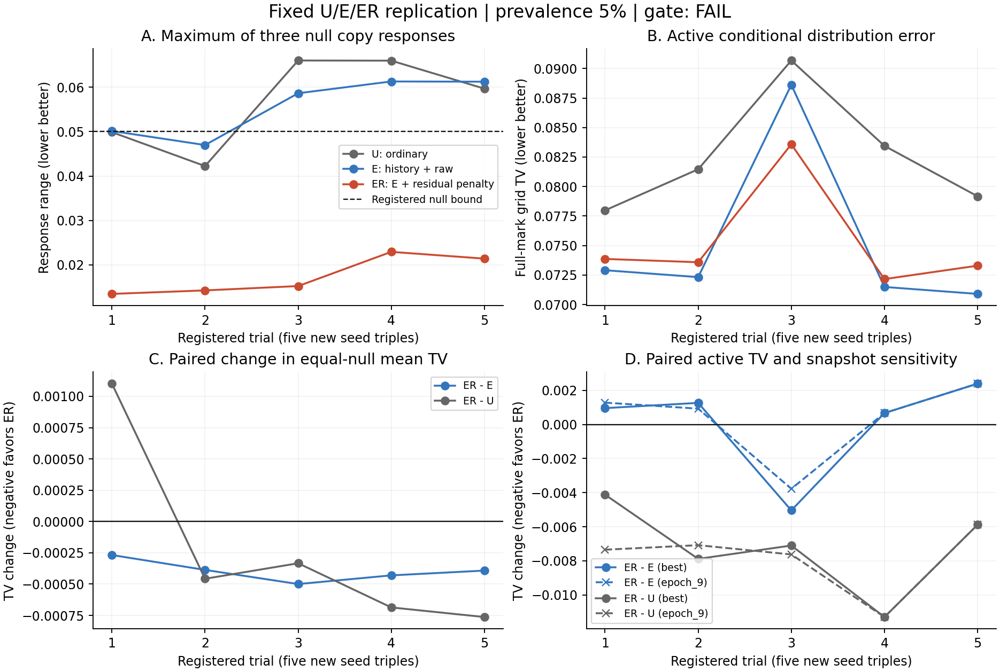

# U/E/ER 고정 모델: 다섯 시드 재현성과 비율 확대 판정

2026-09-16. [사전등록](replication_v1_preregistration.md) · [전체 수치와 검증 근거](replication_v1_result.json).

**첫 30회 판정: FAIL. 완료한 신규 GPU 학습: 30회.**
사전등록한 조건에 따라 나머지 비율 90회를 실행하지 않았다.

이번 실험은 모델 구조를 바꾸지 않고 학습 난수와 집단 비율에 대한 재현성을 검증했다.
이전 단일 시드의 v4 PASS를 수정하거나 지우지 않는다. 새 시드 결과와 별도로 해석한다.
새 데이터나 외부 baseline에서 우수성을 확인한 실험은 아니다.

## 고정 조건과 단계 기준

등록 `8f5eaef`; 실행 소스 `e35c6c275eec2b8ae13824d73aa3abee2865579e`.
모델은 U(일반 손실), E(이력 보정+raw gap 경로), ER(E 예측식+중심화 잔차 규제)이다.
U는 133,549개, E/ER는 133,581개 parameter다. ER의 lambda=.01, epsilon=1e-4,
AdamW lr=.001, batch512, 최대50 epoch/patience5, global validation base NLL 선정 규칙을 유지했다.
모든 학습은 fresh initialization이며 checkpoint warm start는 없다. 같은 반복 안에서는
공통 가중치·학습 순서·생성 계획이 짝지어져 있고 E/ER 초기 상태는 전체가 동일하다.

| 반복 | 모델·학습 순서 seed | 경로 초기화 seed | 생성 seed |
|---|---:|---:|---:|
| 1 | 20261001 | 20261101 | 20261201 |
| 2 | 20261002 | 20261102 | 20261202 |
| 3 | 20261003 | 20261103 | 20261203 |
| 4 | 20261004 | 20261104 | 20261204 |
| 5 | 20261005 | 20261105 | 20261205 |

기존 경로 초기화가 별도 고정 seed였으므로 이번에는 그 seed도 바꿨다. 경로 초기화의
분포·범위는 기존 코드와 동일하다. 따라서 이 결과는 초기값/학습 순서의 결합 변동이며,
어느 난수 요인이 차이를 만들었는지 개별 분해한 결과는 아니다. 발견용 seed 20260930은
새 다섯 반복의 평균에 포함하지 않았다. 데이터 생성 seed42와 기존 train/validation은 유지했다.

확대 조건은 (1) 다섯 반복 모두 ER의 기존 반응/유효성 기준 통과, (2) ER−E 및 ER−U의
다섯 시드 평균 TV 차이가 세 null 평균에서는 엄격히 음수, active에서는 0 이하인 것이다.
이는 실험 확대를 위한 방향성 기준이다. 통계적 우수성/비열등성 검정이나 새로운 허용 오차를
추가한 기준이 아니다. 실패하더라도 첫 30회는 모두 완료하며 시드나 규제 강도를 재선택하지 않는다.

## 비율 5% 결과: FAIL

다음 평균±SD는 다섯 학습 시드에 대한 값이다. 최대 null copy는 세 cell과 다섯 시드 전체의
최댓값, 최소 active copy는 다섯 시드 중 최솟값이다. TV는 낮을수록 좋다.

| 모델 | 반응 기준 통과 | 최대 null copy | 최소 active copy | 세 null 평균 TV (평균±SD) | active TV (평균±SD) |
|---|---:|---:|---:|---:|---:|
| U | 2/5 | 0.066038128 | 0.350170374 | 0.053233834 ± 0.000939304 | 0.082549503 ± 0.005010110 |
| E | 1/5 | 0.061313422 | 0.329350614 | 0.053401291 ± 0.000797167 | 0.075247675 ± 0.007516314 |
| ER | 5/5 | 0.022911737 | 0.299357169 | 0.053006165 ± 0.000866234 | 0.075295470 ± 0.004678344 |

**등록된 정확도 판정:** best-validation에서 계산한 paired trial 차이다.

| 비교 | null 평균 TV 차이 | 95% 참고용 t 구간 | active TV 차이 | 95% 참고용 t 구간 | 정확도 방향 판정 |
|---|---:|---|---:|---|---|
| ER−U | -0.000227668 | [-0.001174772, +0.000719436] | -0.007254033 | [-0.010564866, -0.003943201] | PASS |
| ER−E | -0.000395125 | [-0.000499872, -0.000290379] | +0.000047795 | [-0.003575428, +0.003671019] | FAIL |

구간은 df=4 Student-t(mean ± 2.776445×SE)이며, 작은 표본의 근사 정규성에 의존한다.
여러 지표에 대한 다중비교 보정 구간이 아니고, 기존 데이터 재사용/새 데이터 불확실성을
반영하지 않는다. 표본 entity 수를 seed 반복 수처럼 사용하지 않았다. 구간은 확대 판정에
사용하지 않았으며, 양수/음수 방향만으로 확정적인 우수성을 주장하지 않는다.

| 반복 | U active TV | E active TV | ER active TV | ER−E active | ER−U active | ER 반응 판정 |
|---|---:|---:|---:|---:|---:|---|
| 1 | 0.077982434 | 0.072907163 | 0.073863877 | +0.000956714 | -0.004118556 | PASS |
| 2 | 0.081465104 | 0.072320800 | 0.073583792 | +0.001262992 | -0.007881312 | PASS |
| 3 | 0.090682752 | 0.088622820 | 0.083583362 | -0.005039459 | -0.007099390 | PASS |
| 4 | 0.083446537 | 0.071487812 | 0.072154997 | +0.000667185 | -0.011291540 | PASS |
| 5 | 0.079170691 | 0.070899779 | 0.073291324 | +0.002391545 | -0.005879367 | PASS |

**고정 epoch 9 및 train 교차 확인:** best만 유리하게 선택해 설명하지 않도록 함께 표시한다.

| checkpoint / split | 비교 | active TV 차이 평균 | paired seed 수 |
|---|---|---:|---:|
| best / train | ER−E | -0.000116589 | 5 |
| best / train | ER−U | -0.007434857 | 5 |
| best / validation | ER−E | +0.000047795 | 5 |
| best / validation | ER−U | -0.007254033 | 5 |
| epoch_9 / train | ER−E | +0.000171760 | 5 |
| epoch_9 / train | ER−U | -0.007964295 | 5 |
| epoch_9 / validation | ER−E | +0.000297833 | 5 |
| epoch_9 / validation | ER−U | -0.007843381 | 5 |

**모든 best-validation cell:** 평균은 다섯 시드 평균이다. kappa1/label1만 active이고 나머지는 null이다.

| 모델 | kappa/label | grid TV | factual TV | repeat BCE | copy response | repeat response |
|---|---|---:|---:|---:|---:|---:|
| U | 0/0 | 0.050077764 | 0.050075197 | 0.493230973 | 0.019991940 | 0.019671868 |
| U | 0/1 | 0.059160083 | 0.059132826 | 0.490299782 | 0.056773910 | 0.055864483 |
| U | 1/0 | 0.050463655 | 0.050446359 | 0.495310445 | 0.018599350 | 0.018300821 |
| U | 1/1 | 0.082549503 | 0.076579973 | 0.448844245 | 0.366326828 | 0.360446216 |
| E | 0/0 | 0.050380754 | 0.050378602 | 0.493473820 | 0.013184616 | 0.012973645 |
| E | 0/1 | 0.059152885 | 0.059093681 | 0.490448265 | 0.055674802 | 0.054784417 |
| E | 1/0 | 0.050670234 | 0.050666928 | 0.495639016 | 0.011400102 | 0.011217660 |
| E | 1/1 | 0.075247675 | 0.068119098 | 0.444203180 | 0.350560397 | 0.344945040 |
| ER | 0/0 | 0.050225172 | 0.050224579 | 0.493424431 | 0.002377786 | 0.002339781 |
| ER | 0/1 | 0.058322037 | 0.058305498 | 0.489777783 | 0.017433237 | 0.017154549 |
| ER | 1/0 | 0.050471287 | 0.050471341 | 0.495544800 | 0.002291202 | 0.002254553 |
| ER | 1/1 | 0.075295470 | 0.067974302 | 0.444059466 | 0.324072307 | 0.318885987 |

## 검증·계산 환경·저장

- 관련 테스트 135 PASS. CPU에서 U/E/ER 각 두 번씩 학습해 history/state 일치, loss-drop, reload, 생성 유효성, zero-gap 검사를 통과했다.
- 원격 GPU 0/1/2/3에서 실행했다. 각 작업을 배치하기 직전 해당 GPU에 compute process가 없음을 확인했다. 다른 작업은 종료하지 않았다.
- 신규 GPU 학습 30회 완료. 파일 checksum 346개, checkpoint tensor 60개, entity array group 240개 검증.
- Entity 통계 6,720개와 paired seed 평균·구간·단계 판정을 재계산했다. 생성 61,440 entities / 1,413,672 nonfirst gaps의 support/mark/value/길이/계획 검증 PASS.
- 고정 snapshot 누락: 0개. 누락 시 조기 종료를 존중하며 추가 학습이나 다른 checkpoint 대체를 하지 않는 규칙을 사용했다.
- checkpoint·생성 sample·entity arrays·개별 학습 이력은 원격 `artifacts/cs_saf/replication_v1`에 저장했다. git에는 소스·등록·보고서·집계 및 checksum 근거를 보관한다.
- held-out test, 새로운 DGP 데이터, 실데이터, 외부 baseline 학습은 수행하지 않았다. 집단 비율별 view는 같은 underlying data를 공유한다.

## 교수님 보고용 해석 및 다음 결정

**확인한 진전은 두 가지다.** 첫째, E−U active TV는 평균 −.007301828이며
다섯 시드 모두 E가 좋았다. 명시적인 이력 보정이 없는 내부 대조군보다 이력 보정이
있는 구조가 이 데이터에서 도움이 된다는 반복 근거다. 둘째, ER−E의 세 null 평균 TV는
다섯 시드 모두 감소했고, ER만 반응 기준을 5/5 통과했다(U 2/5, E 1/5).
잔차 규제의 불필요한 gap 반응 억제 효과는 단일 시드 관측에서 반복 관측으로 진전됐다.

**해결되지 않은 부분은 활성 정확도 비용이다.** ER−E active TV는 4/5 시드에서 증가,
한 시드에서 크게 감소해 평균은 +.000047795다. 참고용 95% t 구간
[−.003575428, +.003671019]가 0을 포함하므로, 명확한 평균 악화나 통계적 동등성 어느
쪽도 입증한 것은 아니다. 중간값은 +.000956714이며, 작은 평균만 보고 4/5 시드의
손실을 숨기면 안 된다. 고정 epoch 9에서도 4/5가 증가하고 평균 +.000297833이므로,
선정 체크포인트만 바꾸면 문제가 사라진다고 볼 수 없다. 시드3의 개선 때문에 평균이
상쇄된다는 사실은 관측이며, 해당 시드에서 작동한 학습 원인을 확정한 것은 아니다.

ER−U active TV는 평균 −.007254033으로 다섯 시드 모두 낮지만, E 자체의 개선도
거의 같은 크기다. 따라서 U 대비 활성 정확도 이득 전체를 잔차 규제의 공으로 돌릴 수
없다. 현재 분리해서 보고할 기여는 **이력 보정의 활성 정확도 이득**과 **잔차 규제의
null 선택성/정확도 개선**, 그리고 아직 해결되지 않은 두 효과의 결합 조건이다.

**이번 확대 판정은 FAIL이며 10%/25%/50% 90회는 미실행이다.** 평균 차이가 작다는
이유로 0 이하 기준을 뒤늦게 완화하거나, 좋은 시드만 남기거나, 추가 시드를 뽑아
판정을 뒤집지 않았다. 이것은 등록한 확대의 보류이며 모든 가능한 방법의 불가능성이나
연구 전체 중단 판정이 아니다. 이 결과까지가 교수님께 보고할 수 있는 1차 재현성 자료다.

다음 후보는 모델 구조를 또 바꾸기보다, **규제 강도에 따른 null 개선과 active 비용의
관계**를 제한된 범위에서 확인하는 것이다. 예를 들어 기존 E(lambda=0)와 ER(.01)를
보존하고 .003/.03 두 계수만 같은 다섯 시드·두 kappa에서 추가하면 신규 20 fits로
네 점의 비교가 된다. 목적은 좋은 계수를 찾을 때까지 탐색하는 것이 아니라,
null 반응/정확도 이득과 active TV 비용이 어떻게 함께 변하는지 전 범위를 보고하는
것이다. 후속 계수·예산·판정·종료 규칙과 독립 검증 계획은 실행 전에 별도로 고정해야 한다.
이 비교는 **후속 제안일 뿐 사전등록·구현·실행하지 않았다**.

이후에도 개선이 재현되면 새로운 데이터 생성 seed, prevalence/절대 minority 표본 수의
분리 통제, 외부 순차 baseline과 공통 생성 지표, 실데이터 효용으로 범위를 넓혀야 한다.
현재 copy DGP와 유사한 decoder의 구조적 이점과 validation 재사용 한계가 남는다.
외부 baseline보다 좋은 새 방법이나 학회 게재 수준이 확정되었다고 보고하지 않는다.
