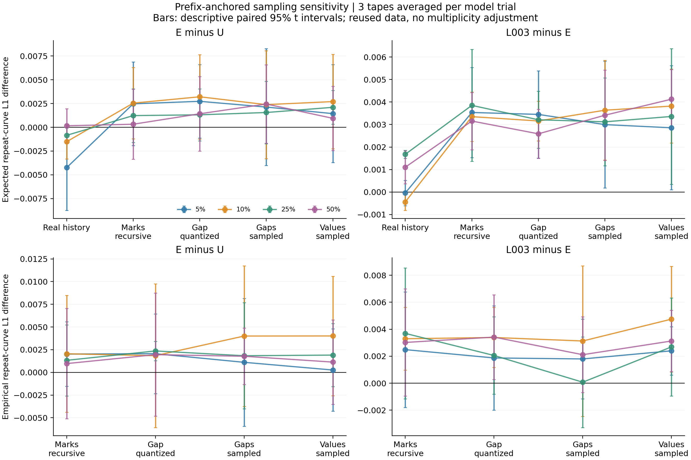
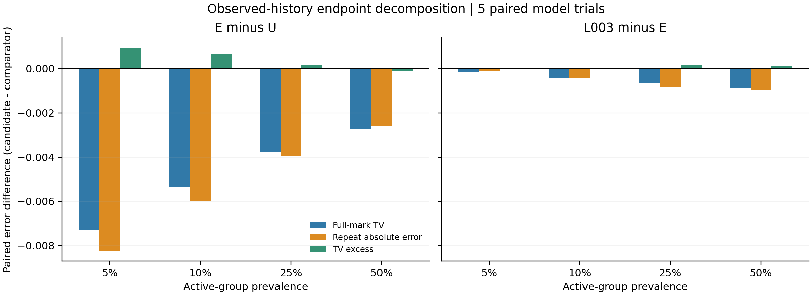

# CS-SAF 저장 모델의 조건부 정확도–생성 품질 차이 진단

2026-09-17. 기준 버전 `65be9bdee506dfee8245f05e711840638b1f559e`. [사전등록](rollout_audit_v1_preregistration.md) · [수치 근거](rollout_audit_v1_result.json) · [별도 산술 검증](rollout_audit_v1_verification.json) · [교수님 보고용 요약](professor_brief_rollout_audit_2026_09_17.md).

**원인 범위를 좁히는 진단 근거를 확보했다.** 실제 gap 경로와 수치값을 유지한 상태에서도, 실제 mark 이력을 모델이 생성한 mark 이력으로 바꾸는 단계에서 E−U 및 L003−E의 반복 관계 오차 차이가 증가했다. 사전등록한 일관성·크기 기준은 E−U에서 5/10/25%, L003−E에서 네 비율 모두 통과했다. **이는 mark 이력의 재귀적 사용에 대한 민감도를 확인한 결과이며, 유일한 인과 원인 규명이나 새 모델의 학습 성공이 아니다.** 기존 실패와 비교 결과는 유지한다.

## 1. 완료 범위와 비교 구조

- 기존 best checkpoint 120개: U/E/L003 × 집단 비율 5/10/25/50% × κ=0/1 × 5 paired model trials. 새 학습 0회, checkpoint 재선택 0회.
- 각 모델에서 전체 validation의 기존 oracle 지표를 다시 계산하고, 원래 저장된 2,048개 생성 entity의 반복곡선 L1·gap–repeat MI를 재현했다. 저장된 자유 생성 경로 총 245,760개를 다시 평가했다.
- 각 data cell에서 관측 집단별 validation entity 128개씩 고정했다. 같은 256개 entity의 길이·첫 mark·첫 수치값을 공유하고, 3개 생성 난수 × 4개 단계로 총 **368,640개** 진단 시퀀스를 생성했다. 같은 모델의 세 생성 반복을 먼저 평균한 뒤 5개 모델 trial을 비교했다.
- train에서 고정된 gap support와 metric bin을 재사용했다. 원래 데이터 seed42와 validation을 재사용하며, 독립 데이터·held-out test·실데이터·추가 외부 baseline은 사용하지 않았다. 모델 입력에 실제 latent state나 활성 여부를 추가하지 않았다.

| 표기 | gap | mark 이력 | 수치값 | 역할 |
|---|---|---|---|---|
| TF | 실제 gap | 실제 mark | 실제 값 | 실제 이력에서 예측 확률 평가 |
| OBS | 실제 연속 gap 경로 | 재귀적으로 생성 | 실제 값 | mark 이력의 변경에 대한 민감도 |
| QUANT | 같은 실제 gap을 support 대표값으로 변환 | 재귀적으로 생성 | 실제 값 | gap 표현의 이산화 민감도 |
| GAP | 모델이 생성 | 재귀적으로 생성 | 실제 값 | gap 경로를 자체 생성할 때의 차이 |
| FULL | 모델이 생성 | 재귀적으로 생성 | 모델이 생성 | 수치값 피드백까지 포함 |

TF→OBS는 첫 실제 mark/value를 공유하는 진단이다. 기존 2,048개 자유 생성처럼 첫 이벤트부터 모델이 생성하는 실험과 동일하지 않다. TF에서 과거 gap만 대표값으로 바꾸는 별도 입력 검증도 실시했다. 각 단계의 효과는 그 순서에 의존하며 상호작용이 제거된 요인 분해가 아니다.

## 2. 평가가 무엇을 측정하는가

고정 모델은 다음의 full-mark 혼합 분포를 사용한다.

\[
p_\theta(m_t\mid H_t,g_t,s)=q_\theta(H_t,g_t,s)\,1[m_t=m_{t-1}]
 +(1-q_\theta(H_t,g_t,s))f_\theta(m_t\mid H_t,s).
\]

따라서 실제 관측 반복 확률은 \(R_\theta=q_\theta+(1-q_\theta)f_\theta(m_{t-1}\mid H_t,s)\)이다. copy 확률 자체와 다르다. U는 기본항과 gap 경로를 사용하고, E는 여기에 이력 보정 계수 32개를 추가한다. L003은 E와 같은 예측 구조를 유지하면서 학습 때 중심화한 gap 잔차에 λ=.003 규제를 적용했던 모델이다. 이번에는 모든 가중치를 고정했다. 과거 gap은 연속값의 log1p 특징으로 GRU에 들어가지만, 생성 gap은 학습 support의 대표값이다. 현재 모델의 gap decoder는 categorical decoder이며, 이번 진단에서 구조를 교체하지 않았다.

각 실제 이력·gap bin에서 다음 항등식을 확인했다.

\[
D_{TV}(p_\theta,p_*)=|R_\theta-R_*|+D_{excess},\qquad D_{excess}\ge0.
\]

\(D_{excess}\)는 64개 mark를 반복/비반복 두 범주로 합치면 보이지 않는 TV 부분이다. 이를 특정 fresh head의 인과적 기여로 동일시할 수 없다. 기존 oracle 현재-gap 적분, float32 bin 경계, 관측 이력 필터와 entity별 평균 방식을 유지했다.

생성 관계 지표에는 train에서 정한 5개 metric bin을 사용했다. 각 경로에서 실제 사용한 반복 확률을 bin별로 평균해 validation의 관측 반복곡선과 비교한 값을 **expected repeat-curve L1**이라고 부른다. 현재 mark를 뽑는 잡음은 줄지만, 생성된 이전 mark·gap 이력의 표본 변동은 남는다. 이 값은 잡음이 전혀 없는 모집단 오차가 아니다. 실제 뽑힌 mark를 세는 empirical L1과 MI도 별도로 보고한다.

## 3. 주된 진단: 실제 gap을 유지해도 mark 이력을 재생성하면 상대 오차가 증가

아래는 활성 집단 κ=1, label=1의 candidate−comparator expected repeat-curve L1이다. 양수는 후보 모델의 오차가 더 큼을 뜻한다. 마지막 차이는 `(OBS 후보−대조군) − (TF 후보−대조군)`이며, 같은 모델 trial 안에서 계산했다.

| 비교 | 비율 | TF 차이 | OBS 차이 | TF→OBS 변화 | 증가 trial | 변화의 참고용 95% t 구간 |
|---|---:|---:|---:|---:|---:|---|
| E−U | 5% | -0.0042471 | +0.0024686 | +0.0067157 | 5/5 | [+0.0013865, +0.0120450] |
| E−U | 10% | -0.0015183 | +0.0025423 | +0.0040606 | 5/5 | [+0.0002643, +0.0078568] |
| E−U | 25% | -0.0008460 | +0.0012296 | +0.0020757 | 4/5 | [-0.0001080, +0.0042594] |
| E−U | 50% | +0.0001596 | +0.0003225 | +0.0001629 | 2/5 | [-0.0017778, +0.0021035] |
| L003−E | 5% | -0.0000422 | +0.0035356 | +0.0035777 | 5/5 | [+0.0012754, +0.0058801] |
| L003−E | 10% | -0.0004408 | +0.0033502 | +0.0037909 | 5/5 | [+0.0025802, +0.0050016] |
| L003−E | 25% | +0.0016769 | +0.0038505 | +0.0021736 | 4/5 | [-0.0001947, +0.0045419] |
| L003−E | 50% | +0.0011036 | +0.0031548 | +0.0020512 | 5/5 | [+0.0006826, +0.0034198] |

E−U는 5/10/25%에서 TF의 평균 이득이 OBS에서는 평균 손실로 바뀐다. 50%의 단계 변화는 +.0001629로 작고 2/5 trial만 양수라 같은 기준을 통과하지 않는다. L003−E는 네 비율 모두 단계 변화가 +.00205~+.00379이고 5/5, 5/5, 4/5, 5/5 trial에서 양수다. OBS 자체의 L003−E 차이는 네 비율 각각 5/5 trial에서 양수다.

사전등록 기준은 같은 방향 4/5 trial 이상, 평균 크기 .001 이상인 비율이 3/4 이상인 **탐색적 기술 기준**이다. 25%의 단계 변화 구간은 두 비교 모두 0을 포함한다. PASS를 모든 비율의 통계적 유의성, 독립 데이터 재현, 일반적 방법 우위로 해석하지 않는다. 여러 비율은 데이터를 공유하고, 여러 대비에 대한 다중검정 보정도 하지 않았다.



## 4. 어떤 설명은 지지되지 않았는가

**전체 mark TV만 좋아지고 이력별 반복 정확도는 나빠졌다는 설명은 이번 평균 결과에 맞지 않는다.** E−U와 L003−E 모두 네 비율에서 grid 반복 절대오차와 factual full-mark TV의 평균도 개선됐다. 사전등록한 endpoint-mismatch screen은 통과하지 않았다. TV의 비반복 부분만 줄어서 기존 개선이 생겼다고 설명할 수 없다.

그러나 **이력별 평균 절대오차와 bin별 집계 확률의 보정 오차는 다른 양**이다. L003−E는 25/50%에서 실제 이력을 넣은 상태에서도 전체 validation의 expected 반복곡선 L1이 각각 +.0017480/+.0016339 악화하며 각각 5/5 trial에서 양수다. 따라서 모든 문제가 재귀 생성 이후에 처음 발생한다고 말할 수도 없다.

| 비율 | grid TV 차이 | grid 반복 절대오차 차이 | factual TV 차이 | 실제 전체 이력의 집계 L1 차이 | 기존 자유 생성 expected L1 차이 | 기존 자유 생성 empirical L1 차이 |
|---|---:|---:|---:|---:|---:|---:|
| 5% | -0.0001549 | -0.0001205 | -0.0001617 | +0.0001679 | +0.0026332 | +0.0010148 |
| 10% | -0.0004432 | -0.0004326 | -0.0004482 | +0.0001069 | +0.0023341 | +0.0024770 |
| 25% | -0.0006501 | -0.0008338 | -0.0004355 | +0.0017480 | +0.0032985 | +0.0035449 |
| 50% | -0.0008660 | -0.0009643 | -0.0007583 | +0.0016339 | +0.0031979 | +0.0023644 |



나머지 단계에서의 paired expected L1 차이 변화는 다음과 같다. 어느 단계도 사전등록한 3개 비율 이상 일관성 기준을 통과하지 않았다.

| 비교 | 비율 | OBS→QUANT | QUANT→GAP | GAP→FULL |
|---|---:|---:|---:|---:|
| E−U | 5% | +0.0002643 | -0.0006049 | -0.0006906 |
| E−U | 10% | +0.0006676 | -0.0008262 | +0.0003210 |
| E−U | 25% | +0.0000838 | +0.0002419 | +0.0005448 |
| E−U | 50% | +0.0010998 | +0.0010237 | -0.0015029 |
| L003−E | 5% | -0.0000854 | -0.0004535 | -0.0001415 |
| L003−E | 10% | -0.0001919 | +0.0004783 | +0.0001826 |
| L003−E | 25% | -0.0006394 | -0.0000907 | +0.0002384 |
| L003−E | 50% | -0.0005675 | +0.0008266 | +0.0007127 |

50% E−U에서는 이산화와 gap 자체 생성의 평균 변화가 각각 약 +.0011/+.0010인 예외가 있다. 그러므로 gap decoder·이산화·수치값이 무관하다고 판정하지 않는다. 실제 mark/value를 유지하며 과거 gap만 이산화한 TF 입력 검증에서 두 모델 간 집계 L1 차이 변화는 모든 비율에서 절댓값 1.6e-5 이내였다. 이 좁은 검증에서는 대표값 치환만으로 주된 현상을 설명하지 못한다.

세 비활성 조건도 모두 평가했다. TF→OBS의 평균 변화는 E−U에서 −.0019589~+.0020054, L003−E에서 −.0015246~+.0023551로 부호와 크기가 달랐다. 비활성 조건의 효과가 항상 0이라는 결과도, 이 현상이 활성 집단에만 존재한다는 결과도 아니다. 모든 cell·trial은 JSON에 포함했다.

## 5. 기존 자유 생성에서 보이는 오차의 형태

각 metric bin에서 다음 **부호 있는 항등식**을 검증했다.

\[
\hat R_{gen}-\hat R_{val}
=(\hat R_{gen}-\bar R_\theta)
 +(\bar R_\theta-\bar R_*)
 +(\bar R_*-\hat R_{val}).
\]

각 항은 현재 표본의 반복 횟수 잔차, 해당 생성 이력에서의 조건부 확률 차이, oracle 집계와 validation 기준의 차이다. 마지막 항에는 방문 이력·gap 구성, 유한 reference 표본, oracle의 gap 표현 가정이 함께 들어간다. 이를 순수한 exposure-bias 효과로 부르지 않는다. 절댓값과 MI는 비선형이므로 각 항의 절댓값을 더하거나 오차 기여 백분율로 바꿀 수도 없다.

현재 mark 샘플의 반복 횟수 대신 모델 확률을 평균해도 기존 자유 생성의 L003−E 오차 차이는 모든 비율에서 양수다(+.0026332/+.0023341/+.0032985/+.0031979). 5%는 4/5 trial, 나머지는 각각 5/5 trial에서 양수다. 따라서 원래 단일 생성 표본의 현재-mark 추출 잡음만으로 악화를 설명하기 어렵다. 세 개의 새 생성 tape를 사용한 진단도 같은 방향을 뒷받침한다. 이력 표본 변동까지 없앴다는 의미는 아니다.

활성 자유 생성의 평균 곡선은 짧은 gap의 반복을 낮게, 긴 gap의 반복을 높게 예측하는 형태다. 예를 들어 5%에서 가장 짧은 bin의 model−validation 차이는 E −.05330, L003 −.05610이고 가장 긴 bin은 E +.04002, L003 +.04459다. L003을 추가하면 양 끝이 더 평평해지는 평균 패턴은 네 비율에서 같다. 반면 생성 이력에서의 model−oracle bin별 차이의 L1은 L003이 E보다 네 비율 모두 평균적으로 낮다. **국소 예측 오차가 매 단계 단순히 커져서 발산했다는 설명은 확인되지 않았다.** 이력별 정확도, 잔차의 부호, 생성 경로에서 방문하는 이력의 분포를 함께 보아야 한다.

대표 gap을 연속 관측값으로 해석한 원래 oracle와, 과거 gap을 bin 관측으로 처리한 oracle를 모두 확인했다. L003−E의 native local discrepancy 변화는 원래 필터 −.0006095/−.0008389/−.0008754/−.0004915, bin 필터 −.0006079/−.0008376/−.0008782/−.0005034로 평균 방향이 같다. 이 대표값 해석 하나로 결론이 뒤집히지는 않았다.

## 6. 무엇을 아직 확정할 수 없는가

1. **고정 gap 경로의 한계:** OBS는 관측 gap 경로에 생성 mark를 결합한 혼합 경로다. 실제 joint DGP에서는 gap과 mark가 숨은 상태를 통해 연결되므로 이 혼합 경로 자체가 분포 밖일 수 있다. 미래 gap까지 조건으로 주는 정확한 조건부 생성도 아니다. 관측 gap을 주면 gap decoder의 원인을 완벽하게 제거한 인과 대조군이 된다고 주장할 수 없다.
2. **방문 이력과 예측 함수의 혼합:** 모델별로 생성된 mark 경로가 다르다. 현재 비교는 같은 난수·gap·값을 공유하지만, 동일한 생성 이력을 모든 모델에 교차 입력하는 설계는 아니다. 특정 encoder 특징이나 gap 경로 파라미터를 유일한 원인으로 지목할 수 없다.
3. **불충분한 일반화 증거:** 기존 데이터·validation에서의 5개 모델 trial이다. 128개/집단의 하나의 고정 panel, 세 생성 tape, 고정 단계 순서에 대한 민감도 결과다. 독립 데이터, 더 긴 길이, 실데이터, 다른 외부 모델에 대한 결과가 아니다.
4. **방법 개선 미실행:** 새 손실·구조·보정기를 학습하지 않았다. 등록한 PASS는 진단 근거를 공개할 기준이며, 생성 품질이 개선된 모델을 얻었다는 판정이 아니다. 이전 ER replication FAIL 및 L003의 생성 품질 한계는 유지한다.

## 7. 근거에 따른 다음 방향 — 제안이며 아직 등록·실행하지 않음

먼저 동일한 생성 mark 이력 묶음을 U/E/L003 모두에 교차 입력하는 저장 모델 진단과, 올바른 joint oracle rollout 기준을 별도로 등록하는 것이 타당하다. 전자는 예측 함수와 방문 이력 분포의 영향을 더 분리하고, 후자는 OBS라는 혼합 경로 자체가 만드는 왜곡을 확인한다. 이 대조군 없이 gap decoder를 무조건 교체하거나 mark 피드백 하나가 유일한 원인이라고 전제하면 안 된다.

그 근거가 확보되면 이력별 한 단계 오차뿐 아니라 **자체 생성 시의 gap–repeat 보정과 여러 단계 관계 보존**을 직접 겨냥하는 제한된 학습 수정 하나를 비교한다. λ=0 대조군, 기존 E/L003, 용량·학습 예산, 비활성 반응 비용을 함께 통제하고 새 데이터/학습 seed에서 확인해야 한다. 추가 λ 탐색, 구조 분리, rollout 목적함수 중 어느 것이 해결책인지는 아직 정해지지 않았다. 이번 요청의 실행은 진단·분석·저장까지 마친다.

## 8. 실행·재현 기록

- 로컬 사전등록 `fd78ae5`, 최초 구현 `ad97c24`, 최종 과학 실행 source `fadf272`. 설정 SHA `fd9661b92596a8146d9fd5229d55fab7dfe7e58d5d9b2ad9bd9c434942ab1bfa`.
- 사용자 조건에 따라 원격 `65be9bd`를 유지한 채 별도 worktree에서 등록·실행했다. 모든 비교 완료 후 등록한 진단 screen PASS를 확인하여 결과를 공개한다. 유리한 seed·비율만 골라 공개하지 않는다.
- CPU 기능 검증 9개 PASS. U/E/L003×4모드 GPU 기능 검증 12개 PASS, 생성 중/사후 확률의 최대 차이는 1.38e-7 미만. 모든 120개 실제 job에서도 사후 확률 일치, 유효 mark/값, 가중치 불변성, 기존 metric 재현을 검사했다.
- 완료 산출물 해시 **480개**, 원래 입력 산출물 해시 **960개**를 재검증했다. 기존 full-validation 조건부 지표와의 최대 절대 차이는 **1.96004e-6**, 등록 허용값 2e-6 이내다. float32/TF32 계산 차이 때문에 비트 단위 동일하다고 표현하지 않는다. 기존 native 반복 L1·MI는 각 job에서 1e-7 허용값으로 재현했다.
- 별도 검증 코드로 entity 평가 배열 120개, bin별 부호 분해·집계곡선 3,840개, 두 mark-feedback screen을 다시 계산했다. 부호 분해의 최대 재구성 오차는 0이었다. 같은 사람이 작성한 별도 산술 검증이며, 외부 연구자의 독립 재현이라는 의미는 아니다.
- 첫 GPU 시도는 deterministic CUDA cumsum 미지원으로 첫 job 중단. 완성된 job은 0개였다. CPU CDF scan으로 수정한 [amendment 01](rollout_audit_v1_execution_amendment_01.md), streamed/full GRU 정밀도 차이를 제거하도록 TF32를 끈 [amendment 02](rollout_audit_v1_execution_amendment_02.md)를 기록했다. 과학적 조건·seed·판정 기준·허용오차는 변경하지 않았다. 실패 기록도 로컬에 보존했다.
- 워크스테이션 GPU 3번(RTX 3090)을 비어 있는 상태에서 사용했고 기존 작업을 종료하지 않았다. 한 프로세스, CPU thread1, allocator 메모리 상한 25%로 실행했다. 진단 프로세스 종료와 GPU 반환을 확인했다. 성능 속도 비교 실험은 아니다.
- raw checkpoint/data는 이전 위치에 그대로 있다. 새 raw 경로는 `research-cs-saf-rollout-audit/artifacts/cs_saf/rollout_audit_v1/`. 전체 step profile·panel ID는 이곳에, 그 SHA와 compact 결과는 Git에 저장한다. 후속 재현에는 기존 checkpoint와 prepared data가 필요하다.

```bash
# 체크포인트/캐시가 있는 원래 진단 worktree에서 결과 검증·재집계
/home/finx_sbk/.conda/envs/cofseq/bin/python3 scripts/summarize_cs_saf_rollout_audit.py
/home/finx_sbk/.conda/envs/cofseq/bin/python3 scripts/verify_cs_saf_rollout_audit.py
/home/finx_sbk/.conda/envs/cofseq/bin/python3 scripts/plot_cs_saf_rollout_audit.py
# 신규 실행은 등록된 source와 CPU/GPU gate를 맞추고 별도 output에서 수행해야 한다.
# 기존 결과 폴더에 재실행하여 덮어쓰지 않는다.
```
