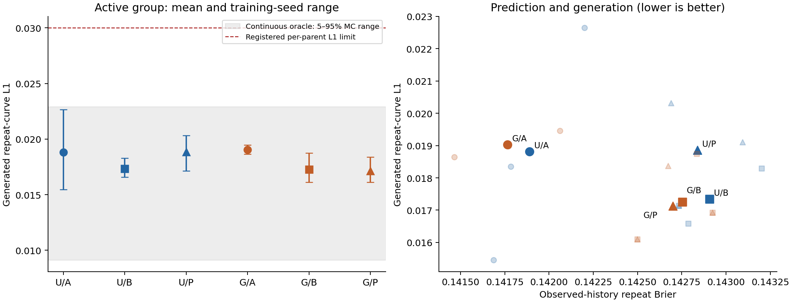
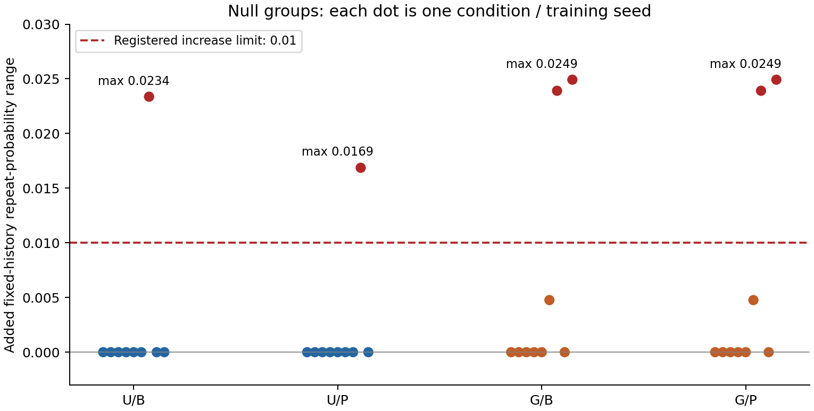
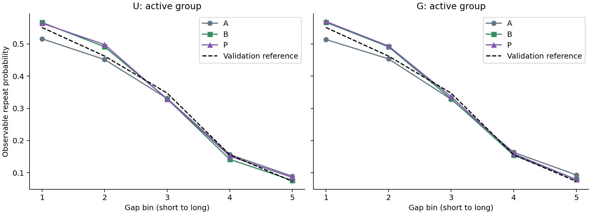

# 생성 관계 보정과 예측 보호: 실행 결과

**24회 보정 탐색, 108개 모델 생성 데이터, 120개 정답 생성 데이터의 평가와 검산을 완료했다. 이번 B/P 보정 후보는 채택하지 않는다.** 생성 오차가 줄어든 조합은 있지만 사전에 요구한 개선 폭에 못 미쳤고, 일부 비활성 조건에서 불필요한 gap 반응이 증가했다. 예측 손실과 다른 변수의 분포 비용은 허용 범위 안이었다. 과거 C의 실패는 그대로 유지한다.

## 무엇을 확인했는가

목표는 **과거 이력을 반영하는 거래별 예측력을 유지하면서, 스스로 만든 거래열의 간격–행동 반복 관계를 개선하는 것**이다. 저장된 U/G 신경망은 고정하고 같은 10개 보정값의 학습 방법만 바꾸었다. U와 G는 모두 이력을 쓰는 내부 신경망이며, 이번 실험이 새로운 신경망 구조의 우수성을 보여주는 비교는 아니다.

| 보정 | 쉽게 설명하면 |
|---|---|
| A | 실제 학습 이력에서 반복확률을 맞춘 기존 보정 |
| B | 직접 생성한 거래열의 관계를 학습 데이터의 관측 관계에 맞추는 보정 |
| P | B와 같은 목표에, 실제 학습 이력의 예측 비용 상한을 추가한 보정 |

인공 데이터의 정답 법칙·평가 데이터를 학습 목표에 넣지 않았다. 보정한 행동을 생성하는 즉시 수치값과 다음 이력에 반영했다. 모든 보정을 확정한 뒤 새 난수로 A/B/P를 함께 평가했다. 데이터 seed42, 집단 비율 10%, 관계 없음/있음 두 조건, 부모 학습 시드 3개다. [구조·수식·탐색 방법](methods.md), [실행 전 기준](preregistration.md).

## 핵심 결과

아래는 관계가 있는 집단의 평균이다. 생성 난수 3개를 각 부모 안에서 먼저 평균한 뒤 학습 시드 3개를 평균했다. L1은 간격 5구간의 반복률 차이, Brier는 실제 이력에서 거래별 반복 예측 오차다. 낮을수록 좋다.

| 모델 | 보정 | 생성 반복곡선 L1 | A 대비 생성 개선 | 반복 Brier |
|---|---|---:|---:|---:|
| U | A | .018815 | 기준 | .141890 |
| U | B | .017339 | 7.85% | .142906 |
| U | P | .018857 | **0.22% 악화** | .142839 |
| G | A | .019031 | 기준 | .141765 |
| G | B | .017257 | 9.32% | .142752 |
| G | P | .017133 | 9.97% | .142699 |



- **생성 관계에 부분적인 개선은 있었다.** G의 B/P는 세 학습 시드 모두 A보다 생성 L1이 낮았다. U/B는 2/3, U/P는 1/3에서 개선됐다. 보호를 추가한 P가 두 모델에서 일관되게 더 낫지는 않았다.
- **등록한 개선 폭은 넘지 못했다.** 평균 10% 및 절대 .002 이상 감소가 필요했다. G/P는 9.972%, .001898 감소로 경계에 가까웠다. 이를 반올림해 통과했다고 하지 않는다. U/P는 평균 개선도 없었다.
- **예측 비용 자체는 허용 범위였다.** 전체 조건·집단·시드에서 Brier 증가 최댓값은 .001064(허용 .002), 행동 NLL 증가는 .002873(허용 .02)이었다. 기본 예측 적격성도 모두 통과했다. 다만 활성 집단의 구간별 평균 예측 L1은 A 약 .0076에서 B/P 약 .0249–.0271로 커졌다. 비용을 허용했다는 것과 예측력이 좋아졌다는 것은 다르다.
- **별도의 실패는 비활성 반응이었다.** 같은 실제 이력에서 gap만 바꿀 때 반복확률 범위가 A보다 얼마나 늘었는지 평가했다. 허용 증가폭은 .01이었지만 U/B .023367, U/P .016865, G/B 및 G/P .024921까지 증가했다. 각각 비활성 조건 9개 중 1/1/2/2개가 실패했다. 따라서 G/P의 생성 개선이 기준에 조금 못 미친 점만으로 실패한 것은 아니다.

예를 들어 G의 활성 데이터 조건·학습 시드 2에서 **관계가 없는 0집단**의 평균 반응 범위는 A .029052에서 B/P .053973으로 늘었다. 신경망과 실제 입력 이력을 고정한 비교이므로, 이 추가 반응은 이번 보정값 변경에서 생긴 것이다. 데이터의 인과효과를 추정했다는 뜻은 아니다.



간격·행동·수치값 분포의 비용은 모두 통과했다. 최댓값은 gap KS +.002096, 행동 sparse TV +.004962, 수치값 KS +.000114였다(각 허용 +.01). 비활성 생성 곡선 L1 최댓값 .017081, 평균 제거 모양 L1 .013529도 각각 .03/.02 이내였다. **집단의 생성 곡선이 괜찮아도 개별 이력에서 불필요한 gap 반응은 커질 수 있음**을 다시 확인했다. 길이는 공통 계획으로 주므로 새로 학습한 성과가 아니다.



[모든 결과 표](result_tables.md), [조건·집단·시드별 비용](costs_by_parent.csv), [예측 지표](conditional_metrics.csv), [108개 모델 생성 평가](generation_metrics.csv), [고정 이력 반응](fixed_history_response.csv).

## 예측 보호의 추가 기여를 주장할 수 있는가

**이번 결과로는 주장할 수 없다.** 선택된 B의 최종 보정값 12개가 모두 P에 부여한 훈련 예측 상한까지 이미 만족했다. P가 탐색 중 부적격 후보를 거부한 것은 사실이지만, B의 최종 예측 비용이 실패하고 P만 이를 구제한 상황은 아니었다. B/P의 최종 보정값도 12개 부모 중 9개에서 같았다. [보호 조건의 작동 기록](guard_activity.csv). 이 9개 부모의 생성물 27쌍도 hash가 같았다. [추가 보고서 검사](report_checks.json).

P는 집단 평균 Brier/NLL 비용만 제한하며, gap에 따른 반응 범위를 직접 제한하지 않는다. 현재 목적함수에는 생성한 집단별 결합 빈도를 맞추면서 개별 이력의 gap 반응이 달라질 여지가 있다. 이번 결과는 이 두 평가가 별개라는 점을 보여준다. 왜 특정 구간 보정이 선택됐는지에 관해서는 생성 이력 분포의 변화, 유한 생성 표본에 대한 탐색·선택 변동 등을 더 분리해야 하며, 하나의 원인을 이미 증명했다고 하지 않는다. [선택값과 훈련 비용](calibration_runs.json), [선택하지 않은 후보까지 포함한 탐색 기록](optimization_traces.json).

## 정답 생성기도 표본 오차가 남는다

정답 법칙으로 생성해도 2,048개 거래열과 고정 validation을 비교하면 반복곡선 L1이 0이 되지 않았다. 활성 집단에서 30개 생성 난수의 결과는 다음과 같다.

| 정답 생성기 | 비교 기준 | L1 평균 | 생성 난수의 5–95% 범위 |
|---|---|---:|---:|
| 연속 gap | 원래 validation | .015876 | .009115–.022901 |
| 모델과 같은 유한 gap 지지집합 | 원래 validation | .014855 | .008013–.022836 |
| 모델과 같은 유한 gap 지지집합 | 같은 방식으로 양자화한 validation | .014048 | .006822–.021162 |

이번 A/B/P 평균도 이 참고 범위 안에 있다. 따라서 **남은 .017–.019 정도의 오차를 모두 구조적 실패로 읽거나 0까지 줄여야 한다고 보는 해석은 부적절하다.** 반대로 이 범위 안에 든다고 정답 생성기와 동등하다거나, B/P의 차이가 전부 우연이라는 결론도 내릴 수 없다. 30개 oracle 난수는 학습 시드가 아니며, 위 범위는 신뢰구간·엄밀한 하한·모델 오류의 원인 분해가 아니다. 양자화와 reference 조건도 구분해야 한다.

모델 값은 여러 난수와 부모의 평균이고 위 oracle 분위수는 한 번 생성한 표본들의 분포다. 평균 방식도 다르므로 이 범위의 겹침을 공식적인 동등성 검정으로 사용하지 않는다.

과거 구조 비교의 A와 이번 A는 같은 가중치·보정값이지만 새 생성 난수로 평가했다. 이번 U/A .018815를 과거 U+gap .026435와 직접 비교해 학습 개선이라고 하지 않는다. 작은 생성 점수 차이를 해석할 때 표본 변동을 함께 봐야 한다. [120개 oracle 생성 평가](oracle_metrics.csv), [요약](oracle_repeat_summary.csv).

## 이번 결정과 이후 방향

1. **이번 B/P 설정을 최종 방법으로 채택하지 않고 종료한다.** 계수·시드·순회를 추가하거나 기준을 낮춰 성공을 찾지 않는다. C의 실패도 유지하며, 이 결과를 C를 되살린 증거로 쓰지 않는다.
2. **현재의 U/G+A를 기준으로 유지한다.** G/B·G/P의 세 시드 생성 개선은 탐색 근거로 남지만, 예측 보호의 추가 기여나 두 내부 구조에 걸친 동시 개선은 입증하지 못했다. 외부 모델 대비 신규 방법의 우수성도 이번에 검증하지 않았다.
3. **다음은 남은 오류가 명확한지를 먼저 분리하는 것이 타당하다.** 현재 반복곡선 평균은 정답 생성기의 유한 표본 변동과 겹친다. 새 구조를 바로 추가하기보다, 저장된 모델/생성물에서 이력 길이·연속 반복 길이별 관계에도 U/G의 일관된 오류가 남는지 oracle 참고 분포와 비교하는 별도 진단을 먼저 설계할 수 있다. 이번 실패 판정을 대체하지 않으며, 이 후속은 아직 사전등록·실행하지 않았다.
4. 이후 구조나 학습법을 제안하려면 그 **구체적인 오류를 같은 보정의 일반 모델보다 줄이고**, 예측·비활성 비용도 지킨다는 결과가 필요하다. 그 후보를 고정한 뒤 새 인공 데이터·학습 시드, 적절히 학습·보정한 외부 모델, 다른 전이 법칙과 실제 데이터로 확장한다. 지금은 AI 학회 수준의 신규성이나 실제 사기 탐지 효용을 입증한 단계가 아니다.

이 결론은 기존 데이터 seed42·10% 집단·세 부모 시드와 한정된 10개 보정값 탐색에 대한 것이다. 모델 계열이나 생성 관계 학습 전체가 불가능하다는 결론은 아니다.

## 검증·실행·저장

사전등록 `13dc0ac`, 학습 구현 `027bc55`, 사전 CPU/GPU 검증 `429172e`. 총 신경망 재학습 0회, 보정 탐색 24회, 탐색·선택 생성 호출 3,120회(6,389,760개 거래열)다. GPU는 여유를 확인해 한 작업씩 실행했고 탐색 시간 합은 약 74.35분이었다. 최대 PyTorch 예약 메모리는 48MiB이며 CUDA context 등 드라이버 메모리는 별도다. 최종 모델 108개 및 oracle 120개 고유 생성 데이터는 총 466,944개 거래열이다. 모든 과학적 실행은 종료했다.

입력·가중치·보정·생성물 hash, 24개 보정이 모든 평가보다 먼저 끝난 시각, train-only 목표와 보호 조건, 고정 생성 계획을 확인했다. 독립 계산에서 예측 지표 324개는 최대 4.54×10⁻¹⁰, 반복관계 지표 1,368개는 9.98×10⁻¹⁷, 전체 native 지표의 대표 검증 468개는 1.25×10⁻¹⁶ 차이로 일치했다. [검증](verification.json), [실행 목록](execution_summary.json), [자원](execution_resources.json).

oracle 결과의 열 이름 충돌로 2개 조건의 평가가 중단된 기술 오류가 한 번 있었다. 실패 파일·로그를 보존하고 저장 이름만 수정했다. 두 최초 oracle 표본은 같은 난수로 재생성해 hash가 동일함을 확인했다. 24개 보정과 108개 모델 생성물을 다시 만들지 않았으며 과학적 기준도 바꾸지 않았다. [기술 기록](execution_notes.md), [회귀 검증](oracle_schema_gate.json), [재생성 일치](oracle_retry_identity.json).

코드·등록·표·그림·보고서·선택 기록은 `research/cs-saf-external-audit-v1`에 저장한다. `main`과 이전 `research/cs-saf`로 병합하지 않는다. 약 152MiB의 원본 생성물·상세 실행 파일은 워크스테이션의 `artifacts/cs_saf/rollout_calibration_v1/`에 있으며 GitHub는 대용량 원본의 전체 백업이 아니다. Notion·Slack은 수정하지 않았다.

기존 원본으로 집계와 그림만 재생성하려면 다음을 실행한다.

```bash
OMP_NUM_THREADS=1 OPENBLAS_NUM_THREADS=1 MKL_NUM_THREADS=1 python scripts/summarize_cs_saf_rollout_calibration_v1.py
MPLCONFIGDIR=/tmp/cs_saf_mpl OMP_NUM_THREADS=1 OPENBLAS_NUM_THREADS=1 MKL_NUM_THREADS=1 python scripts/report_cs_saf_rollout_calibration_v1.py
```
