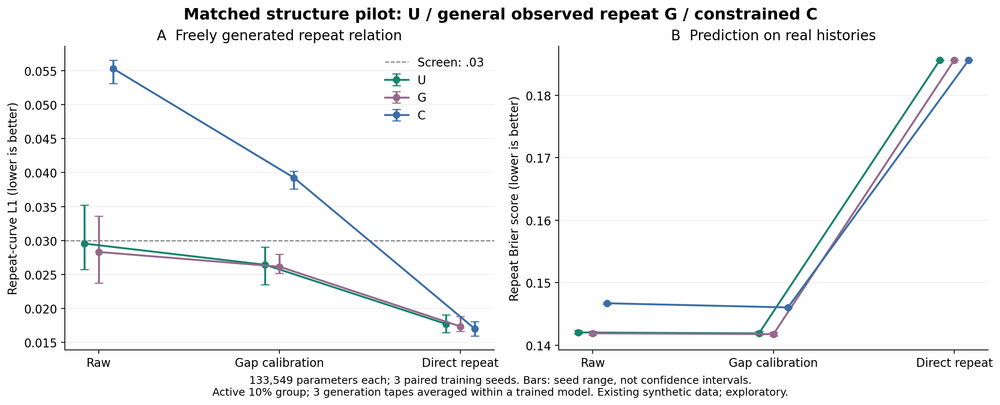
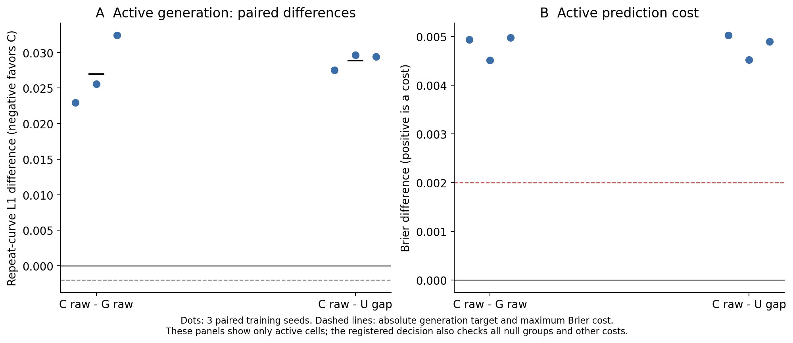

# 같은 조건의 내부 구조 비교 결과 — 2026-09-20

**18회 새 학습과 162개 생성 데이터셋(331,776개 거래열)의 평가를 완료했다. 제안 구조 C는 이번 사전 기준을 통과하지 못했다.** 활성 관계의 생성 오차가 일반 구조 G 및 U+간격별 보정보다 세 학습 시드 모두 컸고, 거래별 예측 정확도도 허용 범위보다 악화했다. 이 후보를 성공한 구조로 고정하거나 외부 비교·독립 검증으로 확대하지 않는다.

## 무엇을 확인하려 했는가

목표는 **이력을 이용한 거래별 예측 정확도를 유지하면서 실제 생성 거래열의 간격–반복 관계를 더 잘 재현하는 것**이다. 단순 반복률 대조군은 생성 곡선을 잘 맞춰도 거래별 이력 차이를 잃을 수 있어, 생성 점수 하나로 새 구조의 우수성을 주장하지 않았다.

| 모델 | 이번 비교의 역할 |
|---|---|
| U | 기존 이력 기반 순차 생성기. 이전 행동 복사와 일반 행동 분포를 혼합 |
| G | 같은 이력에서 관측 반복확률을 직접 예측하는 일반 신경망 구조 |
| C | G와 같은 파라미터에서 이력별 반복 수준과 간격별 반복확률을 제약식으로 연결하는 제안 후보 |

C는 과거 E/ER를 다시 이름 붙인 모델이 아니다. E의 추가 이력 계수와 ER 규제는 사용하지 않았다. C의 제약은 **같은 이력에서 gap별 반복확률의 가중평균이 예측한 반복 수준과 같게 하는 것**이며, 전체 생성 분포를 보장하지 않는다. 제약 계산 자체의 신규성도 주장하지 않는다. [정확한 구조·수식·학습 방법](methods.md).

세 모델에 같은 인공 데이터 분할·이력 정보·133,549개 파라미터·초기 가중치·학습 순서·기본 NLL·학습 예산·모델 선택 규칙을 적용했다. 새로운 학습 시드 3개, 관계 없음/있음 두 조건으로 18회 학습했다. 생성 손실·추가 반복 손실·규제는 넣지 않았다. 각 부모에는 동일하게 학습 데이터만 사용한 간격별 보정(gap)과 경험 반복률 교체(direct)를 적용했다. 이력 차이를 쓰지 않는 `direct` 통계 대조군과 신경망 G는 다르다.

## 핵심 결과

아래는 **관계가 있는 10% 집단**의 3개 학습 시드 평균이다. 생성 점수는 각 모델의 생성 난수 3개를 먼저 평균했다. 모두 낮을수록 좋으며, 곡선 L1은 간격 5구간에서 반복률의 절대 차이, Brier는 거래별 반복 예측 오차다.

| 모델 | 생성 반복곡선 L1 | 거래별 반복 Brier | 행동 NLL |
|---|---:|---:|---:|
| U | .029553 | .142032 | 3.270288 |
| U+간격별 보정 | **.026435** | **.141890** | 3.269965 |
| G | .028320 | .141895 | 3.270101 |
| G+간격별 보정 | .026150 | .141765 | 3.269862 |
| **C** | **.055305** | **.146700** | **3.283995** |
| C+간격별 보정 | .039241 | .146037 | 3.283461 |
| U+직접 반복률 | .017730 | .185631 | 3.367419 |



- **C는 두 성능을 함께 개선하지 못했다.** 생성 L1은 G보다 95.3%, U+gap보다 109.2% 컸다. 3/3 학습 시드에서 두 대조군보다 모두 나빴다. C의 시드별 L1은 .056568/.053142/.056205로 모두 사전 상한 .03을 넘었다.
- **예측 단계부터 손실이 있었다.** U+gap 대비 C의 활성 Brier 증가는 시드별 .005023/.004518/.004891이었다. 사전 허용 증가폭 .002의 약 2.3–2.5배다. 행동 NLL 증가는 모두 .02 이내였지만, Brier 비용 기준은 두 대조군에 대해 세 시드 모두 실패했다. 생성 중 이력 누적만의 문제로 설명할 수 없다.
- **같은 보정을 줘도 해결되지 않았다.** C+gap은 자기 raw보다 생성 오차가 줄었지만, G+gap보다 평균 50.1%, U+gap보다 48.4% 컸고 3/3 시드에서 나빴다. C+gap의 Brier .146037도 U+gap보다 약 .00415 높았다. 또한 사후 보정은 원래 C의 반복 수준 보존 성질을 일반적으로 깨뜨린다.
- **일반 구조를 바꾼 효과도 과장하지 않는다.** G+gap과 U+gap의 생성 평균 차이는 −.000285이며 시드별 방향이 섞인다. 이 작은 차이로 G의 우월성을 선언하지 않는다. 직접 반복률은 생성 곡선을 더 잘 맞추지만 Brier가 .185631로 나빠지는 기존 절충을 다시 보여준다.

전체 9개 변형과 시드별 값은 [결과 표](result_tables.md), [예측 지표](conditional_metrics.csv), [13개 생성 지표와 보조 값](generation_metrics.csv)에 있다. 과거 ARGN의 다른 예산·난수 결과를 이번 동일 조건 표에 섞지 않았다.

## 어디에서 실패했고, 무엇은 유지됐는가

| 사전 기준 | 결과 |
|---|---|
| 두 대조군 각각 대비 생성 오차 10% 및 .002 이상 감소 등 | **둘 다 실패**, 개선 시드 각각 0/3 |
| 각 조건·집단·시드의 Brier 증가 ≤.002, 행동 NLL 증가 ≤.02 | 활성 Brier에서 실패. 전체 24개 대조 조합 중 18개 통과 |
| C와 U+gap 자체의 기본 예측 적격성 | 24/24개 조건 통과. 이는 U 수준의 정확도 유지와 다른 기준 |
| gap/행동/수치값 분포 오차 증가 ≤.01, 길이 오차 증가 ≤.02 | 24/24개 대조 조합 통과 |
| C의 비활성 생성 곡선 L1 ≤.03, 평균 제거 모양 L1 ≤.02 | 9/9개 비활성 조건 통과 |

비활성 곡선 L1의 최댓값은 .016383, 모양 L1은 .012927이었다. 다른 변수의 비용도 최대 gap KS +.001430, 행동 sparse TV +.002590, 수치값 KS +.000795로 상한보다 작았다. 길이는 모든 모델에 같은 계획을 주므로 차이가 0이며, 길이를 새로 잘 학습했다는 성과가 아니다. [모든 비용과 실패 위치](primary_costs.csv).

다만 **비활성 생성 곡선이 기준 이내라는 것이 고정 이력에서 불필요한 반응이 줄었다는 뜻은 아니다.** 보조 진단에서 gap만 바꿀 때의 반복확률 범위는 C가 G보다 세 비활성 조건의 평균에서 모두 컸다(.0326 대 .0225, .0618 대 .0423, .0335 대 .0291). 이 진단은 별도 등록된 보조 관찰이며 새로운 통과 한도를 사후에 붙이지 않았다. [고정 이력 민감도](fixed_history_response.csv).



## 원인에 관해 확인한 범위

**확인한 사실:** C의 제약식은 실제 validation 이력 전체에서 최대 2.39×10⁻⁷ 오차로 성립했다. 확률 정규화·유한차분 기울기·과거 정보만 쓰는지·동일 초기화·저장/재로드·생성 규칙을 검증했다. 세 구조의 선택 epoch도 각 시드·조건에서 같았다. 그럼에도 C는 실제 이력의 반복 예측부터 나빴고, 생성 곡선은 더 평평해졌다.

예를 들어 활성 집단의 가장 짧은 gap 구간에서 실제 반복률은 55.11%, G 생성은 52.42%, C 생성은 46.82%였다. 가장 긴 구간에서는 실제 7.33%, G 11.31%, C 14.15%였다. C는 짧은 간격의 반복을 더 낮게, 긴 간격의 반복을 더 높게 생성했다. 단순 전체 평균 수준 하나의 오차로만 보기 어렵다. [모든 구간 값](repeat_curves.csv).

**아직 확정하지 않은 원인:** C의 반복 수준 head에 부과한 표현 제약과, 제약을 통해 gap head로 흐르는 학습 기울기 중 무엇이 주원인인지는 이 비교만으로 분리되지 않는다. 같은 파라미터 수가 같은 함수 표현력·최적화 성질을 보장하지 않는다. 고정 이력의 평균을 보존하는 수학적 성질도 생성 이력이 바뀐 뒤의 관계 보존을 보장하지 않는다. 구현 검증 통과가 모든 버그의 부재를 증명하는 것도 아니지만, 현재 확인한 결과를 제약식 계산 실패나 오직 생성 피드백 탓으로 설명할 근거는 없다.

## 이번 결정과 다음 방향

**이번 C를 최종 구조·핵심 기여로 채택하지 않는다. 외부 모델 재비교와 독립 데이터 확대는 보류하고, 등록한 실행을 여기서 종료한다.** 허용선을 낮추거나 좋은 시드만 고르지 않는다. 새 방법의 우수성이 입증됐다는 결론도 내리지 않는다.

1. **U/G+gap을 현재의 기준으로 유지한다.** 이력별 예측을 유지하면서 생성 관계를 개선해야 한다는 연구 질문은 남지만, 이번 제약 결합이 그 해법이라는 주장은 지지되지 않았다.
2. **C를 더 검토한다면 먼저 실제 이력의 예측 손실 원인을 분리해야 한다.** 수준 head의 표현과 gap head로 가는 기울기 경로를 각각 통제하는, 같은 용량·손실의 한정된 비교가 필요하다. 현재 두 변화가 함께 적용돼 있으므로 특정 원인을 이미 증명했다고 하지 않는다. 이 후속은 아직 등록·실행하지 않았다.
3. **예측 손실을 해결하지 않은 C에 곧바로 생성 손실을 붙이지 않는다.** 생성 관계 학습을 연구한다면 먼저 예측이 유지되는 U/G를 출발점으로, 같은 추가 목표를 준 일반 대조군과의 효과·비용을 별도로 고정해야 한다. 이를 이번 실패를 지우는 자동 다음 단계로 실행하지 않았다.
4. 예측·생성의 동시 이득이 확인된 후보에 한해서만, 적절히 학습·보정한 TabularARGN 재비교와 새 데이터 생성 시드·학습 시드·다른 전이 법칙을 검증한다. 실제 사기 탐지 효용도 그 이후 별도 과제다.

이번 결과는 기존 인공 데이터 seed42·집단 비율 10%·이미 살펴본 validation에서 얻은 3개 새 학습 시드의 탐색 결과다. C 계열 전체의 불가능성, 모든 금융 데이터의 일반화, 통계적 우월성/열등성을 입증하지 않는다. 과거 E/ER 및 외부 baseline의 결과는 그대로 보존한다.

## 검증과 저장 위치

사전등록 `892a5d1`, 과학적 학습 실행 코드 `6afb05b4ec06b255d0cd9b74a4f9df8276ecbd9e`. CPU/GPU 사전 검증 뒤 18회 본 학습을 수행했고 본 학습·평가의 기술 실패나 재시도는 없었다. 사전 검사 과정의 인덱싱·검사 항목·TF32 문제와 수정은 [기술 기록](execution_notes.md)에 남겼다. 같은 모델 설정을 유지하며 FP32로 고정했고 기준을 완화하지 않았다.

입력·가중치·생성물 hash, 같은 초기 tensor·학습 순서, 데이터 분할, 보정 최적해를 검증했다. 보정값은 독립 스칼라 해법과 최대 1.74×10⁻⁶ 차이였다. 별도 산술 검증에서 예측 지표 324개는 최대 4.91×10⁻⁷, 생성 관계/모양 지표 972개는 최대 1.00×10⁻¹⁶ 차이로 일치했다. [검증](verification.json), [독립 산술 확인](independent_arithmetic.json), [실행 목록과 hash](execution_summary.json), [자원 기록](execution_resources.json).

원격 GPU 학습 및 CPU 평가를 모두 마쳤다. 학습은 매번 여유를 확인한 GPU에서 한 작업씩 실행했으며, 총 학습 시간 합은 약 421초, 최대 예약 메모리는 412MiB였다. 전체 소요 시간에는 별도의 검증·보정·생성·집계가 더해진다. 다른 작업을 종료하지 않았다.

코드·사전등록·표·그림·보고서는 `research/cs-saf-external-audit-v1`에 저장한다. `main`과 기존 `research/cs-saf`에는 병합하지 않는다. 약 440MiB의 checkpoint·특징·생성 원본·검사 원본은 워크스테이션의 `artifacts/cs_saf/structure_v1/`에 보존하며 GitHub는 대용량 원본의 전체 백업이 아니다.

원본을 다시 학습하지 않고 집계·검증·그림을 재생성하는 순서:

```bash
OMP_NUM_THREADS=1 OPENBLAS_NUM_THREADS=1 MKL_NUM_THREADS=1 python scripts/summarize_cs_saf_structure_v1.py
OMP_NUM_THREADS=1 OPENBLAS_NUM_THREADS=1 MKL_NUM_THREADS=1 python scripts/verify_cs_saf_structure_v1.py
OMP_NUM_THREADS=1 OPENBLAS_NUM_THREADS=1 MKL_NUM_THREADS=1 python scripts/report_cs_saf_structure_v1.py
```
